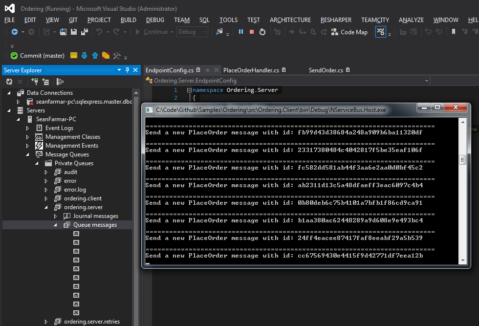
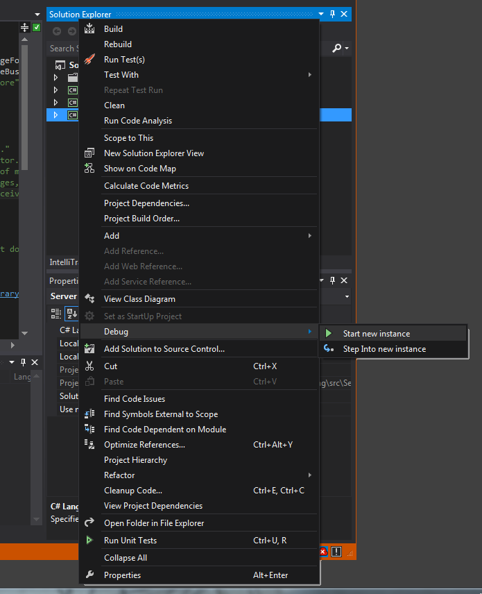
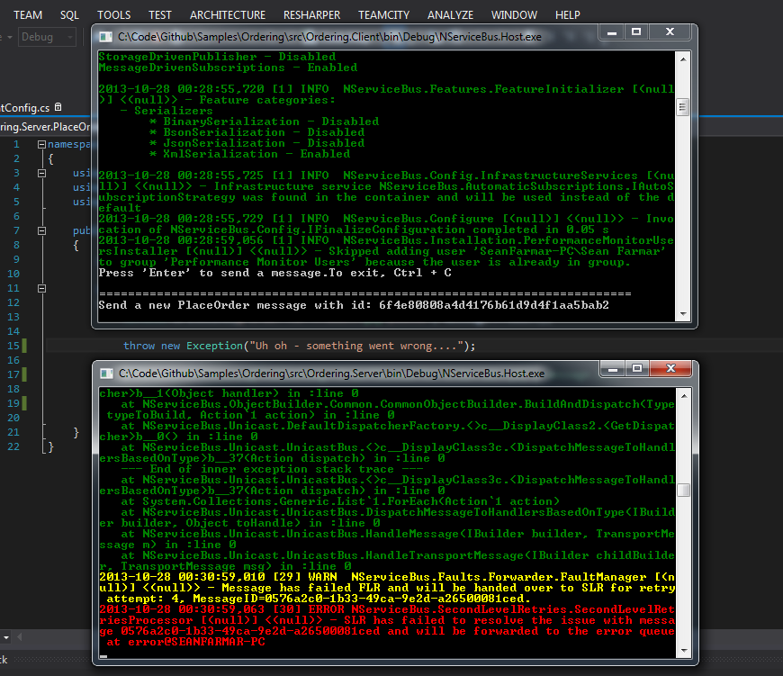

Durable messaging
-----------------

In [the previous section](NServiceBus-Step-by-Step-Guide.md) you've seen how a send to send a messages, see how messaging can get past all sorts of failure scenarios:

1.  [Durable Messaging Demo](#Demo)
2.  [Fault tolerance and Second Level Retries (SLR)](#Fault)
3.  [Retries, errors, and auditing](#AuditAndError)
4.  [Next Steps](#Next)

The complete solution code can be found [here](https://github.com/Particular/NServiceBus.Msmq.Samples/tree/master/Documentation/002_OrderingFaultTolerance)

Durable Messaging Demo
----------------------

*  Run the 'Ordering' solution again and hit Enter on the 'Client' console a couple of times to make sure the messages are being processed. 
   


* Then, kill the 'Server' console (endpoint) but leave the 'Client' console (endpoint) running.
* Hit Enter on the 'Client' console a couple of times to see that the 'Client' application isn't blocked even when the other process it's trying to communicate with is down. This makes it easier to upgrade the backend even while the front-end is still running, resulting in a more highly-available system.
*  Now, leaving the 'Client' console running, go back to Visual Studio and open Server Explorer and locate 'Message Queues' and the Server's queue. You should see this: 
  


All the messages sent to the 'Server' endpoint are queued, waiting for the process to come back online. You can click each message, press F4, and examine its properties specifically BodyStream, where the data is.

Now bring the 'Server' endpoint back online by right clicking the project, Debug, Start new instance.



As you can see the 'Server' processes all those messages, and if you go back to the queue shown above and right click Refresh, it is empty.


Fault tolerance and Second Level Retries (SLR)
----------------------------------------------

Consider scenarios where the processing of a message fails. This could be due to something transient like a deadlock in the database, in which case some quick retries overcome this problem, making the message processing ultimately succeed. NServiceBus automatically retries immediately when an exception is thrown during message processing, up to five times by default (which is configurable).

If the problem is something more protracted, like a third party web service going down or a database being unavailable, it makes sense to try again sometime later.

This is called the " [second level retries](second-level-retries.md) " or SLR functionality of NServiceBus.

SLR is enabled by default, the default policy will defer the message
`10*N` (where N is number of retries) seconds 3 times (60 sec total), resulting in a wait of 10s, then 20s, and then 30s; after which the message moves to the configured ErrorQueue.


So, let's make the processing of messages in the 'Server' endpoint fail.

Throw an exception in the `SubmitOrderProcessor` code like this:

```C#
namespace Ordering.Server
{
    public class PlaceOrderHandler : IHandleMessages<PlaceOrder>
    {
        public IBus Bus { get; set; }

        public void Handle(PlaceOrder message)
        {
            Console.WriteLine(@"Order for Product:{0} placed with id: {1}", message.Product, message.Id);

            throw new Exception("Uh oh - something went wrong....");
        }
    }
}
```

Run your solution again, but this time use `Ctrl-F5` so that Visual Studio does not break each time the exception is thrown, sending a message from the 'Client' console.

You should see the endpoint scroll a bunch of warnings, ultimately putting out an error, and stopping, like this:



While the endpoint can now continue processing other incoming messages (which will also fail in this case as the exception is thrown for all cases), the failed message has been diverted and is being held in one of the NServiceBus internal databases.

If you leave the endpoint running a while longer, you'll see that it tries processing the message again. After three retries, the retries stop and the message ends up in the error queue (in the default configuration this should be after roughly one minute).

**NOTE** When a message cannot be deserialized, it bypasses all retry and moves directly to the error queue.

Retries, errors, and auditing
-----------------------------

If a message fails continuously (due to a bug in the system, for example), it ultimately moves to the error queue that is configured for the endpoint after all the various retries have been performed.

Since administrators must monitor these error queues, it is recommended that all endpoints use the same error queue.

Read more about [how to configure retries](second-level-retries.md) .

Make sure you remove the code which throws an exception before going on.

### <a id="Next" name="Next"> </a> Next Steps

* Go to [NServiceBus Step by Step Guide - Publish Subscribe Communication - code first](NServiceBus/nservicebus-step-by-step-publish-subscribe-communication-code-first)
* Read about [NServiceBus and SOA Architectural Principles](NServiceBus/architectural-principles)
* Try our [Hands on Labs] (http://particular.net/HandsOnLabs)
* Check out our [Videos and Presentations](http://particular.net/Videos-and-Presentations)
* See the [Documentation](http://docs.particular.net)
* Join our [community](http://particular.net/DiscussionGroup)


