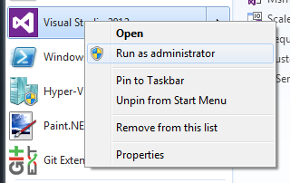
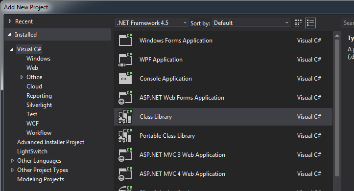
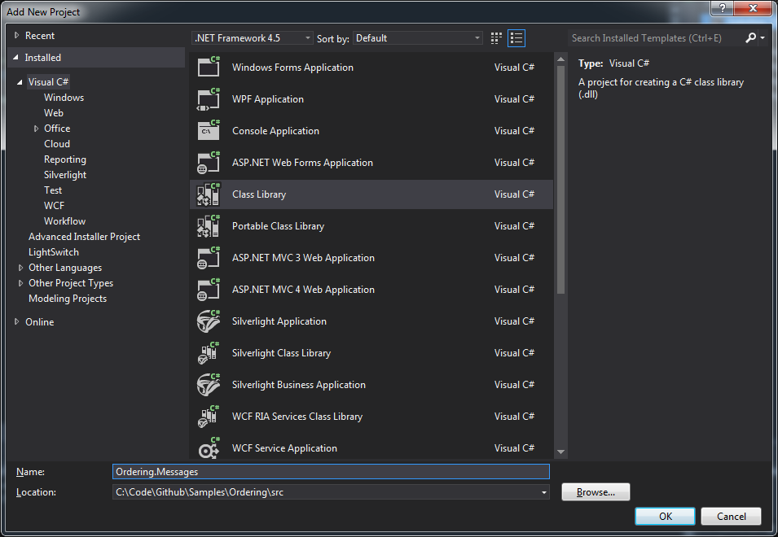
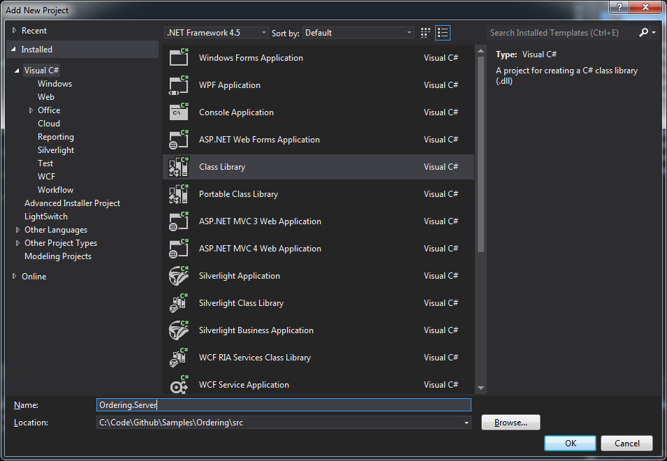
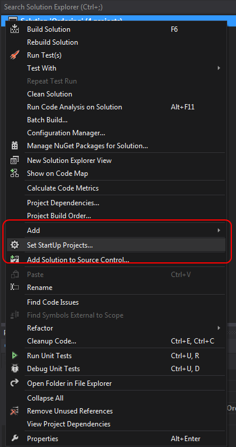
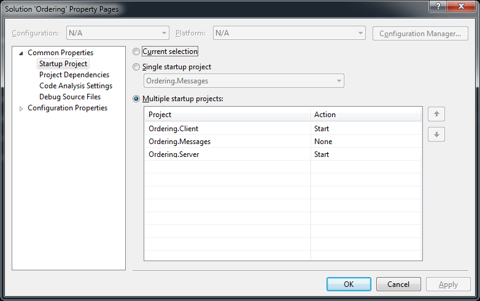
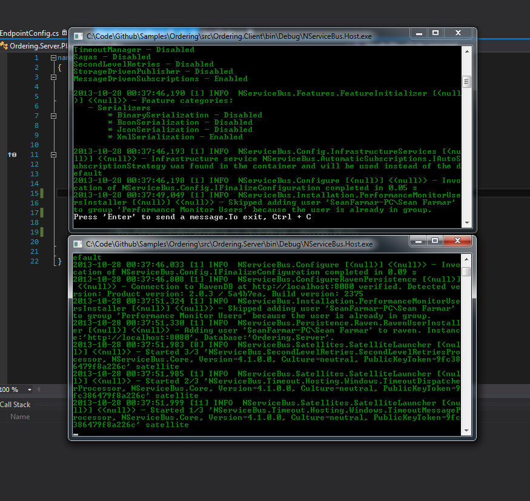
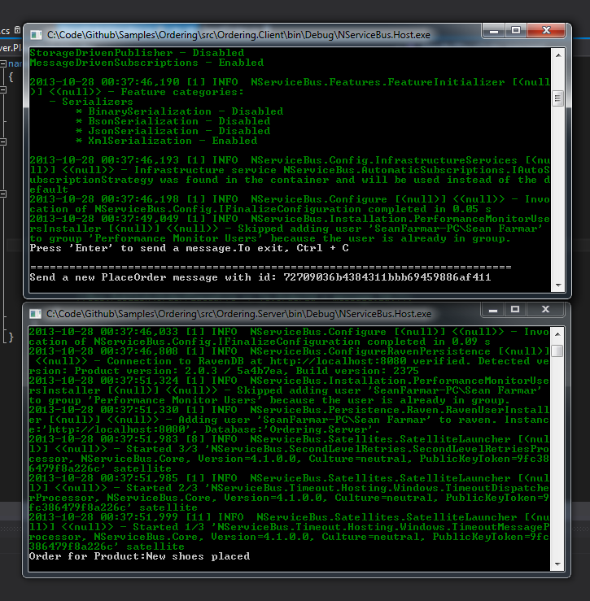

In this tutorial we are going to create a very simple ordering system that will send messages from a client to a server. The ordering system includes three projects: Client, Server, and Messages, to complete this tasks we will execute the following steps:

1.  [Creating the Client project](#Creating-the-Client-project)
2.  [Creating the Messages project](#Creating-the-Messages-Project)
3.  [Creating the Server project](#Creating-the-Server-Project)
4.  [Sending the order](#Sending-the-order)
5.  [Running the solution](#Running-the-solution)

The complete solution code can be found [here](https://github.com/Particular/NServiceBus.Msmq.Samples/tree/master/Documentation/001_OrderingSendOnly)

### Creating the Client project

Let's start by creating a 'Client' project that will send order requests to a NServiceBus endpoint.

Open Visual Studio as administrator, create a new 'Class Library' Project name it 'Ordering.Client', and name the solution 'Ordering'.





We now need to add references the NServiceBus assemblies and the quickest and quickest way to do that is to use NuGet Package Manager Console.

Open the NuGet Package Manager Console: `Tools > Library Package Manager > Package Manager Console`.

Type the following command at the Package Manager Console:

    PM> Install-Package NServiceBus.Host

NOTE: When prompted to reload the project, click reload

The package installation process adds references to NServiceBus assemblies and creates several boiler template files in the Client project.

For example, 'EndpointConfig.cs' is used to configure the project endpoints, and by default the configuration is set to Server.

To change the configuration to 'Client', open the 'EndpointConfig.cs' file that was just created for you and replace this line:


```C#
namespace Ordering.Client
{
    public class EndpointConfig : IConfigureThisEndpoint, AsA_Server
    {
    }
}
```

 with

```C#
namespace Ordering.Client
{
    public class EndpointConfig : IConfigureThisEndpoint, AsA_Client
    {
    }
}
```

 You will add more code to the 'Client' project later on but now we are going to concentrate on the area that will handle our order requests.

### Creating the Messages Project

First lets add a new Class Library project and call it 'Ordering.Messages'.


[](Creat_Messages.png)

The Messages project is the container of message definitions. This project will be shared between the client and server so both sides agree on the typed message descriptions.

Install the 'NServiceBusInterfaces' NuGet package for this new project:

At the Package Manager Console, type:

    PM> Install-Package NServiceBus.Interfaces -ProjectName Ordering.Messages

Add a command with a property to hold a product name:

Delete 'Class1.cs' and add a class and name it 'PlaceOrder.cs' (or if you want you can rename the file to 'PlaceOrder.cs').

Implement the PlaceOrder command in 'PlaceOrder.cs'.

Replace the content of 'PlaceOrder.cs' with the following code:

```C#
namespace Ordering.Messages
{

    public class PlaceOrder : ICommand
    {
        public Guid Id { get; set; }

        public string Product { get; set; }
    }
}
```

### Creating the Server Project

You are now ready to create the orders processing server, add a new class library project and name is 'Ordering.Server'.


[](Creat_Server.png)

Install the 'NServiceBusHost' NuGet package for this new project:

At the Package Manager Console, type:

    PM> Install-Package NServiceBus.Host -ProjectName Ordering.Server

NOTE: When prompted to reload the project, click reload

For the server side to understand and interpret the message content, add a reference to the 'Messages' project you created earlier:

Right click References in the 'Ordering.Server' Project -\> Add Reference -\> Ordering.Messages.

Replace the content of 'PlaceOrderHandler.cs' with the following code:

```C#
namespace Ordering.Server
{
    public class PlaceOrderHandler : IHandleMessages<PlaceOrder>
    {
        public IBus Bus { get; set; }

        public void Handle(PlaceOrder message)
        {
            Console.WriteLine(@"Order for Product:{0} placed with id: {1}", message.Product, message.Id);
        }
    }
}
```


### Sending the order

We nearly done, all it is left to do is to go back to the 'Client' project add a reference to the 'Ordering.Messages' project and copy and paste the following code into the 'Class1.cs' (if you want you can rename the file to 'SendOrder.cs') file:

```C#
namespace Ordering.Client
{
    public class SendOrder : IWantToRunWhenBusStartsAndStops
    {
        public IBus Bus { get; set; }

        public void Start()
        {
            Console.WriteLine("Press 'Enter' to send a message.To exit, Ctrl + C");

            while (Console.ReadLine() != null)
            {
                var id = Guid.NewGuid();

                Bus.Send("Ordering.Server", new PlaceOrder() { Product = "New shoes", Id = id});

                Console.WriteLine("==========================================================================");
                Console.WriteLine("Send a new PlaceOrder message with id: {0}", id.ToString("N"));
            }
        }
        public void Stop()
        {
        }
    }
}
```

 NOTE: The code above is version 4.x, the 3.x interface 'IWantToRunAtStartup' has been replaced with 'IWantToRunWhenBusStartsAndStops'

### Running the solution

You've completed coding the example and now it's time to run the solution. 

To see the complete system, run both the Client and the Server projects together:

To run the 'Client' and 'Server' projects together so you can see it all working, right click on the 'Ordering' solution and select 'Set StartUp Projects...'




in that screen select 'Multiple startup projects' and set the 'Ordering.Client' and 'Ordering.Server' action to be 'Start'.




Finally click 'F5' to run the solution.

Two console application windows should start up



Hit enter (while the Client console is in focus) and you should see 'Order for Product: New shoes placed' in one of them.


