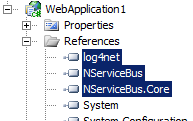

Lighter-weight than BizTalk and more powerful than WCF, NServiceBus comes with its own host process and allows you to host it in your own process.

Requiring as few as three assemblies to be referenced, the Fluent configuration API can get you up and running with transactional one-way messaging in a snap.

Assembly references
-------------------



To host NServiceBus in your own process, the assemblies shown on the left need to be referenced:

-   Log4Net is the industry-standard logging library used by NServiceBus.
-   NServiceBus.dll contains the main interfaces developers should be programming against.
-   NServiceBus.Core.dll contains all the runtime elements needed for execution.

The [Video store sample](https://github.com/Particular/NServiceBus.Msmq.Samples/tree/master/VideoStore.Msmq) for v4.x.


NServiceBus initialization
--------------------------

In the `ApplicationStart` method of your `Global.asax` file in a web application, or in the `Main` method of your `Program` file for console or Windows Forms applications, include the following initialization code:

For NServiceBus v4.x:

```C#
Configure.Serialization.Xml();
Configure.Transactions.Enable();

Configure.With()
    .Log4Net()
    .DefaultBuilder()
    .UseTransport<Msmq>()
    .PurgeOnStartup(false)
    .UnicastBus()
    .CreateBus()
    .Start(() => Configure.Instance.ForInstallationOn<NServiceBus.Installation.Environments.Windows>().Install());

```

Here are some usage samples:

NServiceBus v4.x in ASP.Net MVC:

```C#
public class MvcApplication : System.Web.HttpApplication
    {
        private static IBus bus;

        protected void Application_Start()
        {
            Configure.ScaleOut(s => s.UseSingleBrokerQueue());

            bus = Configure.With()
                     .DefaultBuilder()
                     .Log4Net(new DebugAppender {Threshold = Level.Warn})
                     .UseTransport<Msmq>()
                     .PurgeOnStartup(true)
                     .UnicastBus()
                     .RunHandlersUnderIncomingPrincipal(false)
                     .RijndaelEncryptionService()
                     .CreateBus()
                     .Start(() => Configure.Instance.ForInstallationOn<NServiceBus.Installation.Environments.Windows>()
                                           .Install());

            AreaRegistration.RegisterAllAreas();
            FilterConfig.RegisterGlobalFilters(GlobalFilters.Filters);
            RouteConfig.RegisterRoutes(RouteTable.Routes);
        }

        public static IBus Bus
        {
            get { return bus; }
        }
    }
```

Configuration Code
------------------

Most of the methods are extensions for the
[NServiceBus.Configure](https://github.com/Particular/NServiceBus/tree/master/src/NServiceBus.Core/Config) class provided by the specific components packaged in the NServiceBus.Core assembly. You can similarly configure your own components by writing your own extension methods.

-   `Log4Net()` tells NServiceBus what to [log](logging-in-nservicebus.md) with.
-   `DefaultBuilder()` tells NServiceBus to use the default(Autofac) dependency injection framework. Other [dependency injection frameworks](containers.md) are available as well.
-   `UnicastBus()` tells NServiceBus to use unicast messaging. This is currently the only option available out of the box. LoadMessageHandlers() readies the bus for invoking message handlers when a message arrives.
-   `CreateBus()` takes all the previous options and wires up a bus object for you to use. You can store the reference returned from this call for sending messages.
-   `Start()` tells the bus object created by `CreateBus()` to start its threads for listening and processing messages.

For NServiceBus v4.x:

-   `Configure.Serialization` tells NServiceBus to serialize messages as XML. Additional option is to specify BinarySerializer(), which does binary serialization of messages.
-   `UseTransport<msmq>()` tells NServiceBus to use MSMQ as its transactional messaging transport. NServiceBus also supports Azure queues, FTP, SqlServer (see sample [here](https://github.com/Particular/NServiceBus.SqlServer.Samples)) <!--, ActiveMQ (see sample [here](https://github.com/Particular/NServiceBus.ActiveMQ.Samples)) -->, RabbitMQ (see sample [here](https://github.com/Particular/NServiceBus.RabbitMQ.Samples) ) as transport mechanisms.

In addition to the above initialization code, NServiceBus requires certain configuration data to be available. By default, it retrieves this information from the application config file, though this can be changed with the CustomConfigurationSource() method.


Configuration files
-------------------

To use the initialization code above, provide configuration for the MsmqTransport and processing of faults; specifically, the number of threads it runs, and where it sends messages that cannot be processed.

Include these configuration sections:

For NServiceBus v4.x:

```XML
<section name="MessageForwardingInCaseOfFaultConfig" 
type="NServiceBus.Config.MessageForwardingInCaseOfFaultConfig, NServiceBus.Core"/>
<section name="UnicastBusConfig" type="NServiceBus.Config.UnicastBusConfig, NServiceBus.Core"/>

<!-- Specify the configuration data, as follows: -->

<MessageForwardingInCaseOfFaultConfig ErrorQueue="error"/>
```

 If an exception is thrown during the processing of a message, NServiceBus automatically retries the message (as it might have failed due to something transient like a database deadlock). MaxRetries specifies the maximum number of times this is done before the message is moved to the ErrorQueue.

Routing configuration
---------------------

While you can tell NServiceBus to which address to send a message using the API: `Bus.Send(toDestination, message);` NServiceBus enables you to keep your code decoupled from where endpoints are deployed on the network through the use of routing configuration. Include this configuration section:

```XML
<section name="UnicastBusConfig" type="NServiceBus.Config.UnicastBusConfig, NServiceBus.Core"/>

<!-- And then specify the configuration data like this: -->

<UnicastBusConfig>
<MessageEndpointMappings>
    <add Messages="MessageDLL" Endpoint="DestinationQueue@TargetMachine"/>
</MessageEndpointMappings>
</UnicastBusConfig>  
```

 This tells NServiceBus that all messages in the MessageDLL assembly should be routed to the queue called DestinationQueue on the machine TargetMachine. You can send messages from that assembly, like this: `Bus.Send(messageFromMessageDLL);`


