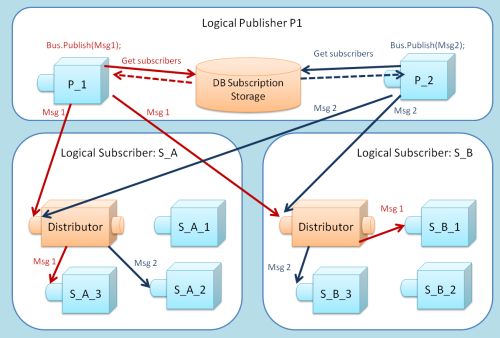

<!--
title: "How Pub/Sub Works"
tags: ""
summary: "
Now that you've seen publish/subscribe in action, let's take a look behind the curtains and see what's going on.

If you haven't seen the <a href="publish-subscribe-sample.md">publish/subscribe sample</a> yet take a minute to walk through or start by <a href="getting-started---creating-a-new-project.md">creating a new project using NServiceBus</a> .

"
-->

Now that you've seen publish/subscribe in action, let's take a look behind the curtains and see what's going on.

If you haven't seen the [publish/subscribe sample](publish-subscribe-sample.md) yet take a minute to walk through or start by [creating a new project using NServiceBus](getting-started---creating-a-new-project.md) .

The main thing to understand is this: subscribers let the publisher know they're interested, and the publisher stores their addresses so that it knows where to send which message. It's fairly straight-forward, once you know how it all works.

Before we get started...
------------------------

One of the common assumptions about pub/sub messaging is that it involves physical one-to-many communication. The only thing is, that at the physical level pub/sub isn't that interesting. It becomes valuable when publishing logical events from one logical area of responsibility to other logically interested parties.

NServiceBus' infrastructure pieces handle the physical distribution and one-to-many message dispatch many look for in pub/sub, but these are quite transparent to the programming model. Let's take a look at the overlay of logical pub/sub and physical distribution, one step at a time.

The above diagram shows us one logical publisher P1, and two logical subscribers SA and SB. Each has a number of physical nodes (colored in blue) and some NServiceBus infrastructure (colored in orange). For now, we're going to assume that both SA and SB are already subscribed, each specifying the left port of its distributor as its public endpoint.

What happens when we publish
----------------------------

When a node in the logical publisher P1 goes to publish a message, here's what happens:

When requested by applicative logic to publish a message, the NServiceBus infrastructure contacts its configured subscriptions database, finds all the subscriber endpoints registered for the given message type, and dispatches a physical message to each one.

Since one-way messaging is used to dispatch physical messages, even if one of the subscriber endpoints is offline or otherwise unavailable, this does not cause the publishing thread to block. The message is stored in the sending machine's outgoing queue (for a configurable period of time), while the messaging infrastructure attempts to deliver the message to its destination.

What the distributor does
-------------------------

All the distributor does at this point is forward the message it receives to another node.

You can think of the distributor as something like a load balancer—it distributes the messages coming to it to a number of other machines. This kind of physical one-to-many communication is needed for scaling out the number of machines running for a given subscriber, but doesn't actually entail any pub/sub. Each subscriber gets its own distributor and each of them decides independently to which machine it passes its messages.

See [more information on the distributor](load-balancing-with-the-distributor.md) .

The same for any publisher node
-------------------------------

It doesn't matter which node in the publisher is publishing a message, the same process happens.

What this means is that you can scale out the number of publishing nodes just by making use of a database for storing subscriptions, with no need for a distributor. When using the generic NServiceBus Host process you get this by default in its production profile.

Next steps
----------

-   Learn about the [API and configuration involved in
    pub/sub](publish-subscribe-configuration.md) .
-   See how to [configure the distributor and learn more about its
    internals](load-balancing-with-the-distributor.md) .
-   Find out how to use the [generic NServiceBus Host
    process](the-nservicebus-host.md) .

