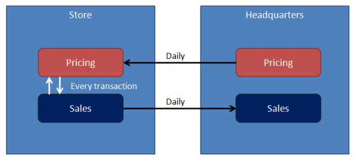
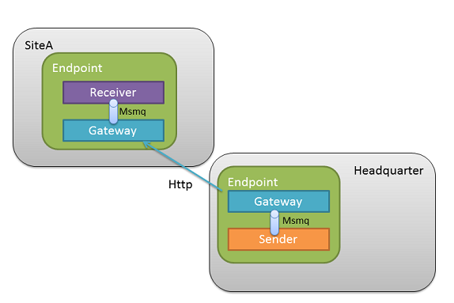

<!--
title: "Introduction to the Gateway"
tags: ""
summary: ""
-->

This article, together with [the Gateway & Multi-Site Distribution with NServiceBus](the-gateway-and-multi-site-distribution.md) article, provide a high level overview of the NServiceBus gateway, where to use it, and more importantly where not to use it. The main purpose of the gateway is to allow you to do the same durable fire-and-forget messaging that you are accustomed to with NServiceBus across physically separated sites, where "sites " are locations where you run IT infrastructure and not web sites.

The gateway only comes into play where you can't use the regular queued transports for communication i.e. when setting up a VPN-connection is not an option. The reason for not using a VPN could be security concerns, bandwidth limitation, latency problems, high availability constraints, etc.

When not to use the gateway
---------------------------

The gateway should not be used when the reason for running separate sites is disaster recovery. Under those circumstances all your sites are exact replicas and are not logically different from each other, so you're better off using whatever support your infrastructure provides to keep your sites in sync. Examples are SAN snapshots, SQL server log shipping, and RavenDB replication.

So if your sites are logically similar, use one of the approaches above; if they are logically different, the gateway may come in handy.

What are logically different sites?
-----------------------------------

Logically different sites serve different business purposes, i.e., one site differs in behavior from other sites. Imagine a chain of retail stores where headquarters keep the prices for the different goods you're selling. Those prices need to be highly available to all your stores. If the link to HQ is down, you can't do business, and that is bad for sales.

Looking at this scenario from a logical point of view, you see that all the pricing communication goes on within the same business service (BS). The different physical sites have different logical behavior. This is a sure sign that the gateway might come in handy. Dig deeper and look at the actual responsibilities of each site:

-   Headquarters - Maintains the prices and pushes any price change out
    to the different stores on a daily basis
-   Store - Stores the prices locally for read-only purposes

Prices are usually set for at least a day at a time so it's good enough for the HQ to push them to the sites once per day. Model this as DailyPriceUpdatesmessage containing the list of price updates for the coming business day. Given this design, you only need to get one message across to each site per day, which lowers the requirement for the infrastructure.

Internally in HQ, other business services may need more frequent updates, so model this with another logically different message, PriceUpdatedForProduct, which allows you to use the pub/sub pattern while communicating with other BS.

The gateway doesn't support pub/sub (more on that later) but this isn't a problem since request/response is perfectly fine within a BS, remembering that those sites are physically different but the communication is within the same logical BS. So when you use the gateway, the guideline is to model the messages going explicitly across sites. If you extend the sample to include a sales service responsible for reporting the sales statistics so that the pricing service can set appropriate prices, you get the following picture:



The prices are pushed daily to the stores and sales reports are pushed daily to the HQ. Any pub/sub goes on within the same physical site. This is the reason that the NServiceBus gateway doesn't support pub/sub across sites since it shouldn't be needed in a well designed system.

<div style="direction: ltr;"> Going across sites usually means radically different transport characteristics like latency, bandwidth, reliability, and explicit messages for the gateway communication, helping to make it obvious for developers that they are about to make cross-site calls. This is where Remote Procedure Call (RPC) really starts to break down.


RPC completely hides the fact that you are now going out of your data center and will meet all the fallacies of distributed computing head on.

Using the gateway
-----------------

Beginning with NServiceBus V3, the gateway is included in the core assembly, meaning that every endpoint is capable of running a gateway.

To turn on the gateway, call Configure.RunGateway(). To send messages, use the new IBus interface called SendToSites method, as shown:


```C#
/// <summary>
/// Sends the messages to all sites with matching 
/// site keys registered with the gateway.
/// The gateway is assumed to be located at the master node. 
/// </summary>
/// <param name="siteKeys"></param>
/// <param name="messages"></param>
/// <returns></returns>
ICallback SendToSites(IEnumerable<string> siteKeys, params object[] messages);
```


This allows you to pass in a list of sites to where you want to send your messages. You can configure each site with a different transport mechanism. Currently the supported channels are HTTP/HTTPS but you can easily extend the gateway with your own implementation.

On the receiving side is another gateway listening on the input channel and forwarding the incoming message to the target endpoint. The image below shows the physical parts involved:



A gateway runs inside each host process. The gateway gets its input from a regular MSMQ queue and forwards the message over the desired channel
(HTTP in this case) to the receiving gateway. The receiving side de-duplicates the message (ensures it is not a duplicated message, i.e., a message that was already sent) and forwards it to the main input queue of its local endpoint. The gateway has the following features:

-   Automatic retries
-   De-duplication of messages
-   Transport level encryption with SSL
-   Support for data bus properties with large payloads
-   Can listen on multiple channels of different types
-   Included in every endpoint
-   Easily extensible with other channels

Next steps
----------

-   Examine the working sample in the NServiceBus/Samples/Gateway folder
-   Read the other article about the gateway: [the Gateway & Multi-Site
    Distribution with
    NServiceBus](the-gateway-and-multi-site-distribution.md)

Key messages
------------

-   Only use the gateway for logically significant sites.
-   Use explicit messages for your cross-site communication.
-   The gateway doesn't support pub/sub.
-   Automatic de-duplication and retries come out of the box.


