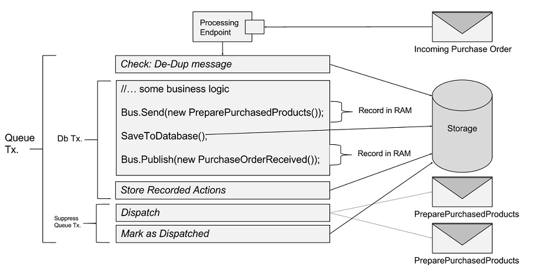

**NOTE: This article refers to a beta version of NServiceBus (V5) and is subject to changes and updates.**


NServiceBus V5 brings the option of running endpoints with the same reliability we all got accustomed to while running under DTC, but now without it. 

## Supported Transports
Out of the box RabbitMQ is the only transport that is enabled automatically by default.
SqlServer is also supported but in a different way (for details, see [SqlServer Transport](#SqlServer-Transport) section below).
All other transports need to be enabled explicitly using both of the following configuration settings when configuring the endpoint:

```C#
public class EnableNoDTC : INeedInitialization
{
    public void Init(Configure config)
    {
        config.EnableOutbox();
    }
}
```
and also the following configuration in the config file:

```xml
<appSettings>
  <add key="NServiceBus/Outbox" value="true" />
</appSettings>
```

### Note
The reason of this double opt-in required configuration at this time for all other transports is because we want users to be aware that unfortunatelly this new feature cannot coexist with existing not enabled endpoints unless they are [idempotent](http://en.wikipedia.org/wiki/Idempotence).

## How does it work
These feature has been implemented using both the [Outbox pattern](http://gistlabs.com/2014/05/the-outbox/) and the [Deduplication pattern](http://en.wikipedia.org/wiki/Data_deduplication#In-line_deduplication).
As a message is dequeued we check to see if we have previously processed it and if yes we dicard it otherwise we invoke the handlers code and store all outgoing message in a durable storage in the same transaction as the users own database changes. Finally we send out all outgoing messages and update the deduplication storage.

Here is a diagram how it all works:


## Caveats
- Currently only NHibernate storage has been implemented;
- Both the business data and dedupplication data need to share the same database;

## SqlServer Transport
SqlServer transport supports No-DTC without Outbox.
To enable SqlServer transport to not use MSDTC you need to ensure that all of the following connection strings are exactly the same (including the casing) in your config file:
```xml
<connectionStrings>
  <add name="NServiceBus/Persistence" connectionString="MY CONNECTION STRING" />
  <add name="NServiceBus/Transport" connectionString="MY CONNECTION STRING" />
  <add name="MyBusinessDataDatabase" connectionString="MY CONNECTION STRING" />
</connectionStrings>
```
next you need to configure `NHibernate` to be the default persistence and pass the business data [NHibernate Configuration instance](http://www.nhforge.org/doc/nh/en/#configuration-programmatic) to it, eg:
```C#
public class ShareNHibernateConfiguration : INeedInitialization
{
    public void Init(Configure config)
    {
        var configuration = BuildMyBusinessDataNHibernateConfiguration();

        config
            .UsePersistence<NServiceBus.NHibernate>(c => c.UseConfiguration(configuration));
    }
}
```

## How to access NHibernate Session
To get access to the current `IDbConnection`, `ISession` or/and `ITransaction`, all it is required is to inject via DI the `NServiceBus.Persistence.NHibernate.NHibernateStorageContext` into your own sagas or/and handlers.
Here is an example:
```c#
class OrderPlacedHandler : IHandleMessages<OrderPlaced>
{
    public NHibernateStorageContext NHibernateStorageContext { get; set; }

    public void Handle(OrderPlaced message)
    {
        var order = NHibernateStorageContext.Session.Get<Entities.Order>(message.OrderId);

        order.Shipped = true;

        NHibernateStorageContext.Session.Update(order);
    }
}
```

## Samples
1. [Sql Server Transport without MSDTC Sample](https://github.com/Particular/NServiceBus.SqlServer/archive/Samples.zip)
This sample shows how to configure an Endpoint that uses SQL Server transport and NHibernate as it business data storage and how to access the NHIbernate `ISession` for a `Saga` and a `Handler`.
1. [Outbox Sample](https://github.com/Particular/NServiceBus.NHibernate/archive/Samples.zip)
This sample shows how to enable Outbox on an endpoint and how to access the NHIbernate `ISession` for a `Saga` and a `Handler`. 
