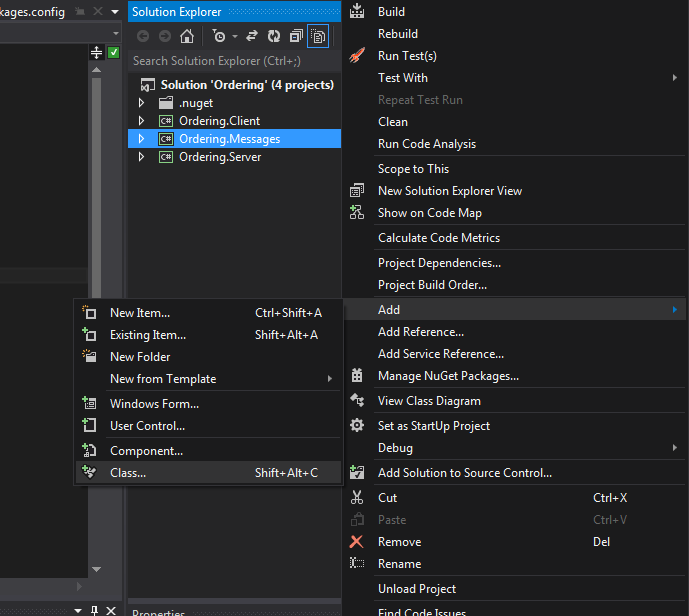
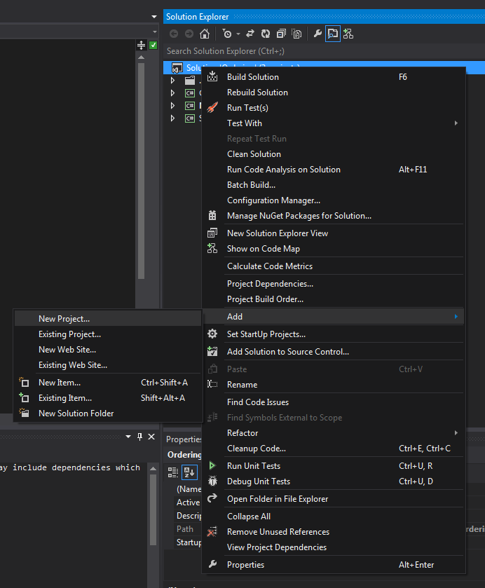
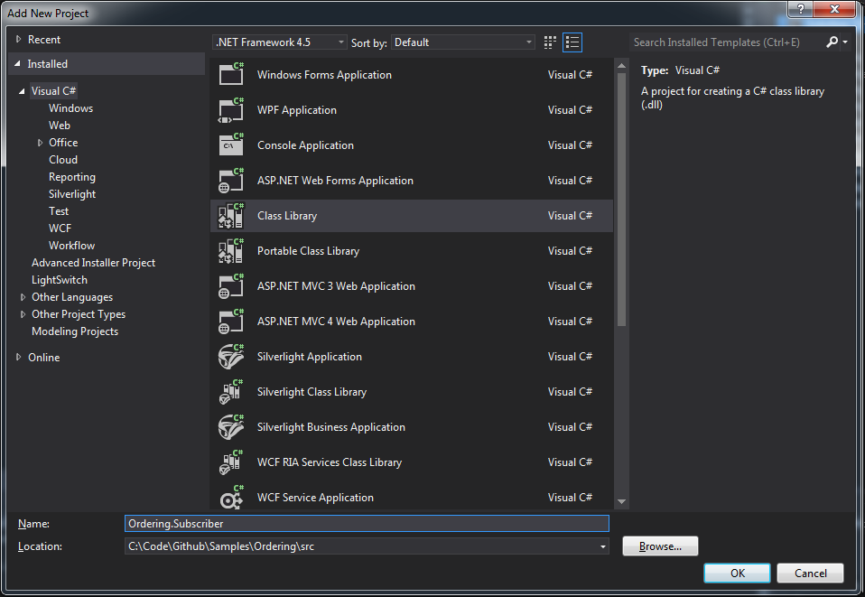
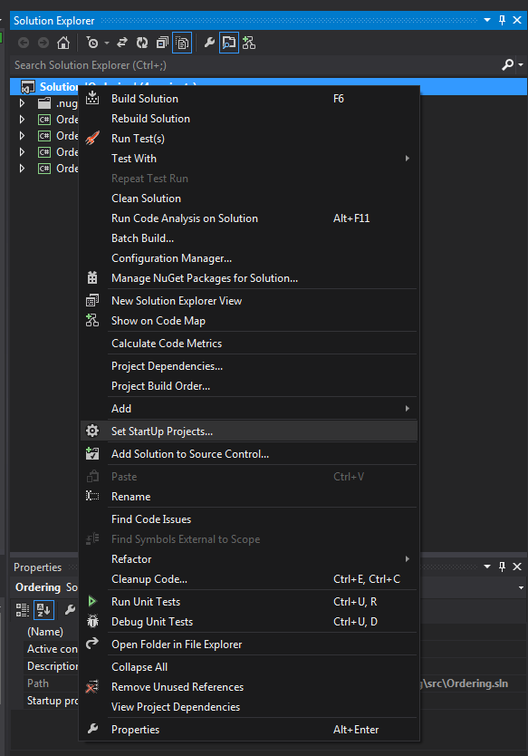
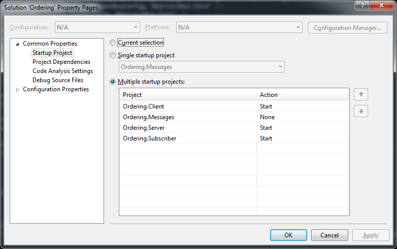
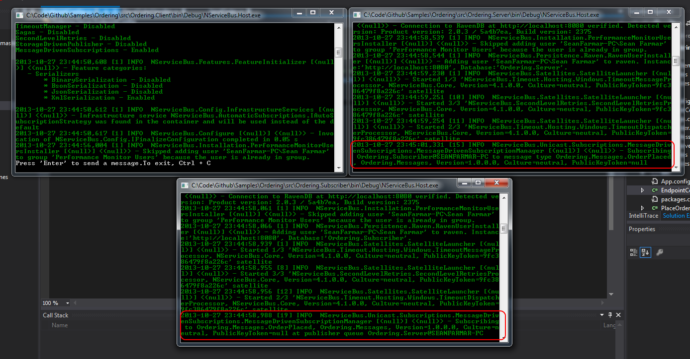
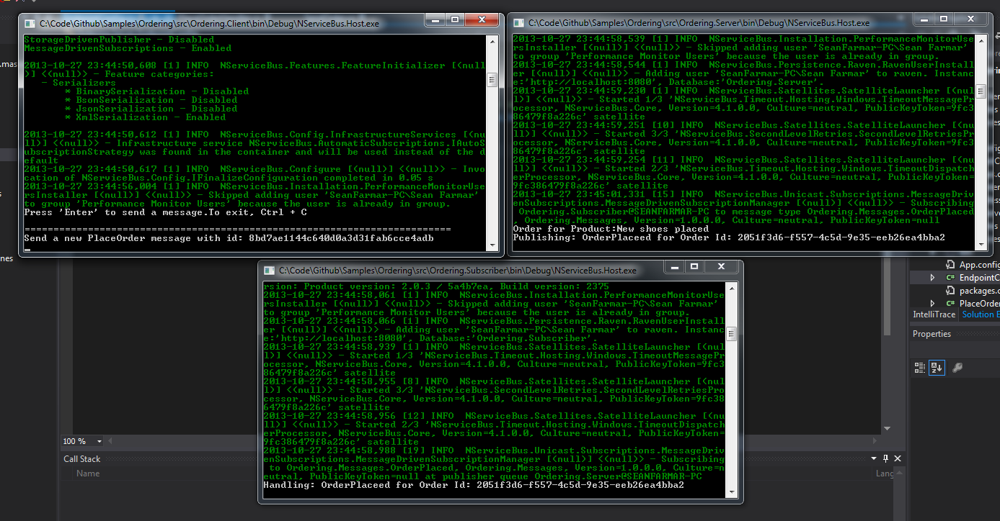

In the previous section: [NServiceBus Step by Step Guide - Fault Tolerance - code first](NServiceBus-Step-by-Step-Guide-fault-tolerance-code-first.md) we learnt about fault tolerance.

1.  [Creating an event message](#CreatingEvent)
2.  [Publishing the event](#Publishing)
3.  [Creating the Subscriber project](#Subscriber)
4.  [Handling the event](#Handeling)
5.  [Running the solution](#Running)
6.  [Next Steps](#Next)

The complete solution code can be found
[here](https://github.com/Particular/NServiceBus.Msmq.Samples/tree/master/Documentation/003_OrderingPubSub)

Now that we've gone through the basics of NServiceBus communication, configuration and fault tolerance, let's move on to publish/subscribe.


### <a id="CreatingEvent" name="CreatingEvent"> </a> Creating an event message

There are only a few steps needed to introduce pub/sub and make your solution look like the one appearing above.


Right click your Messages Project and add a class file, and create a `OrderPlaced` event:




The message class will implement the `IEvent` marker interface


```C#
namespace Ordering.Messages
{

    public class OrderPlaceed : IEvent
    {
        public Guid OrderId { get; set; }
    }
}

```


### <a id="Publishing" name="Publishing"> </a> Publishing an event


In order to publish the `OrderPlaced` event we will modify the
`PlaceOrderHandler`, add a `Bus.Publish<OrderPlaced>()` as shown below

```C#
namespace Ordering.Server
{

    public class PlaceOrderHandler : IHandleMessages<PlaceOrder>
    {
        public IBus Bus { get; set; }

        public void Handle(PlaceOrder message)
        {
            Console.WriteLine(@"Order for Product:{0} placed with id: {1}", message.Product, message.Id);

            // throw new Exception("Uh oh - something went wrong....");

            Console.WriteLine(@"Publishing: OrderPlaceed for Order Id: {0}", message.Id);

            Bus.Publish<OrderPlaced>(e => {e.OrderId = message.Id;});
        }
    }
}
```


As the 'Ordering.Server' endpoint is now a publisher, we need to change the endpointConfig.cs file to implement the AsAPublisher marker interface that will configure the endpoint with a Publisher profile


```C#
namespace Ordering.Server
{
    public class EndpointConfig : IConfigureThisEndpoint, AsA_Publisher
    {
    }
}
```


To learn more about profiles go check out: [Profiles For NServiceBus Host](profiles-for-nservicebus-host.md)


### <a id="Subscriber" name="Subscriber"> </a> Creating the Subscriber project

Now we can go ahead and create a subscriber endpoint that will subscribe and handle the 'OrderPlaced' event.

Right click the Ordering solution and select 'Add' \> 'New Project...'




Create a class library project and name the project Subscriber.




We will use nuget to install the an NServiceBus.Host, in the package manager window and type

    PM> Install-Package NServiceBus.Host -ProjectName Subscriber

Click reload all


### <a id="Handeling" name="Handeling"> </a> Handling the event

In our new Subscriber project

-   Add a new class file, name it `OrderPlacedHandler`
-   Add a reference to the `Messages` project
-   Implement the `IHandleMessages<OrderPlaced>` interface
-   Add an IBus auto property and implement the handler as shown below

```C#
namespace Ordering.Subscriber
{
    public class OrderPlacedHandler : IHandleMessages<OrderPlaced>
    {
        public IBus Bus { get; set; }

        public void Handle(OrderPlaced message)
        {
            Console.WriteLine(@"Handling: OrderPlaceed for Order Id: {0}", message.OrderId);
        }
    }
}

```

For the Host will auto subscribe to the event we need to add the message publisher

In the Odering.Subscriber project we will add MessageEndpointMappings in the app.config file as shown below:

```XML
<UnicastBusConfig>
  <MessageEndpointMappings>
    <add Messages="Ordering.Messages" Type="Ordering.Messages.OrderPlaced" Endpoint="Ordering.Server" />
  </MessageEndpointMappings>
</UnicastBusConfig>
```

### <a id="Running" name="Running"> </a> Running the solution

Now it's time to run the solution and see it all working together we will run the Client, Server and the Subscriber projects:

Right click on the 'Ordering' solution and select 'Set StartUp Projects...'



in that screen select 'Multiple startup projects' and set the 'Ordering.Client', 'Ordering.Server' and 'Ordering.Subscriber' action to be 'Start'.



Finally click 'F5' to run the solution.

Three console application windows should start up

Notice the Subscriber is subscribing the Ordering.Messages.OrderPlaced



Hit enter (while the Client console is in focus) and you should see
'Order for Product: New shoes placed' in one of them.



And there you are: publish/subscribe messaging is working!

As you see, it's very easy to get started with NServiceBus. You're all set now and can build your own distributed systems with NServiceBus.

### <a id="Next" name="Next"> </a> Next Steps

* Read about [NServiceBus and SOA Architectural Principles](architectural-principles)
* Try our [Hands on Labs](http://particular.net/HandsOnLabs)
* Check out our [Videos and Presentations](http://particular.net/Videos-and-Presentations)
* See the [Documentation](http://docs.particular.net)
* Join our [community](http://particular.net/DiscussionGroup)

