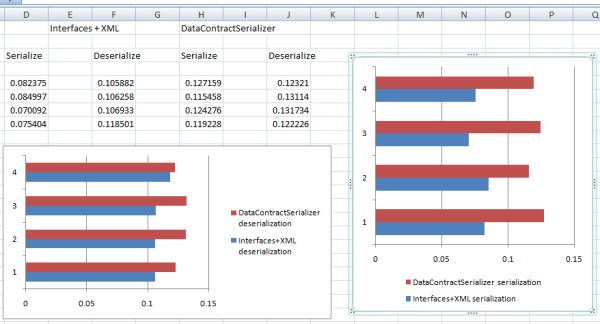

<!--
title: "Performance"
tags: ""
summary: ""
-->

NServiceBus:

-   Efficiently processes a single message
-   Processes high volumes concurrently
-   Scales out to servers of varying sizes
-   Scales down to low-spec devices

=\> The ultimate balance of speed and safety.

Benchmarks don't lie; liars do benchmark
----------------------------------------

Many parameters can affect the measured performance. The most obvious is hardware—the number of servers and CPU cores, the size of memory and storage, the storage speed, the amount of redundancy, and so on. Less obvious is what the system actually does—some message processing is trivial, while other messages may result in aggregated historical reports and sifting through terabytes of information.

Most benchmarks can be viewed as nothing more than anecdotes.

What others are saying
----------------------

In his presentation, [Dave de Florinier](http://gojko.net/2008/12/02/asynchronous-net-applications-with-nservicebus/) mentions achieving a throughput of 600,000 messages per hour on V1.7 or V1.8 of NServiceBus.

On a discussion group, [Raymond Lewallen](http://tech.groups.yahoo.com/group/nservicebus/message/1791) posted a throughput of 1.8 million messages per hour on V1.9 of NServiceBus.

Detailed statistics
-------------------

The most [detailed breakdown of NServiceBus performance](http://www.udidahan.com/2008/05/21/nservicebus-performance/) was on V1.8. The short and sweet version is 100 million durable and transactional messages per hour and 900 million non-durable messages per hour, on three blade centers (48 blades), thirty 1U servers, and twenty clusters.

XML serialization
-----------------

One area of interest when evaluating a technology is how fast it can handle XML. NServiceBus has its own custom XML serializer that is capable of handling classes, interfaces, and dictionaries, and does not use the WCF DataContractSerializer. The standard .net binary serializer does binary serialization.

The chart below compares the NServiceBus XML serializer and the WCF DataContractSerializer when processing small messages with five levels of nesting. You can see that the NServiceBus performance is superior; at times, even 40% faster.

Times are measured for 100 operations, so NServiceBus can serialize a single message in 0.7-0.8 ms, and deserialize it in roughly 1ms. Larger messages take longer.

