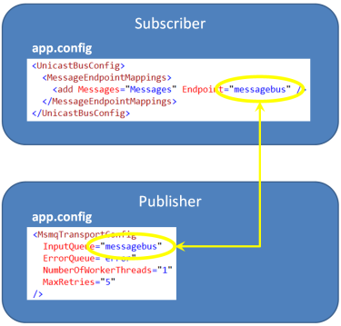
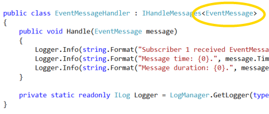
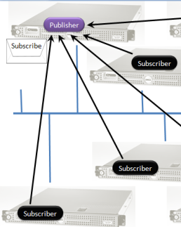

<!--
title: "Publish/Subscribe Configuration"
tags: ""
summary: "<p></p>
<p>The part of the <add> entry stating Messages=&quot;Messages&quot; means that the assembly &quot;Messages.dll&quot; contains the message schema. Specific types can be configured using their qualified name: &quot;namespace.type, assembly&quot;.</p>
"
-->



The part of the <add> entry stating Messages="Messages" means that the assembly "Messages.dll" contains the message schema. Specific types can be configured using their qualified name: "namespace.type, assembly".

The part stating Endpoint="messagebus" tells the subscriber's bus object that the publisher accepts subscription requests on that queue. The queue name "messagebus" is short for "the queue named 'messagebus' on the local machine". To indicate a queue on a remote machine, use a format similar to email:MessageBus@RemoteServer.

[Click here](how-do-i-specify-to-which-destination-a-message-will-be-sent.md) for more configuration options related to mapping messages to endpoints.

However, the input queue of each process does need to be on the same machine as the process.

At this point, the bus in the subscriber process knows about the message schema and the endpoint on which the publisher is willing to accept subscription requests. The bus object then sees that there is application code in the subscriber that wants to handle those messages, and sends a subscription request to that endpoint.


Subscription intent
-------------------

Application code in the subscriber handles the messages published by the publisher by implementing the (IHandleMessages<t>) NServiceBus interface, as shown:



This interface requires the single 'Handle' method to accept a parameter of the same type as declared in the class inheritance. Ignore the body of the method for now as it has no bearing on how publish/subscribe works.

Since the message being handled (EventMessage) belongs to the message assembly previously described (Messages.dll), and the subscriber's bus knows those messages belong to the publisher (from the app.config above), and the only way that a process can handle messages belonging to someone else is for them to be a subscriber, the bus automatically subscribes. Here's how it works.


Messaging mechanics
-------------------



The bus at the subscriber subscribes to the publisher by sending a message to the queue that is configured in its <unicastbusconfig> section as described above. In the message, the bus includes the type of message and the input queue of the subscriber. When the bus at the publisher side receives this message, it stores the information.

It is important to understand that each publisher is responsible for its own information. There isn't necessarily some logically central broker which stores everything, although NServiceBus does allow for configuring all publishers to store their information in a physically central location, such as a database.

A subscriber can also be a publisher. It is simple to state that a given process is a publisher.

How to be a publisher
---------------------

To indicate that a given process is a publisher, reference the NServiceBus assemblies and write a class that implements IConfigureThisEndpoint and AsAPublisher as shown below.

On top of the three NServiceBus assemblies referenced, reference
'log4net', which is the open-source library that is used for logging.
[Logging is configured in NServiceBus](logging-in-nservicebus.md) slightly differently than the standard log4net model.


Ignore the interface ISpecifyMessageHandlerOrdering for now.

Subscription Storage
--------------------

NServiceBus internally sets up the storage where subscription information is placed. By default, NServiceBus stores this information in RavenDB but there are also built-in storage options on top of MSMQ and relational databases and in memory. You don't need to specify this yourself either in code or config. See [how profiles work in NServiceBus](profiles-for-nservicebus-host.md) for more information.

By default, the subscriptions are stored in a Raven database with the same name as your endpoint. Subscriptions for each message type are stored as a document in the "Subscriptions" collection.

To configure MSMQ as your subscription storage:


```C#
public class ConfigureMsmqSubscriptionStorage : INeedInitialization
{
    public void Init()
    {
        Configure.Instance.MsmqSubscriptionStorage();
    }
}
```

 You don't need any configuration changes for this to work, NServiceBus automatically uses a queue called "{Name of your endpoint}.Subscriptions". However if you want specify the queue used to store the subscriptions yourself, add the following config section and subsequent config entry:


```XML
<?xml version="1.0" encoding="utf-8" ?>
<configuration>
  <configSections>
    <!-- Other sections go here -->
    <section name="MsmqSubscriptionStorageConfig" type="NServiceBus.Config.MsmqSubscriptionStorageConfig, NServiceBus.Core" />
  </configSections>
  <!-- Other config options go here -->
  <MsmqSubscriptionStorageConfig Queue="YourQueue" />
</configuration>
```

 For multiple machines to share the same subscription storage, do not use the MSMQ option outlined above; instead, use any of the database-backed stores described on this page.

To configure a relational database as your subscription storage, just reference the NServiceBus.NHibernate.dll and add:


```C#
public class ConfigureNHibernateSubscriptionStorage : INeedInitialization
{
    public void Init()
    {
        //Usage for V3
        Configure.Instance.DBSubcriptionStorage(); 
        
        //Usage for V4
        Configure.Instance.UseNHibernateSubscriptionPersister();
    }
}
```

 This option requires the following to be present in your config, for V3:


```XML
<?xml version="1.0" encoding="utf-8" ?>
<configuration>
  <configSections>
    <!-- Other sections go here -->
    <section name="DBSubscriptionStorageConfig" type="NServiceBus.Config.DBSubscriptionStorageConfig, NServiceBus.NHibernate" />
  </configSections>
  <!-- Other config options go here -->
  <DBSubscriptionStorageConfig>
    <NHibernateProperties>
      <add Key="connection.provider" Value="NHibernate.Connection.DriverConnectionProvider"/>
      <add Key="connection.driver_class" Value="NHibernate.Driver.SqlClientDriver"/>
      <add Key="connection.connection_string" Value="Server=YOUR_DB_SERVER;initial catalog=NServiceBus;Integrated Security=SSPI"/>
      <add Key="dialect" Value="NHibernate.Dialect.MsSql2008Dialect"/>
    </NHibernateProperties>
  </DBSubscriptionStorageConfig>
</configuration>
```

 And for V4:


```XML
<?xml version="1.0" encoding="utf-8"?>
<configuration>
  <appSettings>
    <!-- dialect is defaulted to MsSql2008Dialect, if needed change accordingly -->
    <add key="NServiceBus/Persistence/NHibernate/dialect" value="NHibernate.Dialect.{your dialect}"/>
 
    <!-- other optional settings examples -->
    <add key="NServiceBus/Persistence/NHibernate/connection.provider" value="NHibernate.Connection.DriverConnectionProvider"/>
    <add key="NServiceBus/Persistence/NHibernate/connection.driver_class" value="NHibernate.Driver.Sql2008ClientDriver"/>
    <!-- For more setting see http://www.nhforge.org/doc/nh/en/#configuration-hibernatejdbc and http://www.nhforge.org/doc/nh/en/#configuration-optional -->
  </appSettings>
  
  <connectionStrings>
    <add name="NServiceBus/Persistence/NHibernate/Subscription" connectionString="Data Source=YOUR_DB_SERVER;Initial Catalog=subscription;Integrated Security=True" />
  </connectionStrings>
</configuration>
```

 If you don't want all this information in your config, you can specify it in code through the overload of the DBSubscriptionStorage method, which accepts a dictionary of the NHibernate properties above.

The additional 'autoUpdateSchema' parameter, if set to 'true', tells NServiceBus to create the necessary tables in the configured database to store the subscription information. This table is called 'Subscriptions' and has two columns, 'SubscriberEndpoint' and 'MessageType'; both of them varchars.

Read more information on [NHibernate configuration](http://nhforge.org/doc/nh/en/index.html#session-configuration)
, specifically Table 3.1 and the optional configuration options in section 3.5. Table 3.3 can help you configure other databases like Oracle and MySQL.

How to publish?
---------------

To publish a message, you need a reference to the bus object in your code. In the pub/sub sample, this code is in the ServerEndpoint class in the Server project, as shown:


```C#
public class HandlerThatPublishedEvent : IHandleMessages<MyMessage>
{
    public IBus Bus { get; set; }
 
    public void Handle(MyMessage message)
    {
        Bus.Publish<MyEvent>(e =>
            {
                e.SomeProperty = "xyz";
            });
    }
}
```

 The 'Bus' property is automatically filled by the infrastructure. This is known as 'Dependency Injection'. All development done with NServiceBus makes use of [these patterns](http://en.wikipedia.org/wiki/Dependency_injection) . The technology used as the dependency injection container by NServiceBus is pluggable, with five options available out of the box, Autofac is the default.

In the 'Run' method, you see the creation of the event message. This can be as simple as instantiating the relevant class or using the bus object to instantiate messages defined as interfaces. Read more information on
[whether to use interfaces or classes to represent messages](messages-as-interfaces.md) .

Once the event message object has been created, the call to Bus.Publish(eventMessage); tells the bus object to have the given message sent to all subscribers who expressed interest in that type of message. As we saw in the walkthrough, if a subscriber is unavailable, their messages aren't lost—they're stored until the subscriber comes back online. See the 'store and forward messaging' section of the
[architectural principles](architectural-principles.md) of NServiceBus for more information.

Security and authorizations
---------------------------

You may not want to allow any endpoints to subscribe to a given publisher or event. NServiceBus provides a way for you to intervene in the subscription process and decide whether a given client should be allowed to subscribe to a given message. You can see this in the SubscriptionAuthorizer class in the Server project.

The class implements the IAuthorizeSubscriptions interface, which requires the AuthorizeSubscribe and AuthorizeUnsubscribe methods. The implementation that comes in the sample doesn't do very much, returning true for both. In a real project, you may access some Access Control System, Active Directory, or maybe just a database to decide if the action should be allowed.

Versioning subscriptions
------------------------

In NServiceBus V3.0 and onwards subscriptions for types with the same Major version are considered compliant. This means that a subscription for MyEvent 1.1.0 will be considered valid for MyEvent 1.X.Y as well.

**NOTE** : V2.X required a perfect match. This should make it easier to upgrade your publishers without affecting the subscribers.

Best practices
--------------

When you tell NServiceBus that your messages are event,s the framework helps you enforce best messaging practices by only allowing you to Bus.Publish|Subscribe|UnSubscribe events. Other calls result in a exception. More on [best practices](introducing-ievent-and-icommand.md) .

As you can see, there is a lot going on under the hood. NServiceBus gives you full control over every part of the message exchange while abstracting the underlying technologies. Try modifying the sample a bit, adding your own message handlers, and debugging through the various pieces to get a better feel for what's going on.

Next steps
----------

If you have questions about why things work a certain way, or how best to use NServiceBus on your project, get advice from people who've been working with it for years: [join the community](/DiscussionGroup) or continue to the other samples .

