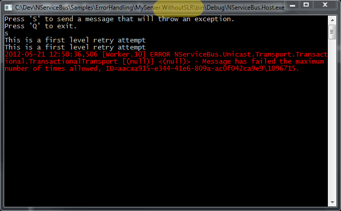

When an exception occurs, you should [let the NServiceBus infrastructure handle it](how-do-i-handle-exceptions.md) . It retries the message a configurable number of times, and if still doesn't work, sends it to the error queue.

Second Level Retries (SLR) introduces another level. When using SLR, the message that causes the exception is, as before, instantly retried, but instead of being sent to the error queue, it is sent to a retries queue.

SLR then picks up the message and defers it, by default first for 10 seconds, then 20, and lastly for 30 seconds, then returns it to the original worker queue.

For example, if there is a call to an web service in your handler, but the service goes down for five seconds just at that time. Without SLR, the message is retried instantly and sent to the error queue. With SLR, the message is instantly retried, deferred for 10 seconds, and then retried again. This way, the Web Service could be up and running, and the message is processed just fine.

## Configuration

### App.config

To configure SLR, enable its configuration section:

<!-- import SecondLevelRetiesAppConfigV5 -->

 *  Enabled:Turns the feature on and off. Default: true.
 *  TimeIncrease: A time span after which the time between retries increases. Default: 00:00:10.
 *  NumberOfRetries: Number of times SLR kicks in. Default: 3.

Fluent configuration API
------------------------

To disable the SLR feature, add this to your configuration 

### In Version 5:

<!-- import SecondLevelRetriesDisableV5 -->

### In Version 4:

<!-- import SecondLevelRetriesDisableV4 -->

### In Version 3:

<!-- import SecondLevelRetriesDisableV3 -->

## Custom Retry Policy

You can change the time between retries or the number of retries in code.

Here is a sample method for handling this behavior.

<!-- import SecondLevelRetriesCustomPolicyHandlerV4 -->

To plug this into NServiceBus use the following APIs.
### In Version 5:

<!-- import SecondLevelRetriesCustomPolicyV5 -->

### In Version 4:

<!-- import SecondLevelRetriesCustomPolicyV4 -->

### In Version 3:

<!-- import SecondLevelRetriesCustomPolicyV3 -->

Working sample
--------------

In the [ErrorHandling sample](https://github.com/Particular/NServiceBus.Msmq.Samples/tree/master/ErrorHandling) are two endpoints, one with SLR enabled and the other with it disabled.

When you run the sample, you should start them using Ctrl+F5 (start without debugging), press the letter "S" in both windows at the same time and watch the different outputs.

Both endpoints execute the same code.

 

