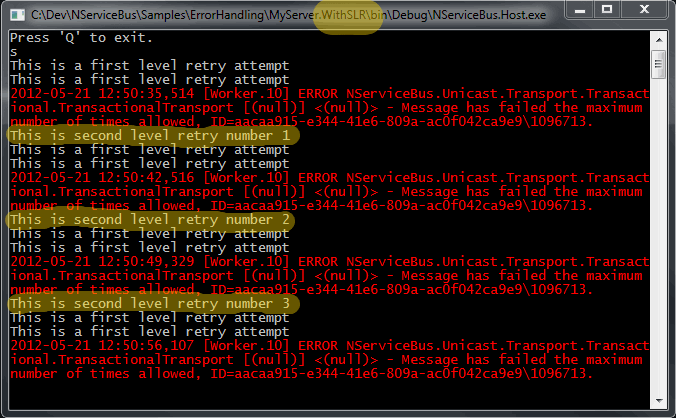

When an exception occurs, you should [let the NServiceBus infrastructure handle it](how-do-i-handle-exceptions.md) . It retries the message a configurable number of times, and if still doesn't work, sends it to the error queue.

Second Level Retries (SLR) introduces another level. When using SLR, the message that causes the exception is, as before, instantly retried, but instead of being sent to the error queue, it is sent to a retries queue.

SLR then picks up the message and defers it, by default first for 10 seconds, then 20, and lastly for 30 seconds, then returns it to the original worker queue.

For example, if there is a call to an web service in your handler, but the service goes down for five seconds just at that time. Without SLR, the message is retried instantly and sent to the error queue. With SLR, the message is instantly retried, deferred for 10 seconds, and then retried again. This way, the Web Service could be up and running, and the message is processed just fine.

Configuration
=============

App.config
----------

To configure SLR, enable its configuration section:

```XML
<configSections>
  <section name="SecondLevelRetriesConfig" 
           type="NServiceBus.Config.SecondLevelRetriesConfig, NServiceBus.Core"/>
</configSections>

<SecondLevelRetriesConfig Enabled="true" TimeIncrease="00:00:10" NumberOfRetries="3" />
```

 *  Enabled:Turns the feature on and off. Default: true.
 *  TimeIncrease: A time span after which the time between retries increases. Default: 00:00:10.
 *  NumberOfRetries: Number of times SLR kicks in. Default: 3.

Fluent configuration API
------------------------

To disable the SLR feature, add this to your configuration 

###In Version 4.0:

```C#
public class DisableSecondLevelRetries : INeedInitialization
{
	public void Init()
	{
	    Configure.Features.Disable<SecondLevelRetries>();  
	}
}

```

###In Version 3.0:

```C#
public class DisableSecondLevelRetries : INeedInitialization
{
	public void Init()
	{         
	  Configure.Instance.DisableSecondLevelRetries();
	}
}
```

Code
----

To change the time between retries or the number of retries you have a couple of different options in code.

In version 3.0, the class `SecondLevelRetries` exposed a static function called `RetryPolicy` and gives you the `TransportMessage` as an argument. .

`SecondLevelRetries` expects a `TimeSpan` from the policy, and if greater than `TimeSpan.Zero`, it defers the message using that time span.

The default policy is implemented in the class `DefaultRetryPolicy`, exposing `NumberOfRetries` and `TimeIncrease` as statics so you can easily modify the values.

In version 4.0, the type `SecondLevelRetries` (used in the `NServiceBus.Management.Retries` namespace to configure the retry and the timeout policy) has been moved to the `NServiceBus.Features` namespace. While version 3.3.x had a separate policy for managing second level retries and timeouts, this has been merged into the new `RetryPolicy` in NServiceBus 4.0 and it is capable of achieving both functions.

Working sample
--------------

In the [ErrorHandling sample](https://github.com/NServiceBus/NServiceBus/tree/master/Samples/ErrorHandling) are two endpoints, one with SLR enabled and the other with it disabled.

When you run the sample, you should start them using Ctrl+F5 (start without debugging), press the letter "S" in both windows at the same time and watch the different outputs.

Both endpoints execute the same code.

 



