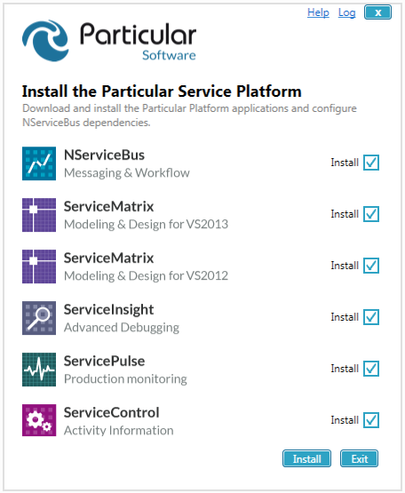

## Download

- [Clickonce download](https://s3.amazonaws.com/particular.downloads/PlatformInstaller/PlatformInstaller.application)
- [Direct setup download](https://s3.amazonaws.com/particular.downloads/PlatformInstaller/setup.exe)

NOTE: The platform Installer is recommended for use in development environments. For testing and production environments it is recommended you use the relevant Chocolatey commands, PowerShell cmdlets and NuGet packages.

## Dependencies 

* ClickOnce
* [.net 4.5](http://www.microsoft.com/en-au/download/details.aspx?id=40779) (will be installed as part of the ClickOnce deployment)
* [Chocolatey](http://chocolatey.org/) (version 0.9.8.23 or higher) 

## License Acceptance

When you first use the Platform installer you will be prompted to accept the NServiceBus License Agreement 

## Confirm Chocolatey install

If you do not already have Chocolatey installed you will be prompted to confirm

## Select items to install

You will be prompted for which items to install.

### NServiceBus

This installs the NServiceBus prerequisites and configures the machine to be compatible for usage by NServiceBus. 

 * Configures DTC for usage by NServiceBus 
 * Setup the NServiceBus Performance Counters
 * Install and configure Msmq
 * Install RavenDB

The equivalent Chocolatey commands are 

    cinst NServicebus.Dtc.install
    cinst NServicebus.PerfCounters.install
    cinst NServicebus.Msmq.install
    cinst NServiceBus.RavenDB.install

### ServiceMatrix for Visual Studio 2013

Installs the [ServiceMatrix for VS2013 Chocolatey Package](http://chocolatey.org/packages/ServiceMatrix.VS2013.install). The equivalent VSIX can be downloaded from the [ServiceMatrix Releases](https://github.com/Particular/ServiceMatrix/releases).

    cinst ServiceMatrix.VS2013.install

### ServiceMatrix for Visual Studio 2012

Installs the [ServiceMatrix for VS2012 Chocolatey Package](http://chocolatey.org/packages/ServiceMatrix.VS2012.install). The equivalent VSIX can be downloaded from the [ServiceMatrix Releases](https://github.com/Particular/ServiceMatrix/releases).

    cinst ServiceMatrix.VS2012.install

### ServiceInsight

Installs the [ServiceInsight Chocolatey Package](http://chocolatey.org/packages/ServiceInsight.install). The equivalent msi can be downloaded from the [ServiceInsight Releases](https://github.com/Particular/ServiceInsight/releases).

    cinst ServiceInsight.install

### ServicePulse

Installs the [ServicePulse Chocolatey Package](http://chocolatey.org/packages/ServicePulse.install). The equivalent msi can be downloaded from the [ServicePulse Releases](https://github.com/Particular/ServicePulse/releases).
    
    cinst ServicePulse.install

### ServiceControl

Installs the [ServiceControl Chocolatey Package](http://chocolatey.org/packages/ServiceControl.install). The equivalent msi can be downloaded from the [ServiceControl Releases](https://github.com/Particular/ServiceControl/releases).

    cinst ServiceControl.install

## MSI Information

* [MSI error messages](http://msdn.microsoft.com/en-us/library/aa376931.aspx)

## Chocolatey Information 

* [Chocolatey Google Group](https://groups.google.com/forum/#!forum/chocolatey)
* [Chocolatey Wiki](https://github.com/chocolatey/chocolatey/wiki)
* [Proxy Settings for Chocolatey](https://github.com/chocolatey/chocolatey/wiki/Proxy-Settings-for-Chocolatey)
 
### Updating Chocolatey

If you have an older version of chocolatey you can use the [chocolatey update command](https://github.com/chocolatey/chocolatey/wiki/CommandsUpdate#chocolatey-update-cup).

    c:\> chocolatey update

If that fails the recommended approach is to re-install Chocolatey using the following command

    c:\>  @powershell -NoProfile -ExecutionPolicy unrestricted -Command "iex ((new-object net.webclient).DownloadString('https://chocolatey.org/install.ps1'))" && SET PATH=%PATH%;%systemdrive%\chocolatey\bin    
See [Installing Chocolatey](https://github.com/chocolatey/chocolatey/wiki/Installation) for more info

## ClickOnce Information

* [Troubleshooting ClickOnce Deployments](http://msdn.microsoft.com/en-us/library/fb94w1t5.aspx)
* [ClickOnce forum](http://social.msdn.microsoft.com/Forums/windows/en-US/home?forum=winformssetup)

### FAQ

* If you're having issues with connectivity please see this post on how to set Chocolatey and NuGet up behind a proxy: http://escapologist.wordpress.com/2013/02/27/nuget-and-chocolatey-behind-a-proxy/
