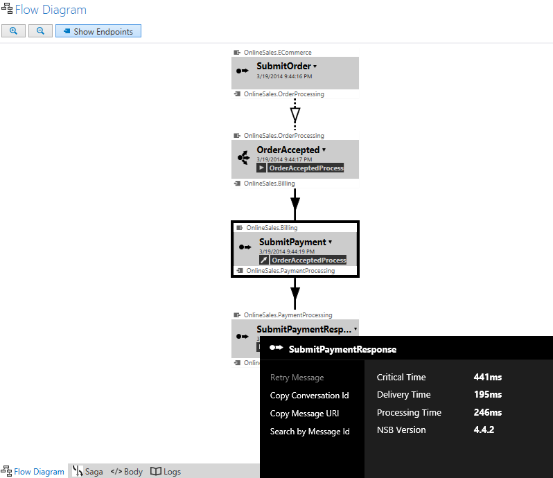
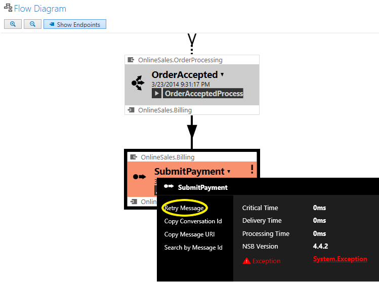

#Introduction

The [NServiceBus](../NServiceBus/overview.md "NServiceBus Overview") platform can provide your system with all the benefits of a distributed, messaged based, fault tolerant, and distributed architecture.  Visualizing and verifying the functionality of such a distributed system can be real challenge.  

From design all the way through to production, ServiceInsight lives up to its name by providing powerful insight and information about the system in a concise and user friendly way. 

Let's review some of the features and benefits...

1.  [ServiceInsight and the NServiceBus Platform](#the-nservicebus-platform "The NServiceBus Platform")
2.  [Visualizing The System](#visualizing-the-system "Visualizing your system in ServiceInsight")
3.  [The Message Window](#the-message-window "The Message Window")
4.  [Endpoint Explorer](#endpoint-explorer "Endpoint Explorer")
5.  [Flow Diagram](#flow-diagram "The graphical flow diagram")
6.  [Message Properties](#message-properties "The Message Properties Window")
7.  [Saga View](#saga-view "The Saga View")
8.  [Body and Log Views](#body-and-log-views "The Body and Log Tabs")
9.  [Errors and Retries](#errors-and-retries "Visualizing and Dealing with Errors")
10. [Next Steps](#next-steps "Next Steps")

##The NServiceBus Platform
ServiceInsight is just one of the tools created to complement NServiceBus from design all the way through IT operations.  [ServiceMatrix](../ServiceMatrix/index.md "ServiceMatrix") will accelerate the design of your system.  The audit and error aggregation power of [ServiceControl](../ServiceControl/index.md "ServiceControl") is leveraged by [ServicePulse](../ServicePulse/index.md "ServicePulse") for operational monitoring and alerting. ServiceInsight provides the detailed view of messages in their system context. From endpoints to sagas, ServiceInsight will show the relationships and data.  

#Visualizing the System
The ServiceInsight user interface provides multiple views of your distributed system.  Using information collected in ServiceControl, ServiceInsight is able enumerate your endpoints and provide detailed message and relationship data.  Platform specific tools are no longer needed thanks to the formatted view of XML, JSON and binary messages.  

A detailed visual overview of the messages collated by conversation is provided in the flow diagram.  Using this view you can see the flow in your system and which endpoints raised specific events and sent or handled messages.  The Saga view provides an singular view into the start of a saga, the timeouts and interactions. 

As you select endpoints the other views within ServiceInsight will respond and filter the information to show only messages pertaining to that endpoint. 
##The Message Window
Visibility and access to messages details is critical in a distributed NServiceBus system.  The Messages window provides a detailed grid view indicated the status of a message, type, time stamps and service level information.  The list can be filtered based on specific message content.  These searches can include all message data, not just the common fields that are displayed.    

This ability to filter and locate is very helpful at design time.  When used in conjunction with ServiceMatrix debugging, ServiceInsight will be launched automatically and will filter the messages to include only your current debug session.  Similarly, the ServicePulse monitoring platform provides the ability to open ServiceInsight to a specific message in order to drill in for more detail.

An auto-refresh feature keeps the information in ServiceInsight automatically and efficiently refreshed.  This enables a nearly real time information in all of the views provided. 

###Timing and performance

There is a lot of performance-related information in the message header. You can sort all the messages in an endpoint based on the time the messages were sent, critical time, processing time, or delivery time. This information, combined with Message Type and ID, give you an opportunity to easily locate the messages that have taken too long to process, or if a particular message occasionally takes more time to get delivered.  

This message view list has a relationship to the other panels in the user interface.  When you select specific messages the related properties window and flow diagram will change to illustrate details of the selected message. 
##Endpoint Explorer
The Endpoint Explorer indicates the connection to the ServiceControl instance providing data to ServiceInsight.  Underneath it the list clearly enumerates the endpoints contained in the system and even which machine they are deployed on.  

The message list described above is filtered based on your endpoint selection.  If you select a specific endpoint the message list will only list messages handled by that endpoint.   Selecting the root ServiceControl connection and the tree view will expand the list to include all messages.

##Flow Diagram
A picture is said to be worth 1000 words.   The flow diagram provides extensive message and system information in a single picture.
As you select messages in message list the flow diagram illustrates the message but it doesn't stop there.  All related messages from the same conversation are illustrated along with the nature of the messages and the endpoints involved.

Each message is represented by a box indicating the message type and illustrating a variety of useful details including the endpoints involved and time information.  Published events and sent commands have diferent icons and illustrations. Dropdowns provide even more message detail and convenient links to search based on this message, copy message details and even retry messages.

##Message Properties
Each message in NServiceBus contains extensive detail.  As you select messages in the flow diagram or in the list an additional Message Properties window provides a listing of all the detailed properties for the message.  Much like in Visual Studio, the properties are structured in convenient groups.

##The Saga View
Sagas play a critical role in an NServiceBus system.  As coordinators of processes they are started by certain messages and can interact with a variety of additional messages and services.  Once again, ServiceInsight provides a graphical view for sagas that provide an efficient illustration of what is happening.  By clicking on a message in the flow diagram that is handled by a saga, the view is opened.  

The saga illustrates not only how the saga was initiated, it illustrates any other messages that were sent or handled.  Detailed message data, time information, and details on saga data changes are conveniently visible. 
##Body and Log Views
Along the bottom edge of the Flow Diagram there is a a tab for Body and Logs. 
###Body View
Sometimes its nice just to have a raw view of the message data.  WIth ServiceInsight there is no need to use the MSMQ tools provided by Windows. ServiceInsight provides this view with the Body tab of the flow diagram.   It will give you a look directly at the message you have selected.  You will get both an XML and HEX view of the body.  

###Log View
ServiceInsight leverages the ServiceControl API to retrieve information.  The Log tab of the Flow Diagram window displays details of the interactions as ServiceInsight polls ServiceControl for more data. 

##Errors and Retries
Having the visibility ServiceInsight provides is especially useful when things go wrong.  NServiceBus will do it's part to provide durability and retry.  But when intervention is required, you no longer need to manually collate log files or get access to remote servers to research an error.  Thanks to the aggregated error information of ServiceControl, the views within ServiceInsight will illustrate messages will errors and bring detailed information right to you.
###Status in the Message List
The status of an errant message is illustrate in the message window.

###The Flow Diagram
In the flow diagram highlights and error in red and provides more details with convenient access to the stack trace.

After the retry features of NServiceBus have completed, the message goes to an error queue.  Instead of the return to sender console application, ServiceInsight makes retrying a message extremely easy.   Clicking `Retry Message` will send the message back to the queue it originally came from. 

##Next Steps
ServiceInsight is the way to visualize your NServiceBus system and get a detailed view of how it works.  Take some time to learn about and explore the other framework tools: [ServiceMatrix](../ServiceMatrix/index.md "ServiceMatrix"), [ServiceControl](../ServiceControl/index.md "ServiceControl") and  [ServicePulse](../ServicePulse/index.md "ServicePulse") 
