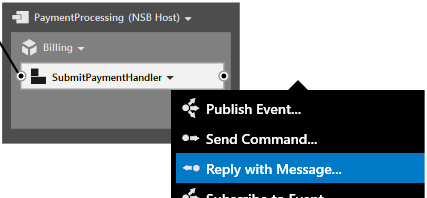
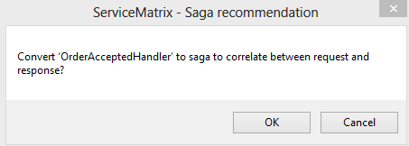

In the previous series of articles we learned about the [advantages of NServiceBus](getting-started-with-nservicebus-using-servicematrix-2.0-fault-tolerance "Fault Tolerance in NServiceBus").  We also explored two patterns: [request-response](getting-started-with-servicematrix-2.0 "ServiceMatrix Request Response ") and [publish-subscribe](getting-started-with-nservicebus-using-servicematrix-2.0-publish-subscribe.md "ServiceMatrix and PubSub"). 

Business processes usually involve multiple steps and require the coordination of multiple systems.  When dealing with this situation in a message-based and event-driven architecture, the saga pattern can be employed.  NServiceBus has built in [support for sagas](../NServiceBus/sagas-in-nservicebus.md "Saga Support in NServiceBus").  In this article, we'll introduce how Sagas are used in ServiceMatrix.

1.  Introduction to Sagas for Request-Response  
2.  Adding a Payment Processing Service
3.  


#Introduction to Sagas for Request-Response
To demonstrate a Saga we'll continue to extend our Online Sales sample.  Before we proceed, please verify that your solution has the ECommerce website, and both the OrderProcessing and Billing endpoints as shown. 


As you may recall, in our example, the ECommerce website sends the SubmitOrder message into the our OrderProcessing system.  The backend `OrderProcessing` component processes the `SubmitOrder` message and raise and `OrderAccepted` event.  The `Billing` service has subscribed to this event.

#Adding a Payment Processing Service
In an e-commerce scenario you might expect billing to involve some interaction with a payment processing gateway.  This usually involves submitting some payment information and getting a response back that includes an authorization code.  In this message based example, the billing service will use a command message to submit the payment for processing and receive back a response message asynchronously.  This type of communication is called the request-response or full-duplex pattern. 

Let's add a payment processing component to our system. 

Using the drop-down on the `OrderAcceptedProcessor` component in the `Billing` service, add new command called `SubmitPayment`.


This canvas will illustrate the new `SubmitPayment` command along with an undeployed `SubmitPaymentProcessor`.  As was done previously, use the drop-down of this component to deploy it to a [new endpoint](servicematrix-deploytopaymentprocessing.png) hosted in the NServiceBus host and name it `PaymentProcessing`.   The relationship between the Billing and PaymentProcessing endpoints should now look like this:


We've created a new `PaymentProcessing` endpoint and a new command message that billing can use to submit payments for processing.  If you view the code in the `SubmitPaymentProcessor` you will see that it simply handles the request and could be modified to invoke a a web service that processes credit cards or other payments. This web service would likely return and authorization code that would be need to be packaged in a response and sent back to the requester. 

#Correlating the Payment Response using a Saga
To send a response from the `SubmitPaymentProcessor` component, use the drop-down and select `Reply with Message`.



This reply is automatically going to be routed by to the requester which in this case is the `OrderAcceptedProcessor` component that sent the message. As you select this option you will be prompted as follows:



Choose **OK.** 

Why do we need a Saga? In our NServiceBus system we are using asynchronous messaging to communicate between services.  The OrderAcceptedProcessor sent the SubmitPayment request but doesn't wait or block for a response.  Once the payment request is processed by the payment processor, the messaging system will deliver the response message back at some point in the future and it will be handled.  However, if we want to have access to any of the related data from the original `OrderAccepted` event, the `OrderAcceptedProcessor` component must be able to store the information and make it available when handling this response.  The NServiceBus saga implementation is used for just this purpose.  It will automatically persist Saga data and make it available in your code when a correlating message is handled.  You can read much more about sagas in [this NServiceBus article.](../NServiceBus/sagas-in-nservicebus.md "Sagas in NServiceBus")

After you select  **OK** ServiceMatrix will create the `SubmitPaymentResponse` message class.  It will change the `OrderAcceptedProcessor` into a saga and create a handler for the `SubmitPaymentResponse`.  The related area of the canvas should now look like this: 


Since the `OrderAcceptedProcessor` is now a Saga, notice the icon has changed slightly. ServiceMatrix has also generated more code to support a saga implementation.  It will take care of persisting the message data from each  I has also provided some ways to safely integrate your own custom code.  Let's look at that next. 

#Modifying the Saga Code
As we've built our sample application we have created many messages using ServiceMatrix.  So far we haven't added any properties to our message classes.  While they aren't needed for the solution to work, having a few will help demonstrate the power of the NServicebus saga implementation and how to customize the code.

Compile the Visual Studio solution and open the `OrderAcceptedProcessor` code by using the drop-down menu.  The code window will open the `OrderAcceptedProcessor.cs` file which contains a partial class.  Virtual methods can be implemented in this class that allow you to customize the implementation.  These virtual methods are called by the generated code in another partial class.  

```C#
namespace OnlineSales.Billing
{
    public partial class OrderAcceptedProcessor
    {
		partial void HandleImplementation(OrderAccepted message)
        {
            // TODO: OrderAcceptedProcessor: Add code to handle the OrderAccepted message.
            Console.WriteLine("Billing received " + message.GetType().Name);
        }
	}
}
```
This class already has one virtual method for the original `OrderAccepted` event from our previous example.  We'll need to supplement this code in a few ways.  We'll modify the `SubmitPayment` request message before it is sent and also modify the handling of the `SubmitPaymentResponse`.   We'll also need to mark the saga as complete.  

##Modify the Payment Request
In our sample process, when the Billing service receives the `OrderAccepted` event the `SubmitPayment` request needs to be sent.  Luckily, by default ServiceMatrix will generate code to publish or send the outbound message when it receives an inbound messages.  A partial method is called and can be used to configure the `SubmitPayment` message before it is sent.  To make use of it, modify the partial class for the component by adding the `ConfigureSubmitPayment` partial method as shown below.  
 
```C#
 partial void ConfigureSubmitPayment(OrderAccepted incomingMessage, InternalMessages.Commands.Billing.SubmitPayment message)
        {
            /*This method gives us access to the OrderAccepted event and the SubmitPayment message before it is sent. 
			Consider adding some properties to transfer.... 
			incomingMessage.OrderID = message.OrderReferenceNumber	
			*/
		Console.WriteLine("Configuring the Submit Payment Message");

        }
```
##Adding the Response Handler
ServiceMatrix has implemented partial methods we can extend when handling the `SubmitPaymentResponse`.  Modify the partial class to include the new virtual method as shown.  

```C#
partial void HandleImplementation(InternalMessages.Billing.SubmitPaymentResponse message)
{
     //Handle the SubmitPaymentResponse
     Console.WriteLine("Billing received " + message.GetType().Name);
}
```
##Completing the Saga
The saga maintains data between calls but this persistence needs to last only until the process is over.  To end a saga and free up its resources it must be marked as complete when the final message is received.  ServiceMatrix generates code that will keep track of each message and provides convenient virtual method that can be used complete the saga by calling the `MarkAsComplete` method.  Continue modifying the `OrderAcceptedProcessor.cs` class by adding the code below:

```C#
 partial void AllMessagesReceived()
        {
            Console.WriteLine("All messages received. Completing the Saga.");
            MarkAsComplete();
        }
```
##Review the SubmitPaymentProcessor Code
 Use the drop-down on the `SubmitPaymentProcessor` component to bring up the code window. As was the case with the Saga, ServiceMatrix has generated the basic code needed for the `SubmitPaymentProcessor` to handle the `SubmitPaymen`t message and will by default send a `SubmitPaymentResponse`.  In our lets modify the response.  To do that, we must use one of the provided virtual methods just like we did in the saga above.  It will give our code a chance to access and modify the response befoer it is sent back. Change the implementation to include the virtual method below. 

```C#
namespace OnlineSales.Billing
{
    public partial class SubmitPaymentProcessor
    {
        partial void HandleImplementation(SubmitPayment message)
        {
            // TODO: SubmitPaymentProcessor: Add code to handle the SubmitPayment message.
            Console.WriteLine("Billing received " + message.GetType().Name);
        }

        partial void ConfigureSubmitPaymentResponse(SubmitPayment incomingMessage, InternalMessages.Billing.SubmitPaymentResponse response)
        {
            //This method is passed both the SubmitPayment and the SubmitPaymentResponse. 
            //It is here we could invoke a webservice to process the payment and build a response message based on the outcome.

            System.Console.WriteLine("Sending the Payment Response.");
        }
    }
}
```
#Running The Solution
Press `F5` to build and run the solution.  Arrange the consoles for OrderProcessing, Billing and the new PaymentProcessing endpoints so you can see them all simultaneously.  When the ECommerce website launches use it it send a test message.  Notice the interaction between the Billing and PaymentProcessing endpoints.  

###Billing & PaymentProcessing Endpoint Consoles


As before, the `Billing` service has received the `Orderaccepted` event and handled it in the `OrderAcceptedProcessor` component, now running as a saga.  It handles the event and sends the `SubmitPayment`command to the `SubmitPaymentProcessor` component running in the `OrderProcessing` endpoint.  The `SubmitPaymentResponse` reply is sent back to the `OrderAcceptedProcessor` saga.  Once both the `OrderAccepted` even and the `SubmitPaymentResponse` messages have been received the saga is completed.

#Summary
As we've expanded our example to invoke a `PaymentProcessing` service, 


#Leveraging ServiceInsight
[ServiceInsight](../ServiceInsight/index.md "ServiceInsight") is an additional tool in the NServiceBus framework.  It uses audit and error data and 
