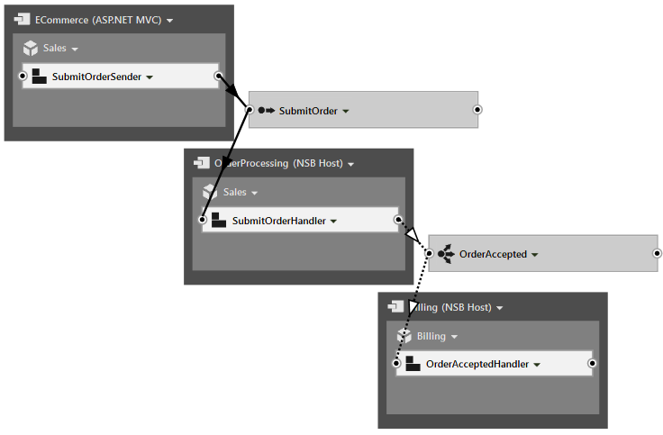
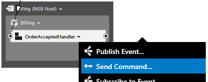

In the previous series of articles we learned about the [advantages of NServiceBus](getting-started-with-nservicebus-using-servicematrix-2.0-fault-tolerance "Fault Tolerance in NServiceBus").  We also explored two patterns: [request-response](getting-started-with-servicematrix-2.0 "ServiceMatrix Request Response ") and [publish-subscribe](getting-started-with-nservicebus-using-servicematrix-2.0-publish-subscribe.md "ServiceMatrix and PubSub"). 

Business processes usually involve multiple steps and require the coordination of multiple systems.  When dealing with this situation in a message-based and event-driven architecture, the saga pattern can be employed.  NServiceBus has built in [support for sagas](../NServiceBus/sagas-in-nservicebus.md "Saga Support in NServiceBus").  In this article, we'll introduce how Sagas are used in ServiceMatrix.

1.  Introduction to Sagas for Request-Response  
2.  Adding a Payment Processing Service
3.  

##Introduction to Sagas for Request-Response
To demonstrate a Saga we'll continue to extend our Online Sales sample.  Before we proceed, please verify that your solution has the ECommerce website, and both the OrderProcessing and Billing endpoints as shown.

As you recall in our example, the backend `OrderProcessing` component has process the `SubmitOrder` message and raise and `OrderAccepted` event.  The `Billing` service has subscribed to this event.

##Adding a Payment Processing Service
In an e-commerce scenario you might expect billing to involve some interaction with a payment processing gateway.  Let's proceed to add such an interaction to our example.

Using the drop-down on the `OrderAcceptedProcessor` component in the `Billing` service, add new command called `SubmitPayment`.

This canvas will illustrate the new `SubmitPayment` command along with an undeployed `SubmitPaymentProcessor`.  As was done previously, use the drop-down of this component to deploy it to a [new endpoint](servicematrix-deploytopaymentprocessing.png) hosted in the NServiceBus host and name it `PaymentProcessing`.   The relationship between the Billing and PaymentProcessing endpoints should now look like this:

We've created a new `PaymentProcessing` endpoint and a new command message that billing can use to submit payments for processing.  If you view the code in the `SubmitPaymentProcessor` you will see that it simply handles the request and could be modified to invoke a a web service that processes credit cards or other payments. Such a web service would likely return and authorization code that would be needed to be sent back to the requester.  Let's look at how to do that in ServiceMatrix next.  

###Correlating the Payment Response
 