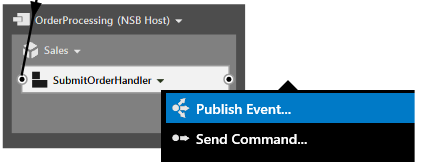
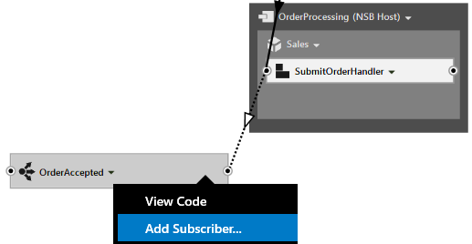

In the [previous article](getting-started-with-nservicebus-using-servicematrix-2.0-fault-tolerance.md "ServiceMatrix Fault Tolerance") introducing ServiceMatrix, you explored some of the fault tolerance features of NServiceBus. 

In this article you will expand the Online Sales system and introduce the Publish/Subscribe pattern using ServiceMatrix.  You will proceed through the following steps:

1. [Introduction to Publish/Subscribe](#introduction-to-publish-subscribe)
2. [Create the OrderAccepted Event](#create-the-orderaccepted-event)
3. [Add A Subscriber](#adding-the-subscriber)
4. [Deploy the Event Processor](#deploy-the-orderacceptedprocessor)
5. [Review the Code](#review-the-code)
6. [Build and Run the Solution](#build-and-run-the-solution)
7. [Additional Exercises](#additional-exercises)

# Introduction to Publish/Subscribe
Before you move on, please confirm that the `OnlineSales` solution you created previously is still working correctly.  Picking up where you left off, your `OnlineSales` solution ServiceMatrix Canvas should look like this:


## Expanding the OnlineSales Example
So far the [Online Sales](getting-started-with-servicematrix.md "Getting Started with ServiceMatrix") example implements the request response messaging pattern to facilitate communication between the website and your order processing system. We've all purchased items online and know that in reality many different things will need to happen when an order is accepted for processing. Arguably the most important business step should be billing the customer! In your example, consider how to add a billing capability to charge the customer for the order.
## Create the OrderAccepted Event
In your example the `SubmitOrderProcessor` component handles the `SubmitOrder` messages.  Using the drop-down menu of `SubmitOrderProcessor`, select 'Publish Event' as shown.



Name the new event `OrderAccepted`.
## Adding the Subscriber
To create a subscriber for this new event, select the dropdown of the `OrderAccepted` event and choose 'Add Subscriber' as shown here:



In the 'Add Event Subscriber' window use the 'Add new Service' text box to add a [new service called Billing](images/servicematrix-addeventsubscriber.png "New Billing Service").  You should notice that `OrderAcceptedProcessor` has been created in a new Billing Service. The dashed container indicates that the component has yet to be deployed. Also notice that the lines representing the `OrderAccepted` event messages are dashed.  This is because they are events. The `SubmitOrder' messages are commands and are illustrated with a solid line. 

. 

## Deploy the OrderAcceptedProcessor
To deploy the `OrderAcceptedProcessor` use the drop down menu and choose 'Deploy Component' as shown here:


In the resulting '[Deploy To Endpoint](images/servicematrix-deploytonewendpoint.png "Deploy to Endpoint")' window choose the 'New Endpoint' option and [create an endpoint](images/servicematrix-newbillingendpoint.png "Add Billing Endpoint") called `Billing`.

At this point with a little re-arranging your ServiceMatrix canvas should look like this:


The `SubmitOrderProcessor` raises the `OrderAccepted` event, to which `OrderAcceptedProcessor` of the `Billing` service is subscribed.

As you would expect, the ServiceMatrix [Solution Builder](images/servicematrix-pubsubsolutionbuilder.png "SolutionBuilder") reflects the new endpoint, service, component, and event you added using the ServiceMatrix canvas.  Of course the [`OnlineSales` solution](images/servicematrix-pubsubsolution.png "Visual Studio Solution") in Visual Studio has the new project for `Billing` as well as the new 'OrderAccepted' event. 
## Review the Code
ServiceMatrix generates the initial code for publishing and processing the event and both the publishing and subscribing end. 
### Event Publisher Code 
Your new event is published by the `SubmitOrderProcessor` component. Review the code by clicking the drop-down menu of `SubmitOrderProcessor` and selecting 'Open Code'.  You should see the following code: 
```C#
namespace OnlineSales.Sales
{
     public partial class SubmitOrderProcessor
    {
        partial void HandleImplementation(SubmitOrder message)
        {
       		Console.WriteLine("Sales received " + message.GetType().Name);
        }
     }
}

```
This should look familiar as it was created in the first article as part of handling the `SubmitOrder` message. Recall that this partial `SubmitOrderProcessor` class and the partial `HandleImplementation` method give you a chance to customize the message handler.  

But what about your new `OrderAccepted` event? In a similar way ServiceMatrix allows you to implement a `ConfigureOrderAccepted` partial method  to customize your new `OrderAccepted` event. To take advantage of this capability you need to add the following partial method to the partial class. (In my case, I modified the `SubmitOrder` message and the `OrderAccepted` event to have a public property and mapped them to each other.)

```C#
partial void ConfigureOrderAccepted(SubmitOrder incomingMessage, OnlineSales.Contracts.Sales.OrderAccepted message)
        { 
        
            //This is your chance to mutate or change the OrderAccepted Message. Notice that you have access to the SubmitOrder message as well so you can transfer content. 
			
			//NOTE: For this line to work, you will need to modify the SubmitOrder message to have a CustomerName and the OrderAccepted event to have a Billing name property. 
        	// message.BillingName = incomingMessage.CustomerName;
        }

```
#### Review the Generated Code 
Take a brief look at the generated code and how this customization works. Press F12 on the `SubmitOrderProcessor` class name and navigate to the code generated portion of the partial class as shown below. NOTE: Do not edit this generated portion as it is at risk of being regenerated by the ServiceMatrix platform.

```C#
namespace OnlineSales.Sales
{
    public partial class SubmitOrderProcessor : IHandleMessages<SubmitOrder>
    {
		public void Handle(SubmitOrder message)
		{
			this.HandleImplementation(message);

			var OrderAccepted = new OnlineSales.Contracts.Sales.OrderAccepted();

			ConfigureOrderAccepted(message, OrderAccepted);
			
			this.Bus.Publish(OrderAccepted);
		}

		partial void HandleImplementation(SubmitOrder message);

		partial void ConfigureOrderAccepted (SubmitOrder incomingMessage, OnlineSales.Contracts.Sales.OrderAccepted message);

		public IBus Bus { get; set; }
    }
}

```
Notice how this generated `Handle` method does the following: 

1. Invokes the `HandleImplementation` partial method, passing in the received `SubmitOrder` message.
2. Creates a new `OrderAccepted` event. 
3. Invokes the `ConfigureOrderAccepted` partial method, passing in both `SubmitOrder` and `OrderAccepted`.
4. Finally publishes the `OrderAccepted` event using a reference to the bus.

### Subscriber Code
In the `OrderAcceptedProcessor` drop-down menu select `Open Code` and you should see the following. 

```C#
namespace OnlineSales.Billing
{
    public partial class OrderAcceptedProcessor
    {
		partial void HandleImplementation(OrderAccepted message)
        {
                Console.WriteLine("Billing received " + message.GetType().Name);
        }
    }
}

```
Nothing new here!  Notice that this generated `OrderAcceptedProcessor` code is the exactly the same as was generated for the  `SubmitOrderProcessor`.
#Build and Run the Solution
Go ahead and run the solution. This time, in addition to the [sales web site](images/servicematrix-demowebsite.png "Demo Website") and [`OrderProcessing` endpoint console](images/servicematrix-reqresp-orderprocessor.png "Order Processing"), you should see another console window for `Billing`.

Send a few test messages from the website.  You should see them handled by the `OrderProcessing` console as before.  You should almost immediately see that the `Billing` endpoint has received your new `OrderAccepted` event as shown below:

  
 
##You Did It!##
Congratulations! You have created a complete working solution for communicating via publish/subscribe messaging.  

As you see, it's very easy to get started with NServiceBus and ServiceMatrix.  


##Additional Exercises

###Add a Shipping Service
Try expanding the solution on your own.  Add a `Shipping` capability.  You can add another event to publish when billing is complete. Call it `OrderBilled`. Add a subscriber in a new `Shipping` service deployed to a `Shipping` endpoint also hosted in the NServiceBus host. 

### Explore the ServiceMatrix Solution Views
The Solution Builder of ServiceMatrix provides various views into the solution you have created. Look at the [toolbar](images/servicematrix-solutionbuilder-final.png "Solution Builder Toolbar") and review some of the other buttons. In addition to the Default View represented by the hammer, note the ServiceMatrix View icon. 

Select an endpoint in the SolutionBuilder then press the 'ServiceMatrix View' icon. A new 'ServiceMatrix Details' window is displayed as shown here:


This view provides a convenient look into the properties and components of the endpoint. 
#Next Steps
To understand the licensing model for ServiceMatrix, please continue to [this article](licensing-servicematrix-v2.0.md "Licensing ServiceMatrix 2.0"). 

Learn more about the advantages of the bus architectural style and try the entire NServiceBus platform at [Particular.net](http://docs.particular.net "Particular Docs"). 
 
Get some training!
- Purchase the *Advanced Distributed Systems Design* [training video](http://particular.net/adsd "ADSD Training Video"). Presented by Udi Dahan and recorded in New York in 2013. 
- Attend the online course *Introduction to NServiceBus* by [Pluralsight.](http://pluralsight.com/training/Courses/TableOfContents/nservicebus "Pluralsight")

