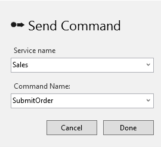
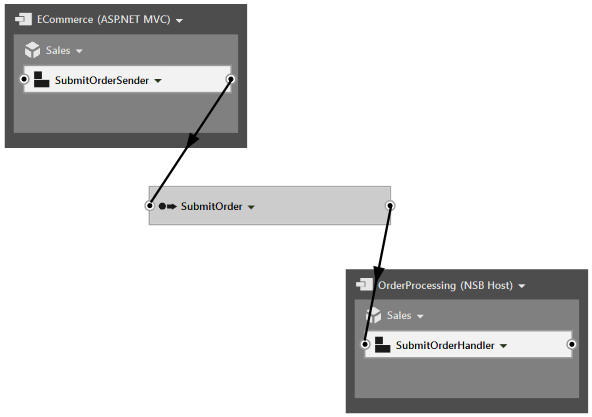
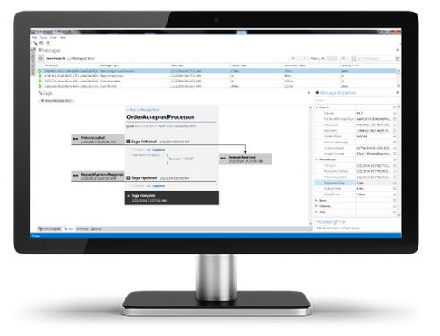

This step-by-step guide to the Particular Service Platform walks you through the creation of a send-and-receive NServiceBus distributed application using ServiceMatrix V2.X for Visual Studio 2012 & 2013, using the following steps:

1.  [Installing ServiceMatrix](#installing-servicematrix-for-visual-studio-2012)
2.  [Creating a New Project](#creating-a-new-project)
3.  [Creating Endpoints](#creating-endpoints)
4.  [Creating a Message](#creating-a-message)
5.  [Creating Services](#creating-services)
5.  [Deploying Components](#deploying-components)
6.  [Handling a Message](#handling-a-message)
6.  [Running the Application](#running-the-application)
7.  [Using ServiceInsight](#using-serviceinsight)
9.  [Next Steps](#next-steps)

The example demonstrates the integration of an online sales web store with a back-end system using the request-response pattern and NServiceBus.

## Installing ServiceMatrix for Visual Studio

ServiceMatrix is a Visual Studio integrated development environment for developing the NServiceBus distributed system.

This document reviews the use of ServiceMatrix for Visual Studio, assuming ServiceMatrix has already been installed.

ServiceMatrix can be installed using the Particular Platform Installer. To download and install ServiceMatrix separately, [follow the instructions](installing-servicematrix-2.0.md "Installing ServiceMatrix").

For this example you need to meet the following system requirements:
- Visual Studio 2012 or 2013
- ASP.NET MVC 4 ([http://www.asp.net/downloads](http://www.asp.net/downloads))

**NOTE**: If you have both Visual Studio 2010 and Visual Studio 2012/13 installed on your machine, you can install ServiceMatrix for one Visual Studio version only. This document reviews the use of ServiceMatrix V2.0 for Visual Studio 2012 or 2013.

## Creating a New Project
To get started with ServiceMatrix, create a new project.
### Create an NServiceBus project
In Visual Studio, select `File\New\Project` and select 'NServiceBus System' under the Visual C\# project type. Target the .NET Framework 4.5 for this project. 


In the Solution name, type 'OnlineSales' (or any other name) for the name of your application.
### Review The Solution
You'll see that a solution folder has been created for your solution, as shown. 


A number of projects have been created for you, as shown in the Solution Explorer pane. The `Solution Items` folder is part of the ServiceMatrix infrastructure.

Two important folders are the `Contract` and `Internal` projects as they are where all message types are placed:
-   All defined events will be put in the `Contract` project.
-   All commands will be put in the `Internal` project. 

Later you will see how messages from different services are partitioned in these projects. 

Look at the design environment. The [Solution Builder](images/servicematrix-solutionbuilder.png "Solution Builder") on the left provides a hierarchy of the logical elements of the solution. If you  don't see a docked window in Visual Studio called Solution Builder,  open it via the View menu.

You should see folders in Solution Builder called 'Infrastructure', 'Libraries', 'Endpoints', and 'Services'.
-   Infrastructure is where cross-cutting concerns like authentication and auditing are handled.
-   Libraries are units of code that can be reused, including logging and data access.
-   Endpoints are where code is deployed as executable processes. They can be MVC web applications or [NServiceBus Hosts](../NServiceBus/the-nservicebus-host.md).
-   Services are logical containers for code that provide the structure for publish/subscribe events and command-processing. 

The [NServiceBus Canvas](images/servicematrix-canvas.png "NServiceBus Canvas") is in the center of the solution as shown above.   The endpoints, services, components, and messages that comprise your solution will be created and illustrated here.

To start building your solution, use the dashed areas within the canvas and the buttons at the top. 

Alternatively, you can create them using the Solution Builder tree view.  However, since this is a visual tool, this example demonstrates on the canvas.  As you add items to the canvas they will appear in the Solution Builder as well as in the Solution Explorer project.

##Building the Online Sales Solution
This online sales example involves a website that collects online orders, and a back-end order processing system that processes them.  

To build the solution you will define and endpoint for the website and another endpoint for the order processing system.  A new 'Sales' service will define components for submitting and processing orders as well as a command message to represent the order submission.  

##Creating Endpoints
First you will create the endpoints for selling and processing.
### New Endpoint
To create an endpoint on the canvas either select the dashed 'New Endpoint' area on the canvas or the button at the top of the canvas.


Name the endpoint `ECommerce` and choose ASP.NET MVC as the endpoint host.  
**NOTE:** MVC Endpoints require that ASP.NET MVC be installed on the local machine. You can [install ASP.NET MVC from here](http://www.asp.net/downloads) or use the Web Platform Installer.

### Review the Endpoint
You will examine the generated code in detail later to understand how things work behind the scenes.  For now, notice how ServiceMatrix has created the ECommerce Endpoint on the canvas, in the Solution Builder and in the Visual Studio Project.

In the Solution Builder, notice that this endpoint has a folder to contain components.  Components contain the code for specific services.  They can only send commands to other components in the same service.  However, they can subscribe to events that are published by components in *any* service. Soon your sales components will be deployed to your endpoints.

###Create OrderProcessing Endpoint

Create another endpoint called `OrderProcessing`.  This time select 'NServiceBus Host' as the host.  

At this point your solution should have both endpoints on the NServiceBus canvas.

 

Notice how you can control the zoom with your mouse scroll wheel, and drag the boxes around. This is how you rearrange the canvas when you add more things to it.

##Creating a Message
To facilitate communication between the website and the back-end `OrderProcessing` endpoint, use a command message. Create this message using the drop-down menu of the `ECommerce` endpoint, and select `Send Command` as shown.  


##Creating Services 
As you create the new command message, you are prompted for the name of a service.  In NServiceBus a service contains components responsible for facilitating the communication between the website and order processing.  Name the new service `Sales` and the command `SubmitOrder` as shown.


  
The canvas now illustrates the new Sales service with two components.  The `SubmitOrderSender` component sends the command and is deployed to the `ECommerce` endpoint.  The `SubmitOrderHandler` component receives the command message and is shown in an 'Undeployed Components' box.  


##Deploying Components

You cannot build the solution with components that are not deployed.  If you try to build at this point you will get an error indicating that the `Sales.SubmitOrderHandler` must be allocated to an endpoint.  Deploy the `SubmitOrderHandler` component using its drop-down menu and the `Deploy Component` option.  When prompted, deploy the component to the `OrderProcessing` endpoint.


At this point, with a little reorganizing, the canvas should illustrate the `ECommerce` and `OrderProcessing` endpoints using the `Sales` service components to send and process the `SubmitOrder` command.



By deploying these components to each endpoint, the `Sales` service affords your systems the capability to easily communicate reliably and durably, using a command message containing the data for the submitted order.  

In addition to illustrating them in the canvas, the [Solution Builder](images/servicematrix-solutionbuilder-salesservice.png "Solution Builder With Sales") now shows the `SubmitOrder` command in the commands folder.  It also illustrates the components and the fact they send and process the `SubmitOrder` command accordingly. You can also see code that has been generated in the Visual Studio project.

##Review the Message
The `SubmitOrder` command is a simple message meant to communicate the order between your endpoints.  To view the generated class file, click the drop-down menu of the `SubmitOrder` command and select View Code [as shown](images/servicematrix-submitorderviewcode.png "View SubmitOrder Code"). This is a very simple C# class.  You can add all sorts of properties to your message to represent the order data: strings, integers, arrays, dictionaries, etc. Just make sure to provide both a get accessor and a set mutator for each property. 

```C#
namespace OnlineSales.Internal.Commands.Sales
{
    public class SubmitOrder
    {
		//Put your properties in the class.
		//public string CustomerName { get; set; }
    }
}
```

##Handling a Message

Now build the solution and see how everything turns out.  Look at the `SubmitOrderHandler` code by selecting its drop-down menu and choosing 'View Code'.  As you can see below, there is not much there.  A partial class has been created where you can add your order processing logic. 
```C#
namespace OnlineSales.Sales
{
    public partial class SubmitOrderHandler
    {
        partial void HandleImplementation(SubmitOrder message)
        {
            // TODO: SubmitOrderHandler: Add code to handle the SubmitOrder message.
            Console.WriteLine("Sales received " + message.GetType().Name);
        }
    }
}
```
You can locate the ServiceMatrix-generated partial class counterpart in the `OnlineSales.OrderProcessing` project and the `Infrastructure\Sales` folder. There is not much to see; just a class that implements `IHandleMessages<submitorder>` and has a reference to `IBus` that you can use from within your partial class to send out other messages, publish events, or to reply to commands.  The partial method `HandleImplementation(message)` is a call to the implementation above.  To learn more about the way to use the generated code, see [Using ServiceMatrix Generated Code](customizing-extending.md "Using ServiceMatrix Generated Code").  
    
```C#
namespace OnlineSales.Sales
{
    public partial class SubmitOrderHandler : IHandleMessages<SubmitOrder>
    {
		public void Handle(SubmitOrder message)
		{
			// Handle message on partial class
			this.HandleImplementation(message);
		}

		partial void HandleImplementation(SubmitOrder message);
        public IBus Bus { get; set; }
    }
}

```

##Sending a Message 
Lastly, review how the 'ECommerce' website sends a message.  When ServiceMatrix generated the MVC endpoint, it created a demonstration site already capable of sending the commands created using the tool.

### Review MVC Code
Find the `TestMessagesController.generated.cs` file in the Controllers folder in the OnlineSales.ECommerce project.  ServiceMatrix generates this file as part of the MVC application. Notice the `SubmitOrderSender.Send` method that sends the command message `SubmitOrder`.  This method was generated in a different partial class file located in the `Infrastructure\Sales\SubmitOrderSender.cs` file.  

```C#
namespace OnlineSales.ECommerce.Controllers
{
    public partial class TestMessagesController : Controller
    {
        // GET: /TestMessages/

        public ActionResult Index()
        {
            return View();
        }

        // POST: /TestMessages/SendMessageSubmitOrder
          
        public ISubmitOrderSender SubmitOrderSender { get; set; }
          
        [HttpPost]
        public ActionResult SendMessageSubmitOrder(SubmitOrder SubmitOrder)
        {
            ConfigureSubmitOrder(SubmitOrder);
            SubmitOrderSender.Send(SubmitOrder);

            ViewBag.MessageSent = "SubmitOrder";

            return View("Index");
        }
        partial void ConfigureSubmitOrder(SubmitOrder message);
    }
}
```  
This is a demonstration site that provides an initial reference application in MVC.  Any modifications to this file will be overwritten by subsequent regeneration of the demonstration site.  To accomodate your changes, before the `SubmitOrderSender.Send` is called, the code invokes a partial method called `ConfigureSubmitOrder` that accepts your `SubmitOrder` message as a parameter.  You can implement this in the `SubmitOrderSender.cs` file in the `\Sales` directory of the `OnlinesSales.ECommerce` project, as shown in the following code snippet:  

```C#
namespace OnlineSales.Sales
{
    public partial class SubmitOrderSender
    {
        //You can add the partial method to change the submit order message.
        partial void ConfigureSubmitOrder(SubmitOrder message)
        {
            message.CustomerName="John Doe";
        }
    }
}
```

##Running the Application

Now press `F5` or press the 'Play' button in Visual Studio to debug the application. You should see both the eCommerce website launched in your default browser and a console window for the NServiceBus host that is running your OrderProcessing endpoint.  

### eCommerce Website
The ECommerce website generated by ServiceMatrix should look like the image below.


Notice the 'Try NServiceBus' box and the 'Test Messages' button on the right side.  When you click the button another page opens with a button to publish the `SubmitOrder` to the bus as shown.


To send the `SubmitOrder` message just click the word 'Send!'. Go ahead and click to send a few times.

### Order Processing

Since you selected the NServiceBus host for your OrderProcessing endpoint it is launched as a console application for convenient development.  Your console window should look like this.


As you click the Send button in the website, you will see the console indicate that the `OrderProcessing` endpoint has received the messages.

##Using ServiceInsight
By default, when you run a ServiceMatrix project, [ServiceInsight](../ServiceInsight/index.md "ServiceInsight") is launched.  ServiceInsight is another Particular Service Platform application that provides a detailed runtime view of your solution.  It will illustrate and enumerate the messages, endpoints and data in your solution as you create an debug it.  To understand how to use ServiceInsight to complement ServiceMatrix please see [this article on that topic](servicematrix-serviceinsight.md "Using ServiceInsight and ServiceMatrix").  



### Congratulations!
You've just built your first NServiceBus application. Wasn't that easy?

## Next Steps
We mentioned that [ServiceInsight](../ServiceInsight/index.md "ServiceInsight") can be a valuable tool in the design process and where to [learn more about it](servicematrix-serviceinsight.md).  For runtime monitoring of an NServiceBus solution, the platform also includes [ServicePulse](../ServicePulse/index.md "ServicePulse for Monitoring").  

In this article you saw how to use ServiceMatrix to connect a front end website and a backend processing system using NServiceBus. 

What's so exciting about that?  After all inter-process communication has been done many times before. 

One answer is ***fault tolerance***.  Next, you can explore the fault tolerance and durability features NServiceBus offers.

Continue with a review of the fault tolerance in the [next article](getting-started-with-nservicebus-using-servicematrix-2.0-fault-tolerance.md "Getting Started with Fault Tolerance").  
