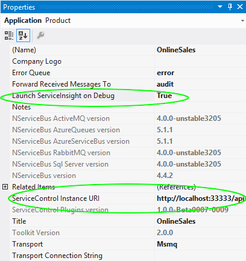
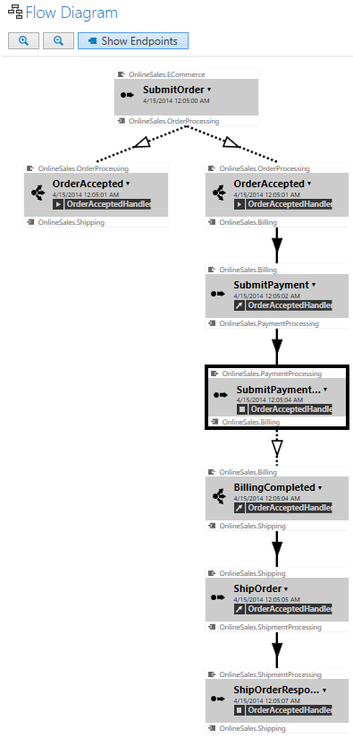

ServiceMatrix dramatically accelerates the creation of NServiceBus systems using a graphical design tool that is integrated into the Visual Studio environment.  

ServiceInsight provides the ability to visualize the behavior of your system at runtime (whether in a debug and test environment or a production environment). This visualization includes message and endpoints interactions, Saga and long running processes, performance data and more.

Combining the ServiceMatrix design-time visualization, and the ServiceInsight runtime visualizations, provides a comprehensive and easy to understand view of your system behavior, and the effect of your development decisions on the system's at runtime. 

The integration and interaction features of ServiceMatrix and ServiceInsight increase the overall development speed of a system by creating a quick and intuitive feedback loop between designing the system and writing the code (with ServiceMatrix within Visual Studio), and then, by simply clicking F5 to launch a debug session in Visual Studio, launch ServiceInsight and view in real near-time how the design behaves in runtime.

Let's see how it works.

1. [Setting Up ServiceInsight Integration](#setting-up-serviceinsight-debugging "Service Insight Debugging Setup")
2. [How Debugging Works](#how-debugging-works "How Debugging Works")
2. [Launching ServiceInsight](#launching-serviceinsight "Launching ServiceInsight")
3. [Next Steps](#next-steps "Next Steps")

# Setting Up ServiceInsight Integration

ServiceMatrix is configured to integrate with ServiceInsight through the Application Properties of the  solution. To review them, open the Solution Builder window, right click the root application in the tree, and select properties.

Two key properties are highlighted below:

To set things up for debugging, ServiceMatrix not only needs to launch ServiceInsight, but also must locate and integrate with [ServiceControl](/ServiceControl). ServiceControl aggregates log and error information from the Errors and Audit queues of your system. It also provides the data and query ability necessary for ServiceInsight to access the message data. 

Turn on the automatic launch of ServiceInsight using the property shown.  By default, ServiceMatrix uses the Windows registry to determine the location of the ServiceControl but you can change this property for your specific situation as required. 

# How Debugging Works

### Debugging Metadata

When debugging a ServiceMatrix solution, an new assembly is added to your project. If you look at your project references in the Solution Explorer, you will see that your projects have a reference to the `ServiceControl.Plugin.DebugSession` assembly (or `ServiceControl.Plugin.Nsb5.DebugSession`).  This assembly is a [ServiceControl Endpoint Plugin](../ServiceControl/Plugins.md "ServiceControl Endpoint Plugins") for debugging. 
This debug assembly is loaded by NServiceBus and adds a specific debug session ID to the header of each message.  When ServiceInsight is launched, it uses this ID to filter the results to only the messages for your debug session. 

# Launching ServiceInsight

When you launch your ServiceMatrix solution in the Visual Studio debugger, ServiceInsight launches and delivers the debug session ID needed for searching. For more details about invoking ServiceInsight, refer to the article on [ServiceInsight Application Invocation](/ServiceInsight/application-invocation.md "Invoking ServiceInsight").  The image below shows the search window of ServiceInsight populated with the filter that uses the debug session ID.

### Auto-Refresh

When launched, the ServiceInsight system efficiently polls ServiceControl for message data. Auto-refresh allows ServiceInsight to populate with your debug information and provide near real-time insights to your system. The polling period is configurable via the Options menu in ServiceInsight with the default value set to two seconds.   

## Visualizing your Solution

As you run ServiceInsight during your debug session, you can see the messages arriving in the message window. Simultaneously, ServiceInsight dynamically illustrates the relationship between the messages in the Flow Diagram, as shown.

ServiceInsight provides information including message data, a detailed saga view, and a complete endpoint list.

# Next Steps

The debug integration of ServiceInsight and ServiceMatrix delivers the power of ServiceInsight to your design process. To learn more about ServiceInsight, refer to the articles [here](/ServiceInsight).
