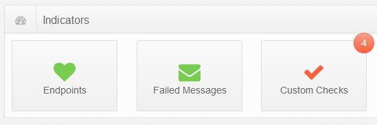
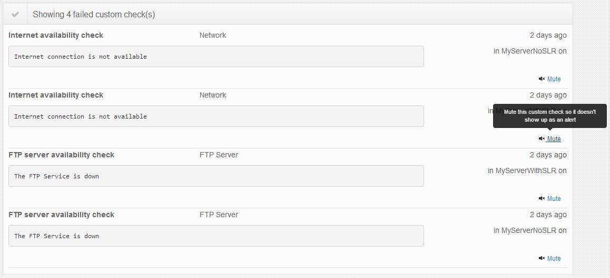

ServicePulse monitors the health and activity of NServiceBus endpoints using heartbeat messages and activity indications (see [Introduction to Endpoints and Heartbeats in ServicePulse](http://docs.particular.net/ServicePulse/intro-endpoints-heartbeats)).

However, an endpoint and its hosting process may be fully functional (in the sense that it and its hosting process are able to send, receive and process messages) but required external conditions may not be met, and required services that the endpoint's business logic relies on may be malfunctioning. As a result, the endpoint's may not be able function as expected.

These external conditions and services are specific for each solution and/or endpoint. ServicePulse CustomChecks can be programmed to monitor for such failures by developing a Custom and Periodic Checks: customized logic that verifies that these conditions are met, that all services your endpoint and solution rely on are functioning as expected, and alerts whenever they are not.

### Common Scenarios

While the specific needs and dependencies of solutions and endpoints vary significantly from one to the other, there are common scenarios of required external conditions and services.

#### Connectivity

Most endpoints require connectivity to local intranet or external internet. Some also require VPN connectivity. 

It is recommended that you identify and periodically check that the endpoint (and its host) can indeed connect to the resources it requires. 

**Examples:**

* In a store & forward pattern (MSMQ): can an endpoint hosted on one machine connect to another machine, on which another endpoints is located ?
* In a Broker pattern: can the endpoint connect to the broker ? (e.g. SQL Server) 
* If required by the endpoint, can the endpoint connect to the local intranet ?
* If required by the endpoint, can the endpoint connect to the internet ?  
* If required by the endpoint, can the endpoint connect with the required security settings, credentials and VPN software ?  

#### Storage

* When local or remote storage is required by the endpoint, is that storage location available, accessible and properly configured (security, permissions, quota etc.)
* When local or remote storage is required by the endpoint, is there enough available storage left for required operations ? If there is a requirement for a minimum free space available - is that requirement met ?

#### External Services

* When an endpoint needs to communicate with external services (credit card validation, identity and authentication service, CRM etc.), is that service available, accessible and responsive ? 

### Custom Checks in ServicePulse

#### Custom Checks Indicator

The custom checks indicator in the ServicePulse Dashboard indicates when one or more custom checks fails. The number of failed Custom Checks is presented in the upper right corner of the indicator, and a descriptive event is displayed in the Recent Events list.

For example, in the image above, the number 4 indicates there are 4 failing custom checks. These custom checks may be all located on the same endpoint or on 4 separate endpoints. Use the Custom Checks details page to to drill-down into the details of the failures and their location. 

#### Custom Checks details page

Clicking on the custom checks indicator in the ServicePulse Dashboard, or on the related link in the navigation bar, provides a detailed display of the currently failed and failing custom checks, per endpoint.

As you can see, there are 4 failing custom checks, located on 2 endpoints (2 failures per endpoint). 

If one or more of the failures is expected (for examples, it may be caused by a planned maintenance activity that brought down an external service the endpoint relies on), you can Mute the specific occurrence of the custom check.

Muting a custom check means that the specific custom check failure event is discarded. If an additional failure occurs later (for example, when the custom check is defined to run periodically), a new failure event will be raised.    
 
### Getting Started with Custom Checks

* [How to Develop Custom Checks for ServicePulse](/ServicePulse/how-to-develop-custom-checks)
* [How to configure endpoints for monitoring by ServicePulse](/ServicePulse/how-to-configure-endpoints-for-monitoring)
* [ServiceControl Custom Checks Plugin](/ServiceControl/Plugins#servicecontrol-plugin-customchecks)
