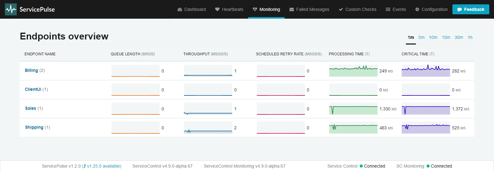
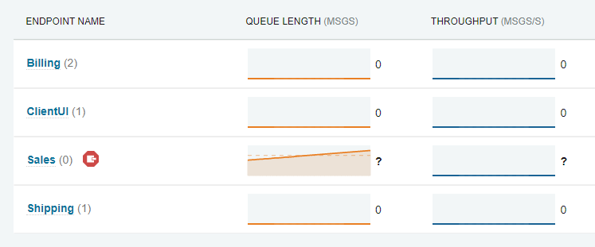
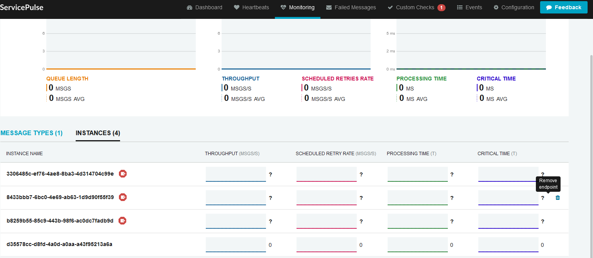

ServicePulse collects and displays performance monitoring data about running endpoints on the Monitoring tab.

NOTE: ServicePulse will only display the monitoring tab if it is configured to point to a ServiceControl monitoring instance.

The monitoring tab shows a list of logical endpoints as well as the performance data collected about those endpoints. If a logical endpoint is running more than one physical instance, a badge will show a count of physical instances.

Clicking on an endpoint in the monitoring tab will open the endpoint details page.

The endpoint details page shows larger graphs for each of the performance metrics gathered for the logical endpoint. It also contains several breakdown views.

The default breakdown view is by Message Type which shows performance metrics for each type of message that the endpoint processes

The second breakdown view is by instance. Each logical endpoint can be running one or more physical instances. This view shows a breakdown of performance metrics for each physical instance.

NOTE: Each physical instance should be configured with its own instance id, which is shown here. See [Installing the plugin](install-plugin.md) for more information about instance ids.

## Reporting period

The monitoring tab and the endpoint details page both contain an option to change the reporting period.

All graphs present the data collected during this reporting period. Where an average is shown, it is the average over the selected reporting period.

NOTE: The screen is refreshed more frequently when a shorter reporting period is selected.

## Data retention

All performance metric data is retained in memory in the ServiceControl Monitoring instance. Restarting the ServiceControl Monitoring instance will cause all performance metric data to be lost.

Performance metric data is only kept by the ServiceControl Monitoring instance long enough to support the most prolonged reporting period (1 hour).

## Disconnected endpoints

If an endpoint instance stops sending metric data, it will appear with a warning indicator.

This warning indicator will show in the instances break down on the endpoint details page for each instance that is not sending metric data.

### Removing disconnected endpoints

If the endpoint instance should be removed from the set of instances for a logical endpoint, it can be removed by hovering over the stale instance and then clicking the "Remove endpoint" icon.

This removes the endpoint instance from the list of tracked endpoint instances for that logical endpoint.

## Endpoints with failed messages

If ServicePulse is aware of failed messages to be processed by an endpoint, it will show a badge indicating how many failed messages there are.

Click this badge to review the failed messages for this endpoint. See [Failed Message Monitoring](/servicepulse/intro-failed-messages.md) for more details.
