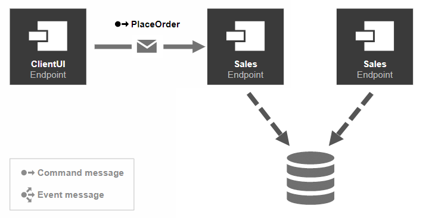
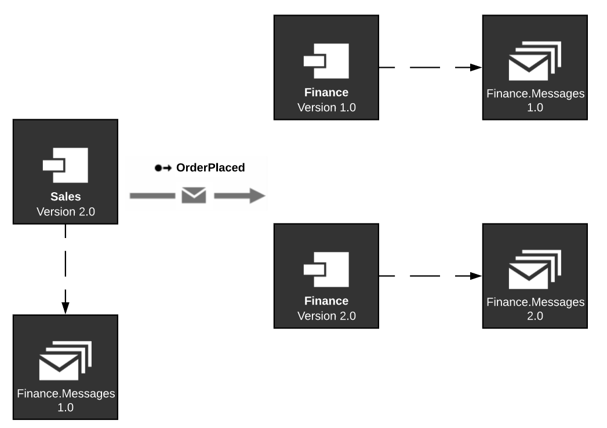

This page describes how to scale out endpoints using NServiceBus. There are several reasons to scale out, such as to achieve higher message throughput, or to provide high availability.

It is important to distinguish between a logical endpoint and an endpoint instance. Review the documentation on [logical endpoints](/nservicebus/endpoints/) for more details.

There are several ways to scale out with NServiceBus:

- [Splitting message handlers](#splitting-message-handlers)
- [Scaling out to different nodes](#scaling-out-to-different-nodes)
- [High availability](#high-availability)

## Splitting message handlers

If message throughput is an issue, the first method to consider is splitting up [message handlers](/nservicebus/handlers/) and [sagas](/nservicebus/sagas/) over multiple logical endpoints.

One message type might take considerably longer to process than other message types. The faster processing messages might suffer in throughput because of the slower processing messages. A good way to monitor and detect this is by using [ServicePulse's monitoring capabilities](/monitoring/metrics/in-servicepulse.md).

Separating slower messages from faster messages leads to higher throughput for the faster messages. For this reason it can be beneficial to include messages and/or handlers in separate assemblies, making it easier to separate them from others.

## Scaling out to different nodes

An endpoint can reach maximum message throughput when resources (for example, the CPU or hard drive I/O) are completely utilized. In these cases it can be beneficial to scale out an endpoint to different nodes.

However, a centralized datastore like SQL Server can also be a bottleneck. It should be noted that scaling out an endpoint to a different node, one that accesses the same SQL Server, will not be beneficial to message throughput. On the contrary, the performance of the centralized datastore will only suffer more.

### Competing consumers

The easiest way to scale out is with [brokered transports](/transports/types.md#broker-transports), as those can make use of the *[competing consumer pattern](https://www.enterpriseintegrationpatterns.com/patterns/messaging/CompetingConsumers.html)*. This is done by deploying multiple instances of an endpoint that will all start processing messages from the same queue. When a message is delivered, any of the endpoint instances could potentially process it. The NServiceBus transport will try to ensure that only one instance will actually process the message. Be aware of [the need for idempotency](/nservicebus/azure/ways-to-live-without-transactions.md#the-need-for-idempotency).

The image below shows the component `ClientUI` sending a command message to the logical endpoint `Sales`. But with messaging, the message is actually sent to the `Sales` queue. With two consumers competing for the `Sales` endpoint, both could potentially process the incoming message.

### Sender-side distribution

Because of the federated nature of queues with MSMQ, with scaled out endpoints across different nodes, each node has its own physical queue. This makes it impossible to apply the *competing consumer pattern*. For this reason NServiceBus supports two options to scale out MSMQ endpoints across nodes.

- [Sender Side Distribution](/transports/msmq/sender-side-distribution.md)
- [Distributor](/transports/msmq/distributor)

Both have their advantages and disadvantages which can be found in the documentation.

## High availability

Though not discussed here, there are many ways to achieve high availability for endpoints using infrastructure with either on-premise or cloud-based solutions. However, a different reason to try to achieve high availability is to make sure an endpoint continues to process messages while upgrading it to a newer version of either the endpoint itself or its messages. For more information on how to do message versioning, see [this sample](/samples/versioning/).

Upgrading an endpoint without stopping message processing, can be accomplished by also using the *competing consumer pattern*, without necessarily deploying multiple endpoint instances to different nodes. In order words, this can even be achieved by deploying two endpoint instances on the same node.

The following image explains the process.

Execute the following steps to upgrade an endpoint without downtime:

1. The `Sales` endpoint has a reference to version 1 of the message assembly `Finance.Messages`.
2. Take down one endpoint instance of `Finance` and upgrade it to version 2 of the message assembly `Finance.Messages`. During this time, `Sales` can continue sending messages and the running endpoint instance for `Finance` can continue processing them.
3. Bring the upgraded version of `Finance` back up so it can start processing version 1 messages.
4. Take down the still-running version 1 of `Finance` and upgrade it as well to version 2 of `Finance.Messages`
5. Update `Sales` to also have message assembly `Finance.Messages` version 2.
