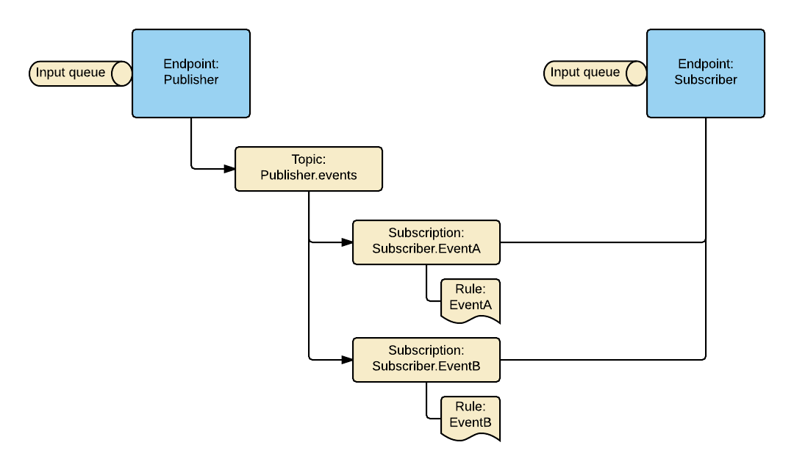

Messaging topology is a specific arrangement of the messaging entities, such as queues, topics, subscriptions, and rules.

Azure Service Bus transport operates on a topology created on the broker. Topology handles exchanging messages between endpoints, by creating and configuring Azure Service Bus entities.

## Versions 7 and above

The following topologies are available:

 1. `EndpointOrientedTopology`
 1. `ForwardingTopology`

The `EndpointOrientedTopology` is backward compatible with the Azure Service Bus transport Version 6 and below.

The `ForwardingTopology` was introduced to take advantage of the broker nature of the Azure Service Bus and to leverage its native capabilities. It is the recommended option for new projects.

NOTE: Although the ForwardingTopology is recommended it is currently not compatible with ServiceControl.

Both topologies create a single input queue per endpoint and implement [Publish-Subscribe](/nservicebus/messaging/publish-subscribe/) mechanism. However, there is a significant difference in the way that mechanism is implemented.

No default topology is set by the Azure Service Bus transport. Topology has to be explicitly configured using [configuration API](/nservicebus/azure-service-bus/configuration/full.md).

### Endpoint Oriented Topology

In the `EndpointOrientedTopology` each publishing endpoint creates a topic called `<publishing_endpoint_name>.events`. The subscribing endpoints subscribe to the topic, by creating a subscription for a particular event type called `<subscriber_endpoint_name>.<event_type_name>`. Note that each subscription has a single rule, used to filter a specific event type.

When a publisher raises an event, it is published to the publisher topic. Then the subscription entities filter events using the associated rules. Finally, the subscriber endpoint pulls events for processing.

The example below demonstrates a publisher called `Publisher` and a subscriber called `Subscriber`. `Publisher` can raise two events, `EventA` and `EventB`. The `Subscriber` subscribes to both events and two subscription entities are created, one per event type. Each subscription entity filters out events using a rule associated with the subscription.

The `EndpointOrientedTopology` topology has several drawbacks:

 1. In order to subscribe to an event, the subscriber must know the publishing endpoint's name, causing coupling between publisher and subscriber. Refer to the [Publisher names configuration](/nservicebus/azure-service-bus/publisher-names-configuration.md) article for more details.
 1. Multiple subscription entities per subscriber cause polymorphic events to be delivered multiple times to the subscribing endpoint. A [workaround](/samples/azure/polymorphic-events-asb/) has to be implemented in order to handle polymorphic events correctly.
 1. When a single subscriber is offline for an extended period of time and events are not consumed, it can cause event overflow. Since a single topic per publisher is used for all the subscribers, when event overflow is happening it will affect all subscribers and not just the one that is offline.

### Forwarding Topology

The `ForwardingTopology` is designed to take advantage of several native broker features offered by the Azure Service Bus. Unlike `EndpointOrientedTopology`, it doesn't work with a single topic per publisher. All publishers use a single topic bundle.

Subscriptions are created under topic bundle with one subscription entity per subscribing endpoint. Each subscription contains multiple rules; there's one rule per event type that the subscribing endpoint is interested in. This enables a complete decoupling between publishers and subscribers. All messages received by subscription are forwarded to the input queue of the subscriber.

This topology solves the polymorphic events and the event overflow problems that the `EndpointOrientedTopology` has.

#### Quotas and limitations

The `ForwardingTopology` supports up to 2,000 endpoints with up to 2,000 events in total. Since multiple rules per subscriptions are used, topics cannot be partitioned.

#### Topologies comparison

|                                             | EndpointOrientedTopology  | ForwardingTopology |
|---------------------------------------------|---------------------------|--------------------|
| Decoupled Publishers / Subscribers          | no                        | yes                |
| Polymorphic events support                  | no                        | yes                |
| Event overflow protections                  | no                        | yes                |
| Subscriber auto-scaling based on queue size | no                        | yes                |
| Reduced number of connections to the broker | no                        | yes                |

## Versions 6 and below

The Azure Service Bus transport has always supported a single default topology out-of-the-box. It is equivalent to the `EndpointOrientedTopology` introduced in Version 7.
