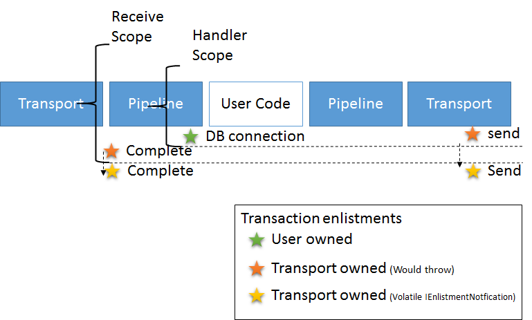

NServiceBus relies on transaction scopes to control how it behaves when it comes to transactions, message dispatching and commit/rollback guarantees. 

The architecture is schematically represented in the diagram:

The Azure Service Bus SDK, which is used in the Azure Service Bus transport, has a few requirements regarding using it from inside a transaction scope:

 * It requires the use of the `Serializable` isolation level, therefore Azure Service Bus transport will always use it. For more information refer to the [Transaction Isolation Levels Explained in Details](http://www.dotnetspeak.com/data/transaction-isolation-levels-explained-in-details/) article. 
 * It does not allow using another transactional resource, e.g. a database connection, within the same transaction scope and will throw an exception in such situation.
 * It does not allow performing send operations on different messaging entities in the same transaction and will throw an exception in such situation.

In order to address the limitations mentioned above, i.e. to allow using transactions in user's code within the handler and performing send operations on different messaging entities in the same transaction, the Azure Service Bus transport creates a transaction scope that is independent from transaction scope wrapping the handler. The two scopes are isolated from each other. They are synchronized using an implementation of `IEnlistmentNotification` for both the send and completion operations. The synchronization is schematically represented by the arrow from orange to yellow stars in the diagram.

The downside of this approach is that each transport operation, such as sending a message, is individual. Even though they are executed at the same moment in a transaction, there is a slight chance that one of the operations fails, while the others do not. This problem is mitigated by using multiple layers of retry behavior, therefore a short interruption in connectivity or broker outage will not have a significant impact and operations will eventually succeed. However a full outage right after the database transaction committed could lead to a send operation that did not execute. In such situation the business data could have been written, but outbound messages would not be sent out.

NOTE: The maximum guarantee that the transport can deliver in these versions is in effect `ReceiveOnly`.

NOTE: Enabling/Disabling DTC will have no effect, this setting is ignored either way as Azure Service Bus does not support it.

WARNING: Disabling transactions will also turn off the `PeekLock` mechanism, so that the transport immediately completes any incoming message before processing and shows no retry behavior.