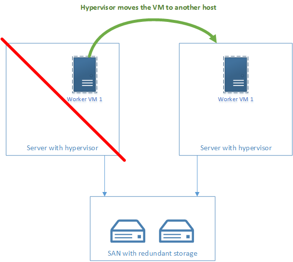

As shown in [How the Distributor works](/nservicebus/msmq/distributor/#how-the-distributor-works), a worker checks in for work with the distributor by sending a register message to it. From that moment the worker will start receiving messages from the distributor.

If a worker goes down, messages can get stuck in the distributor or the worker.

### The messages stored in the distributor outgoing queues

The distributor forwards the message to the worker and relies on the store and forward messaging provided by MSMQ to make sure that it gets there. The message is stored in a outgoing queue and processed when the worker returns to working order.

### The messages that are already in the worker when the worker breaks

The solution to a "broken worker" or a "worker node's hard disk going up in smoke" is virtualization, where worker nodes run in a virtual machine whose image is stored redundantly in a SAN. That way any messages stored locally in the worker node end up physically stored in the image on the SAN. So if the host machine fails, the hypervisor then brings up the virtual machine that went down on a different host machine and all the messages are then processed.

