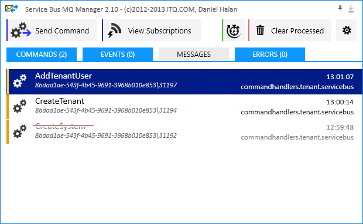

### Visual Studio

The queues on the local machine can be listed using Server Explorer in Visual Studio:

If there is a message in one of the queues, select it and view the properties of the message in the property panel in Visual Studio (usually on the bottom right):

The most interesting property is the BodyStream as it allows the contents of the message to be seen:

### Windows native tools

The MSMQ MMC snap-in can be used to manage queues.

Use one of the following based on the OS

    Start > Run > compmgmt.msc (Computer Management) > Features > Message Queuing

or

    Start > Run > compmgmt.msc (Computer Management) > Services and Applications > Message Queuing.

### Queue Explorer

Queue Explorer is a commercial 3rd party product for managing MSMQ.

http://www.cogin.com/mq/

> QueueExplorer can do much more than with built-in management console - copy, move or delete messages, save and load, stress test, view and edit full message bodies (with special support for .Net serialized objects), and much more. And it works with remote queues too!

### Mqueue Viewer

Fast and free tool to manage MSMQ messages and queues.

http://www.mqueue.net/

> Mqueue Viewer - is a fast and simple tool to manage MSMQ queues, view, edit, add, delete messages. Works with multiple machines/servers. Most importantly - it's completely free!

### Service Bus MQ Manager

A free application to view and manage MSMQ messages.

https://github.com/danielHalan/ServiceBusMQManager

