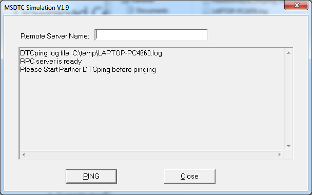
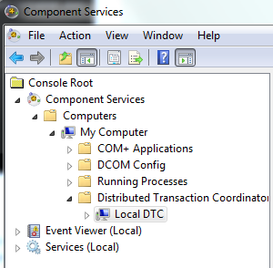
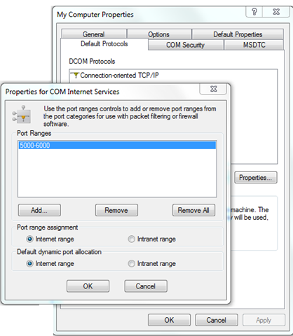
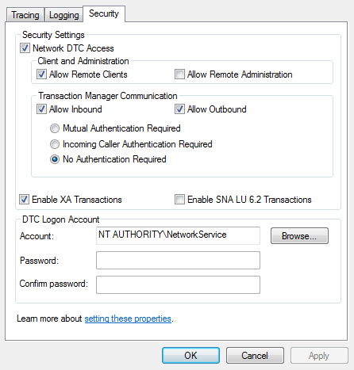
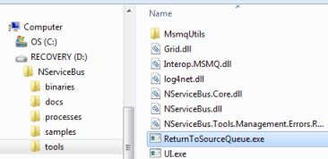

As a part of the NServiceBus "Fault-Tolerant by Default" design, the infrastructure manages transactions automatically so you don't have to remember the configuration of all threading and state management elements.

## Clients and servers

Ideally, server code processes messages transactionally, but it often isn't required for clients, particularly desktop applications. This is one of the differences between the `AsA_Client` and `AsA_Server` settings of the [generic host](/nservicebus/hosting/nservicebus-host/) in NServiceBus.

## Specifying transactions in code

If you aren't using the generic host, you can specify whether the current endpoint should process messages transactionally by setting the `.IsTransactional(true)` after `.MsmqTransport()` (in version 3) or `.UseTransport<Msmq>()` (in version 4).

To override the System.Transactions default timeout of 10 minutes, follow the steps described in [this blog post](http://blogs.msdn.com/b/ajit/archive/2008/06/18/override-the-system-transactions-default-timeout-of-10-minutes-in-the-code.aspx).

## Distributed Transaction Coordinator

In Windows, there is an OS-level service called the DTC that manages transactions needing to span multiple resources, like queues and databases. This service isn't always configured correctly and may require troubleshooting. Download a tool called
[DTCPing](http://www.microsoft.com/en-us/download/details.aspx?id=2868) to help you discover if one machine can access a remote machine over the DTC. The tool looks like this.

If you get an error referring to the RPC Endpoint Mapper, at the command prompt, run `dcomcnfg`. You should see the Component Services screen below.

Open some ports by right clicking "My Computer" and going to the "Default Protocols" tab. From there, select "Connection-oriented TCP/IP" and click the "Properties" button. In the "Properties for COM Internet Services" dialog, check that the Port Ranges includes "5000-6000", as shown:

If the list of Port Ranges is empty, click the "Add..." button and enter
"5000-6000" in the dialog box. Your screen should look like the image above. You can probably make do with less than 1000 open ports, but it depends on the number of machines to connect to each other over the DTC.

After clicking OK and returning to the Component Services screen, navigate to the "Local DTC" node under the Distributed Transaction Coordinator folder, right click, and select "Properties". In the dialog that opens, select the Security tab, as shown:

Ensure that the properties you see are the same as those above and restart the computer.

If DTCPing isn't working, check that the needed ports are open in the firewall. Consider removing the DTC exceptions in the firewall and add them again to make sure.

If DTCPing gives you a message about finding the name but not reaching it, do a simple ping by running "ping computername" in the command prompt. If the machine cannot be reached by ping, it could be that you have a DNS problem that may require your network administrator's help.

Make sure you perform all the steps not just on the servers that connect to the database, but also on the database servers as well.

Finally, check the TCP ports in use on the servers, making sure that each has a different port configured as the communication is bi-directional. At this point, you should be able to run transactional NServiceBus endpoints.

## Message processing loop

Messages are processed in NServiceBus as follows:

1.  The queue is peeked to see if there's a message.
2.  If so, a distributed transaction is started.
3.  The queue is contacted again to receive a message. This is because multiple threads may have peeked the same message. The queue makes sure only one thread actually gets a given message.
4.  If the thread is able to get it, NServiceBus tries to deserialize the message. If this fails, the message moves to the configured error queue and the transaction commits.
5.  After a successful deserialization, NServiceBus invokes all infrastructure and applicative message modules and handlers. An exception in this step causes the transaction to roll back and the message to return to the input queue.

    -   This happens the "MaxRetries" [configurable](/nservicebus/msmq/transportconfig.md#maxretries) number of times.
    -   After that, the message passes to the [Second Level Retries (SLR).](/nservicebus/errors/automatic-retries.md)
    -   If after SLR the error still occurs, the message will be moved to the configured error queue.

In this manner, even under all kinds of failure conditions like the application server restarting in the middle of a message or a database deadlock, messages are not lost.

The automatic retry mechanism is usually able to recover from most temporary problems. When that isn't possible, the message is passed to the [SLR](/nservicebus/errors/automatic-retries.md) to decide what to do next.

## Resolving more permanent errors

In situations where more permanent errors affect systems, despite their diversity, the NServiceBus solution is the same. Before describing it, let's see examples of some of these situations:

-   The database is down.
-   An external or internal web service is down.
-   The system was upgraded accidentally, breaking backwards compatibility.

In all of the above, administrative action is needed, from things as simple as bringing up a database or web service again, to more complex actions like reverting to the previous version of the system.

SLRs also aids in the [resolution of more permanent errors](/nservicebus/errors/automatic-retries.md).

There is nothing necessarily wrong with the message itself. It might contain valuable information that shouldn't get lost under these conditions. Therefore, after the administrator finishes resolving the issue, they should return the message to the queue it came from. Luckily, NServiceBus comes with a tool that does exactly that.

## ReturnToSourceQueue.exe

You can find this tool in the "Tools" directory in your NServiceBus download.

Administrators provide the name of the error queue they'd like to use, and either specify a specific message ID to return to its source queue, or 'all' to return all messages in the given error queue each to its respective source queue.

