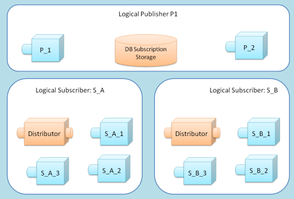
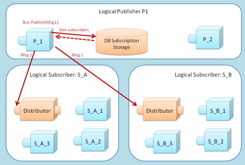
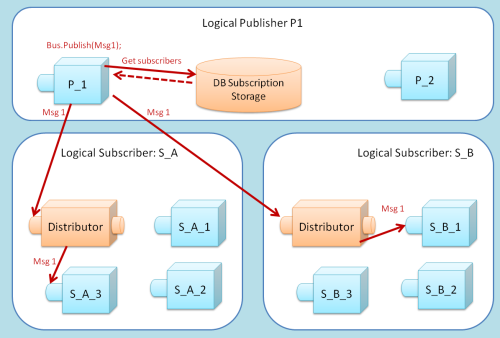

When using the Distributor in a full publish-subscribe deployment, you see is a Distributor within each subscriber balancing the load of events being published.

## Example Topology 

Given one logical publisher P1, and two logical subscribers SA and SB. Each has a number of physical nodes (colored in blue) and some NServiceBus infrastructure (colored in orange). For now, we're going to assume that both SA and SB are already subscribed, each specifying the left port of its distributor as its public endpoint.

## When a publish occurs

When a node in the logical publisher P1 goes to publish a message, here's what happens:

## What the distributor does

All the Distributor does at this point is forward the message it receives to another node.

You can think of the Distributor as something like a load balancer. It distributes the received messages to a number of other machines. This kind of physical one-to-many communication is needed for scaling out the number of machines running for a given subscriber, but doesn't actually entail any pub/sub. Each subscriber gets its own Distributor and each of them decides independently to which machine it passes its messages.

## Multiple publishers

It doesn't matter which node in the publisher is publishing a message, the same process happens.

