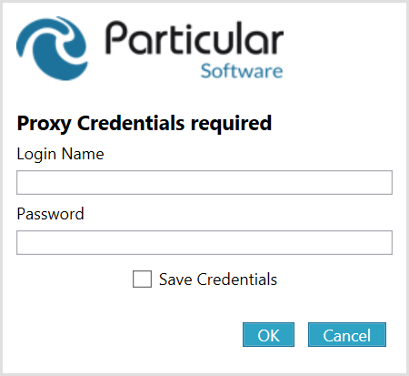

## Overview

The Platform Installer (PI) is recommended for use on development machines only.

This is primarily because

 * PI does not provide a choice of transport (Microsoft Message Queue is assumed).
 * PI requires Internet access which may not be available in a production environment.
 * The PI `setup.exe` will fail on Windows servers were `IE Enhanced Security Configuration` is enabled

[Download the PI](http://particular.net/start-platform-download).

For testing and production environments it is recommended to:

 * Use the [NServiceBus Powershell Module](/nservicebus/operations/management-using-powershell.md) to install the prerequisite components required.
 * Download and run the individual installers from the [download](http://particular.net/downloads) page rather than install via the PI.


## What to expect

The PI is a Microsoft Click-Once application which means it has a built in self-updating mechanism. Click once applications are sometimes blocked by corporate firewalls or software restriction policies. If the PI fails review the [Offline Install](offline.md) page for installation instructions.


### Dependencies

The Click-Once `setup.exe` will install [.Net 4.5.2](https://www.microsoft.com/en-us/download/details.aspx?id=42643) if required and with then bootstrap the PI Application


### License Acceptance

Before proceeding with product selection the PI will prompt to accept the NServiceBus License Agreement.


### Proxy Credentials

The PI requires Internet access to download individual packages. If non-windows integrated proxy authentication is required then a credentials dialog will be show.



This dialog offers to save credentials for future use.
If the Save Credentials option is chosen the credentials will be encrypted and stored in the registry at `HKEY_CURRENT_USER\Software\Particular\PlatformInstaller\Credentials` for use in subsequent launches of the PI. 


## Select items to install

The PI will prompt for which items to install. Individual components can be selected how for installation or upgrade. If the latest version of a product is installed that item will be disabled as there is no installation or upgrade action required. Similarly if the PI cannot communicate with the version information feed it will also disable product selection.


#### NServiceBus

This installs the NServiceBus prerequisites and configures the machine to be compatible for usage by NServiceBus.
This step does the following:

 * Configures Microsoft Distributed Transaction Coordinator for usage by NServiceBus.
 * Adds the NServiceBus Performance Counters.
 * Installs and configures Microsoft Message Queue (MSMQ) service.

There is no harm in running these on multiple times. Each run will check the state of Microsoft Message Queue service, the Distributed Transaction Coordinator service and the Performance Counters and adjust settings or start services as required. In some case the prerequisites may prompt for a restart to complete a change.

Note: The NServiceBus prerequisites do not have a version number and do not toggle to a disabled state after installation.


#### ServiceInsight

Installs the ServiceInsight Package. This MSI can be downloaded directly from here: [ServiceInsight Releases](https://github.com/Particular/ServiceInsight/releases/latest).


#### ServicePulse

Installs the ServicePulse Package. This MSI can be downloaded directly from here: [ServicePulse Releases](https://github.com/Particular/ServicePulse/releases/latest).


#### ServiceControl

Installs the ServiceControl Package. This MSI can be downloaded directly from here: [ServiceControl Releases](https://github.com/Particular/ServiceControl/releases/latest).


## Troubleshooting


### Downloads

The PI caches the downloaded MSI files in `%temp%\Particular\PlatformInstaller`. These files are download directly from GitHub. Some corporate firewalls prevent the downloading of executable files via content filters or by white/black listing specific web sites. If the PI cannot download the individual applications consult with the network administration staff.


### Logs

The PI logs activity in `%appdata%\PlatformInstaller`. The current log file will be  named according to the current date. For example a log created on the 25 January 2016 would result in the filename `log-20160125.txt`.


### MSI Logs

The command line options used for the MSI installations ensure that a detailed log file is produced for each installation. These files are also co-located with the cached installers in `%temp%\Temp\Particular\PlatformInstaller`.

An installation or upgrade of a product will overwrite any existing MSI log for that product.

MSI provide detailed error information via error codes. This MSDN article details [MSI error messages](https://msdn.microsoft.com/en-us/library/aa376931.aspx) which can assist in fault finding installation issues.


### Click-Once

As mentioned above in some circumstances Click-Once can be problematic. The following links provide some useful tips on troubleshooting issues with Click-Once.

 * [Click-Once Deployment](https://msdn.microsoft.com/en-us/library/t71a733d.aspx)
 * [Troubleshooting Click-Once Deployments](https://msdn.microsoft.com/en-us/library/fb94w1t5.aspx)


### Click-once and Enhanced Security on Windows Server 2012 R2

Error shown:
```
An error occurred trying to download 'https://s3.amazonaws.com/particular.downloads/PlatformInstaller/PlatformInstaller.application'.

See the setup log file located at 'C:\Users\ADMINI~1\AppData\Local\Temp\VSD9C86.tmp\install.log' for more information.
```

Log file content:
```
URLDownloadToCacheFile failed with HRESULT '-2146697208'
Error: An error occurred trying to download 'https://s3.amazonaws.com/particular.downloads/PlatformInstaller/PlatformInstaller.application'.
```

Resolve this by (temporarily) disabling IE Enhanced Security.


## Chocolatey

Early versions of the PI relied on [Chocolatey](https://chocolatey.org) to deploy and update products.

The current PI no longer has this dependency. If Chocolatey was installed solely to accommodate the PI then it can be [safely removed](https://github.com/chocolatey/choco/wiki/Uninstallation).