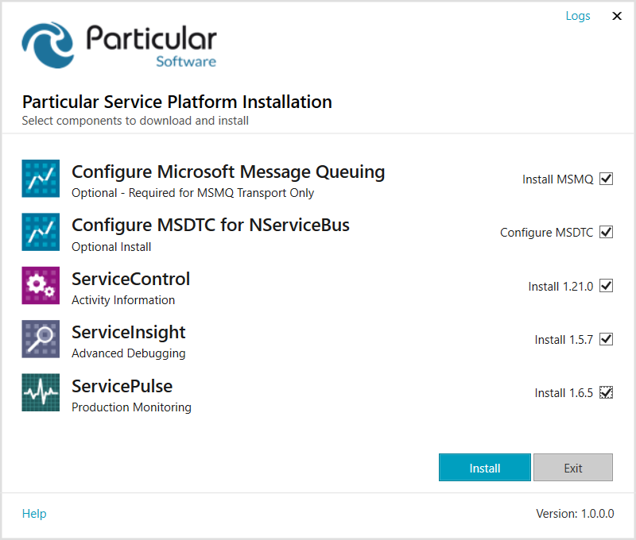

## Overview

The Platform Installer is recommended for use on development machines only.  This is primarily because

- Platform Installer does not provide a choice of transport (Microsoft Message Queue is assumed).
- Platform Installer requires Internet access which may not be available in a production environment.

The Platform Installer can be downloaded by clicking on the download now option on the Particular Downloads page
    
For testing and production environments it is recommended to: 

- use the [NServiceBus Powershell Module](/nservicebus/operations/management-using-powershell.md) to install the prerequisite components you require. 
- Download and run the individual installers from the [download](http://www.particular.net/downloads) page rather than install via the Platform Installer

## What to expect 

The Platform Installer is a Microsoft Click-Once application which means it has a built in self-updating mechanism.  Click  once applications are sometimes blocked by corporate firewalls or software restriction policies. If you cannot run the platform installer please review the [Offline Install](offline.md). page for installation instructions.

### Dependencies

The Click-Once setup.exe will install [.Net 4.5](http://www.microsoft.com/en-au/download/details.aspx?id=40779)  if required and with then bootstrap the Platform Installer 
Application 

### License Acceptance

Before you can proceed with product selection the Platform Installer you will be prompted to accept the NServiceBus License Agreement.  

    
### Proxy Credentials

Platform Installer requires Internet access to download individual packages. If non-windows integrated proxy authentication is required then a credentials dialog will be show. 

This dialog offers to save credentials for future use. 
If the Save Credentials option is chosen the credentials will be encrypted and stored in the registry at `HKEY_CURRENT_USER\Software\Particular\PlatformInstaller\Credentials` for use in subsequent launches of the Platform Installer.  

## Select items to install

You will be prompted for which items to install. Individual components can be selected how for installation or upgrade. If the latest version of a product is installed that item will be disabled as there is no installation or upgrade action required.  Similarly if the Platform installer cannot communicate with the version information feed it will also disable product selection.      

#### NServiceBus

This installs the NServiceBus prerequisites and configures the machine to be compatible for usage by NServiceBus. 
This step does the following:

 * Configures Microsoft Distributed Transaction Coordinator for usage by NServiceBus 
 * Adds the NServiceBus Performance Counters
 * Installs and configures Microsoft Message Queue (MSMQ) service

There is no harm in running these on multiple times. Each run will check the state of Microsoft Message Queue service, the Distributed Transaction Coordinator service and the Performance Counters and adjust settings or start services as required. In some case the prerequisites may prompt for a restart to complete a change.

Note: The NServiceBus prerequisites do not have a version number and do not toggle to a disabled state after installation.

#### ServiceMatrix for Visual Studio 2013

Installs the ServiceMatrix for Visual Studio 2013 Package. This VSIX can be downloaded directly from here: [ServiceMatrix Releases](https://github.com/Particular/ServiceMatrix/releases).  The file name for the Visual Studio 2013 version is `Particular.ServiceMatrix.12.0.vsix`.

#### ServiceMatrix for Visual Studio 2012

Installs the ServiceMatrix for Visual Studio 2012. This VSIX can be downloaded directly from here: [ServiceMatrix Releases](https://github.com/Particular/ServiceMatrix/releases). The file name for the Visual Studio 2012 version is `Particular.ServiceMatrix.11.0.vsix`.

 
#### ServiceInsight

Installs the ServiceInsight Package.  This MSI can be downloaded directly from here: [ServiceInsight Releases](https://github.com/Particular/ServiceInsight/releases/latest).

#### ServicePulse

Installs the ServicePulse Package. This MSI can be downloaded directly from here: [ServicePulse Releases](https://github.com/Particular/ServicePulse/releases/latest).
    

### ServiceControl

Installs the ServiceControl Package. This MSI can be downloaded directly from here: [ServiceControl Releases](https://github.com/Particular/ServiceControl/releases/latest).

## TroubleShooting

### Downloads 

The Platform Installer caches the downloaded MSI and VSIX files in `%temp%\Temp\Particular\PlatformInstaller`.  These files are download directly from GitHub.  Some corporate firewalls prevent the downloading of executable files via content filters or by white/black listing specific web sites. If the Platform Installer cannot download the individual applications please consult with your network administration staff.  

### MSI Logs

The command line options used for the MSI  installations ensure that a detailed log file is produced for each installation.  These files are also co-located with the cached installers in `%temp%\Temp\Particular\PlatformInstaller`.
An installation or upgrade of a product will overwrite any existing MSI log for that product. 

MSI provide detailed error information via error codes.  This MSDN article details [MSI error messages](https://msdn.microsoft.com/en-us/library/aa376931.aspx) which can assist in fault finding installation issues. 

### VSIX Installer Logs

VSIX files are installed using the VSIX installer that ships with Visual Studio Professional (or greater).  The `VSIXInstaller.exe` creates log file in `%temp%`,  these log files use the following naming convention: `VSIXInstaller_<Random GUID>.log`. A typical log file name would be: `VSIXInstaller_06fb7e74-5b5a-490e-af27-3396433f3bea.log`.

Unfortunately Microsoft does not provide a mechanism for setting the logging location or file name. If a VSIX installation fails the Platform Installer will try to indicate the correct VSIXInstaller log file to examine.  

### Click-Once 

As mentioned above in some circumstances Click-Once can be problematic.  The following links provide some useful tips on troubleshooting issues with Click-Once.

* [Troubleshooting Click-Once Deployments](https://msdn.microsoft.com/en-us/library/fb94w1t5.aspx)
* [Click-Once forum](https://social.msdn.microsoft.com/Forums/windows/en-US/home?forum=winformssetup)

## Chocolatey   

Early version of the Platform Installer relied on [Chocolatey](http://chocolatey.org) to deploy and update products.

The current Platform installer no longer has this dependency.  If you installed Chocolatey solely to accommodate the Platform Installer then you can safely remove it by following these [instructions](https://github.com/chocolatey/choco/wiki/Uninstallation)

Note: While Platform Installer no longer uses Chocolatey this does not mean that Particular will discontinue publishing updates via the  platform Chocolatey. We understand some user would prefer to install there packages this way and we will continue to make the Chocolatey packages available.  

