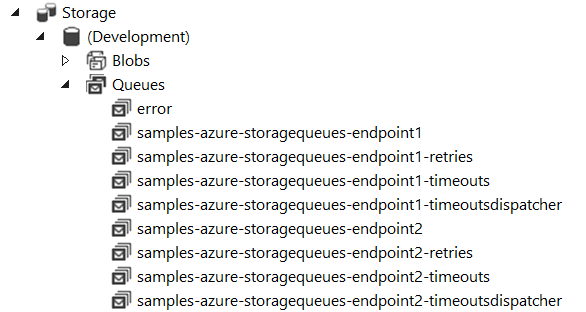

## Prerequisites

Ensure you have an instance of the [Azure Storage Emulator](https://azure.microsoft.com/en-us/documentation/articles/storage-use-emulator/) running.


## Azure Storage Queues Transport

This sample utilizes the [Azure Storage Queues Transport](/nservicebus/azure/azure-storage-queues-transport.md).


## Code walk-through

This sample shows a simple two endpoint scenario.

* `Endpoint1` sends a `Message1` message to `Endpoint2`
* `Endpoint2` replies to `Endpoint1` with a `Message2`.


### Azure Storage configuration

The `Server` endpoint is configured to use the Azure Storage persistence in two locations.


#### The endpoint configuration

snippet:Config


#### The app.config

Note the use of `UseDevelopmentStorage` to point to the Azure Storage Emulator.

snippet:AppConfig


## The Data in Azure Storage

The queues for the two endpoints can be seen in the [Server Explorer](https://msdn.microsoft.com/en-us/library/azure/ff683677.aspx) of Visual Studio.




### Reading the data using code

There are several helper methods in `AzureHelper.cs` in the `StorageReader` projects. These helpers are used to output the data seen below.


#### Writing Queue Messages

This helper peeks the first message from a given queue and writes out the contents of that message.

snippet:WriteOutQueue


#### Using the helper

snippet:UsingHelpers


### The Message Data

If you run only `Endpoint1` and send a messages you can see the contents of the message in the `samples-azure-storagequeues-endpoint2` queue.


### CloudQueueMessage contents

```
{
  "IdForCorrelation": null,
  "Id": "bb6ec79c-984f-4d51-8dd6-a50e010564a5",
  "MessageIntent": 1,
  "ReplyToAddress": "Samples.Azure.StorageQueues.Endpoint1@UseDevelopmentStorage=true",
  "TimeToBeReceived": "10675199.02:48:05.4775807",
  "Headers": {
    "NServiceBus.MessageId": "bb6ec79c-984f-4d51-8dd6-a50e010564a5",
    "NServiceBus.CorrelationId": "bb6ec79c-984f-4d51-8dd6-a50e010564a5",
    "NServiceBus.MessageIntent": "Send",
    "NServiceBus.Version": "5.2.5",
    "NServiceBus.TimeSent": "2015-09-09 05:51:42:197915 Z",
    "NServiceBus.ContentType": "application/json",
    "NServiceBus.EnclosedMessageTypes": "Message1, Shared, Version=0.0.0.0, Culture=neutral, PublicKeyToken=null",
    "NServiceBus.ConversationId": "a496f0ce-a3c8-4f30-9598-a50e010564a5",
    "NServiceBus.OriginatingMachine": "RETINA",
    "NServiceBus.OriginatingEndpoint": "Samples.Azure.StorageQueues.Endpoint1",
    "$.diagnostics.originating.hostid": "658a1d15fed47c77cd63a3e63da15cc6"
  },
  "Body": "77u/eyJQcm9wZXJ0eSI6IkhlbGxvIGZyb20gRW5kcG9pbnQxIn0=",
  "CorrelationId": "bb6ec79c-984f-4d51-8dd6-a50e010564a5",
  "Recoverable": true
}
```


#### Decoded Body

Note that above there is a encoded `Body` property. Decoding this message will produce the following.

```
{"Property":"Hello from Endpoint1"}

```
