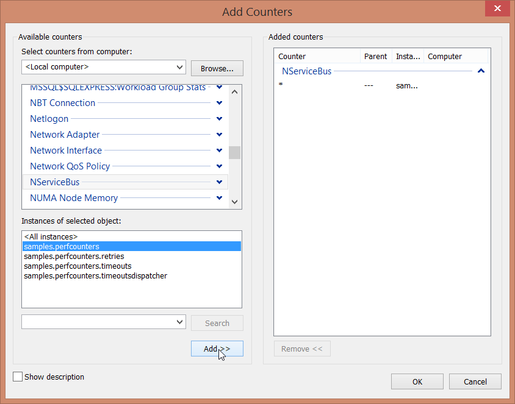
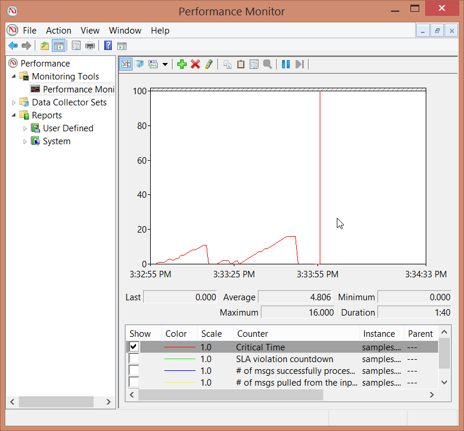
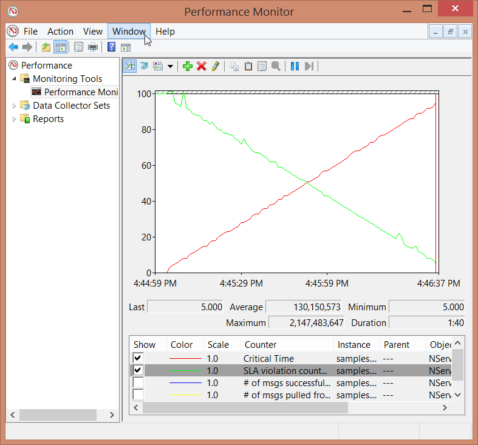
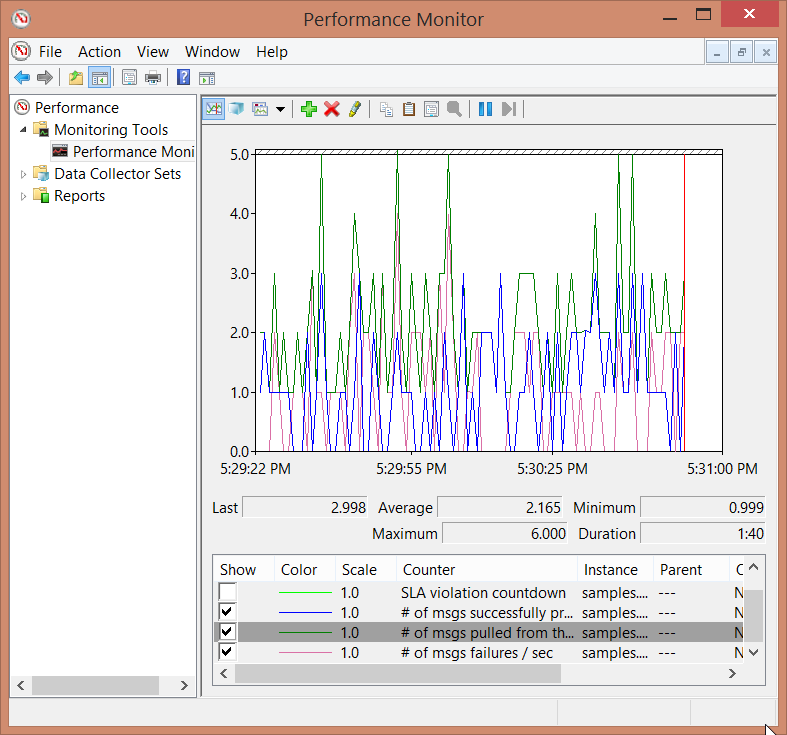

## Install Counters

Use the [NServiceBus Powershell Commands](/nservicebus/operations/management-using-powershell.md) to install the performance counters.

```
Import-Module NServiceBus.PowerShell
Install-NServiceBusPerformanceCounters
```

To list the installed counters use

```
Get-Counter -ListSet NServiceBus | Select-Object -ExpandProperty Counter
```

The following will result

```
\NServiceBus(*)\Critical Time
\NServiceBus(*)\SLA violation countdown
\NServiceBus(*)\# of msgs successfully processed / sec
\NServiceBus(*)\# of msgs pulled from the input queue /sec
\NServiceBus(*)\# of msgs failures / sec
```

## Enabling Counters For The Endpoint

Both the SLA and Critical time are enabled and configured in configuration code.

snippet:enable-counters

The other counters are enabled by default.


## The Handler

The handler just has a random sleep to give achieve some fake load. Not that the max random number is greater than the above configured SLA to cause it to occasionally fire.

snippet:handler


## Run Solution

Run the solution so that the Performance Counter instances are registered.


## Add Counters in Performance Monitor

 1. Start [Windows Performance Monitor](https://technet.microsoft.com/en-au/library/cc749249.aspx).
 1. Clear the default counters.
 1. Add the NServiceBus Counters




## Send Messages

You can now send any number of messages and watch the effect on the specific Performance Counters.

The sending code is in `Program.cs` is set to send 10 messages at a time.


## Performance Counters Analysis


### Critical Time

Continually send more messages and the load on the endpoint increases. This will eventually result the queue becoming back-logged. Messages will spend longer in the queue resulting in a gradually increasing Critical Time. Stop sending messages and eventually the endpoint will catch up and the Critical Time will drop back to 0.




### SLA Violation Countdown

The SLA Violation Countdown is the number of seconds left until the SLA for the particular endpoint is breached. So effectively SLA Violation Countdown is an inverse counter. Continually send message and the Critical Time will increase while the SLA Violation Countdown decreased.

 


### Other counters

NOTE: Only available in Version 4 and above

To visualize both success and failures in the same view change the handler code to the following.

```
int sleepTime = random.Next(1, 1000);
Thread.Sleep(sleepTime);
if (sleepTime%2 != 0)
{
    throw new Exception();
}
logger.InfoFormat("Hello from MyHandler. Slept for {0}ms", sleepTime);
```

Run the end point and send some messages and monitor the results of all those performance counters.

 