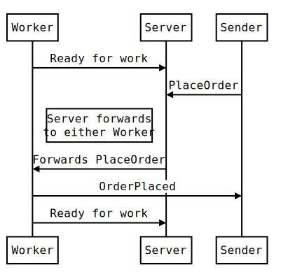

Sometimes a single endpoint for handling messages is not enough so there is a need to scale out. The following sample demonstrates how easy it is to use NServiceBus to scale out your existing message processing by adding more workers on different machines.


## Code walk-through

There are several projects in the solution.


### Sender

A simple project that sends a message to `Server` and handles the message back from the `Worker`.


#### Sending code

<!-- import sender -->


#### Handling code


<!-- import sender-event-handler -->


### Shared

Common message definitions shared between all projects.


### Worker.Handlers

A library for sharing handlers between workers.

Contains one handler.

<!-- import WorkerHandler -->  

WARNING: If you are doing publish from a handler inside a worker then all workers mush share the same [subscription persistence](/nservicebus/persistence/).


### Server

A host for the distributor

<!-- import server -->  


### Worker1 and Worker2

The works are simply host for running the handlers defined in `Worker.Handlers`


#### Startup code

<!-- import Workerstartup -->


#### Configuration
 
<!-- import workerConfig --> 

The Node in the MasterNodeConfig points to the host name where the MasterNode is running. If running the Worker from the same machine as the Distributor, Node should equal "localhost".


## Running the code

Start the solution with all the console applications (`Server`, `Sender`, `Worker1`, `Worker2`) as startup applications.

Go to the `Sender` console an press enter a few times. When this occurs the following happens

 * `Worker`s registers with `Server` that they are work
 * Press enter in `Sender` will trigger it to send a `PlaceOrder` to `Server`
 * `Server` forwards to a random `Worker`
 * `Worker` handles the message
 * `Worker` responds with a `OrderPlaced` to `Sender`
 * `Worker` again tells `Server` it is ready for work
  
<!-- 
https://bramp.github.io/js-sequence-diagrams/
Worker->Server: Ready for work
Sender->Server: PlaceOrder
Note left of Server: Server forwards\nto either Worker
Server->Worker: Forwards PlaceOrder
Worker->Sender: OrderPlaced
Worker->Server: Ready for work
-->
 



### Sender Output

```
Press 'Enter' to send a message.
Press any other key to exit.

Sent PlacedOrder command with order id [1320cfdc-f5cc-42a7-9157-251756694069].
Received OrderPlaced. OrderId: 1320cfdc-f5cc-42a7-9157-251756694069. Worker: Worker2

Sent PlacedOrder command with order id [40585dff-3749-4db1-b21a-25694468f042].
Received OrderPlaced. OrderId: 40585dff-3749-4db1-b21a-25694468f042. Worker: Worker1
```


### Server Output

```
Press any key to exit
2015-08-21 17:07:19.775 INFO  NServiceBus.Distributor.MSMQ.MsmqWorkerAvailabilityManager Worker at 'Sample.Scaleout.Worker2@RETINA' has been registered with 1 capacity.
2015-08-21 17:07:19.802 INFO  NServiceBus.Distributor.MSMQ.MsmqWorkerAvailabilityManager Worker at 'Sample.Scaleout.Worker1@RETINA' has been registered with 1 capacity.
```


### Worker1 Output

```
2015-08-21 17:07:18.906 INFO  NServiceBus.Unicast.Transport.TransportReceiver Worker started, failures will be redirected to Sample.Scaleout.Server@RETINA
Press any key to exit
Processing received order....
Sent Order placed event for orderId [40585dff-3749-4db1-b21a-25694468f042].
```


### Worker2 Output

```
2015-08-21 17:07:18.818 INFO  NServiceBus.Unicast.Transport.TransportReceiver Worker started, failures will be redirected to Sample.Scaleout.Server@RETINA
Press any key to exit
Processing received order....
Sent Order placed event for orderId [1320cfdc-f5cc-42a7-9157-251756694069].
```


## Scaling out in a real environment

This sample has two workers which are hard coded as projects for the sake of keeping the sample easy to use. This manifests in several ways

1. Both `Worker1` and `Worker2` are different projects so that the solution automatically starts with two workers.
2. Both `Worker1` and `Worker2` have different endpoint names so they have distinct queue names when running in your development environment. 
3. Both `Worker1` and `Worker2` have hard coded settings in the app.config

In a real solution you would do the following

1. Have one Worker in the project (or even have the `Server` double up as a worker)
2. In deployment the same `Worker` endpoint would be deployed to multiple machines and only differ by their app.config.


### Worker Input queue

Normally workers are deployed to different machines. When deployed to the same machine a GUID will be added to the end of the worker input queue name. This allows the distributor to properly route messages and prevents workers from competing on the same queue. Since, in this project, we are "faking different machines" by using different projects we can override the GUID behavior to prevent a proliferation of queue names.
 

#### Version 4 and lower

You need to hack the Local Address

<!-- import WorkerNameToUseWhileTestingCode -->


#### Version 5 and higher

You can use configuration 

<!-- import WorkerNameToUseWhileTestingConfig -->