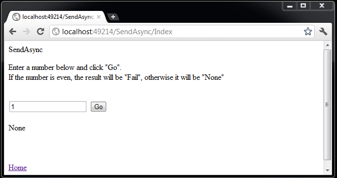

Run the solution. A new browser window/tab opens, as well as a console application.

The web sample starts with two available methods of sending a command to the server and waiting for a response from it:

 * `SendAndBlock`: a controller that uses NServiceBus
 * `SendAsync`: an `AsyncController` that uses NServiceBus

The sample covers only the sending of the asynchronous message as the send and block are similar in NServiceBus.

NOTE: In `SendAndBlock`, the web page renders synchronously. From the user's perspective, the interaction is synchronous and blocking, even though behind the scenes NServiceBus is messaging asynchronously.

Choosing SendAsync results in the following page:

Changing the number in the text box from even to odd changes the result.

This sample has three projects:

 * `AsyncPagesMvc`: ASP.NET MVC application that sends messages (found in the `Messages` project)
 * `Shared`: Common code including declaration of messages
 * `Server`: Destination of messages sent from the MVC project. Hosted in a console application

## Initializing the bus

The sample controller holds a reference to the instance used later to send messages and receive a response (`IBus` implementation for NServiceBus version 5 and below, `IEndpointInstance` for version 6 and above). In `AsyncPagesMvc`, open `Global.asax.cs` and see the code for the `ApplicationStart` method:

snippet: ApplicationStart

## Sending a message

### Asynchronous message sending: SendAsync controller

Using `AsyncController`:

snippet: AsyncController

### Synchronous message sending: SendAndBlockController controller

Open the SendAndBlockController class:

snippet: SendAndBlockController

The controller is sending a message using the instance injected in controller's constructor (`IBus` implementation for NServiceBus version 5 and below, `IEndpointInstance` for version 6 and above). The code calls the send method, passing in the newly created command object.

The call registers a callback method that will be called (with this parameter) as soon as a response is received by the server.

## Handling the message

In the Server project, open the `CommandMessageHandler` class to see the following:

snippet: CommandMessageHandler

This class implements the NServiceBus interface `IHandleMessages<T>` where `T` is the specific message type being handled; in this case, the Command message.

NServiceBus manages the classes that implement this interface. When a message arrives in the input queue, it is deserialized, and then, based on its type, NServiceBus instantiates the relevant classes and calls their Handle method, passing in the message object.

In the method body notice the response being returned to the originating endpoint. This will result in a message being added to the input queue for `AsyncPagesMVC`.
