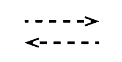
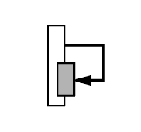

The sequence diagram shows when messages in the same conversation as the selected message were sent and handled relative to each other. It shows the interaction of endpoints involved in the conversation to give an understanding of the sequence of messages that occured during that conversation.

## How the diagram is generated

When NServiceBus sends or publishes a message it adds specific headers such as `NServiceBus.MessageId`, which is a unique ID for that message. The first message to be sent in a conversation will also get a unique `ConversationId` header.

If the handling of an incoming message causes more messages to be sent or published, those outgoing messages are given an `NServiceBus.RelatedTo` header equal to the `MessageId` of the incoming message and are given the same `ConversationId` as the incoming message.

Additional headers are used to determine endpoint names, message intent and other factors. [Read more about headers](/nservicebus/messaging/headers.md).

Note: The order of operations is critical to the correctness of the sequence diagram. When endpoints are running on more than one machine, it is crucial that those machines have synchronised clocks. This can be done using an NTP server.

## What is on the diagram

### Endpoints and lifelines

Each endpoint involved in the conversation is represented by a gray box along the top of the diagram. Hover on the endpoint to get more information such as the host that the endpoint is running on. Extending from the bottom of each endpoint is a (life)line that shows time flowing from top to bottom.

### Start of conversation

Each conversation starts with a single command or event. This message is often triggered by some action external to the system such as a user clicking a Submit Order button on a website. The metadata used to generate the diagram does not include the trigger such cases but it does include the endpoint that sent or published the message, represented by a Start of Conversation marker on the endpoint lifeline.

NOTE: Not every sequence diagram will have a Start of Conversation marker. This can happen if the conversation started a long time ago and the initiating message has expired. It can also happen if the number of messages in the conversation is very large. The diagram will only show get the last 50 messages from the conversation and this may not include the initiating message.

### Messages

When a message is sent, a solid arrow is drawn from the lifeline of the sending endpoint to the lifeline of the receiving endpoint labelled with the message type. The arrow always points from the sending endpoint to the receiving endpoint.

Right-clicking on a message label gives access to actions related to that message.

Some time after a message is received, it is processed by the receiving endpoint. This is represented by a box on the endpoint lifeline
labelled with the message type. If the endpoint received more than one message of that type, the specific message being processed may be seen by hovering over or selecting the processing box.

A message arrow shown leaving a processing box represents an outgoing message that was sent or published while processing the incoming message. These arrows are shown in the order in which those messages were sent or published.

NOTE: A processing box appearing further down the diagram indicates that the processing occured later. This means other messages sent by other endpoints may have been processed in the meantime. The size of a processing box and the distance between them is not important.

If the processing of a message failed, the processing box is displayed in red with an exclamation mark. If the message has not already been (automatically) retried, it can be retried manually via the right-click context menu.

### Events

Events are represented similarly to other messages but with dashed lines and a different icon.

NOTE: Each event published will appear once for each subscriber, as if individual messages were sent to each subscriber by the sender, regardless of whether Unicast or Multicast routing is used. [Learn more about Message Routing](/nservicebus/messaging/routing.md).

### Loopback messages

A loopback message is a message that an endpoint sends to itself and is represented by a short arrow with a special icon, that does not connect to another endpoint lifeline. As with any other message, hovering over or selecting the message will highlight the processing for that message in the lifeline.

### Timeout messages

A timeout is a special type of loopback message where handling is deferred until later. It is represented as a loopback message with a clock icon.

NOTE: The time of processing may not correspond to the time at which a timeout message was sent back for processing by the timeout scheduler. The sequence diagram does not currently support visualization of the time at which the message was sent back and will only indicate when the message was processed.

### Differences with UML sequence diagrams

The language used in the sequence diagram is largely modeled after the standard defined by UML sequence diagrams. However, due to technical limitations and specifics related to messaging systems, the sequence diagram in ServiceInsight has some notable differences:

Item | ServiceInsight | UML
:--- | :---: | :---:
**Start of sequence** |  | 
 | Represented by a black rectangle with a white "play" icon. This representation is used because metadata about what precedes the sequence is unavailable. | Represented by an incoming message (gate) from outside the diagram.
**Uni-directional solid lines** |  | 
 | Used to represent any type of message other than events, including response messages. | Used solely for send and request types of messages.
**Uni-directional dashed lines** |  | 
 | Used solely to represent event messages. | Used solely to represent create messages and response messages.
**Filled arrow style** |  | 
 | Used for all message types. | Used solely for synchronous send messages.
**Open arrow style** |  | 
 | N/A | Used for response messages and asynchronous messages.
**Asynchronous messages** |  | 
 | N/A - all NServiceBus messages are asynchronous so the ServiceInsight Sequence Diagram has no special representation for asynchronous messages and no representation for synchronous messages, even though messages may exhibit synchronous behavior by (system) design. | Represented by a sloping dashed or solid line with an open arrow.
**Send to self / loopback messages** |  | 
 | Represented by a short uni-directional arrow that does not connect to another endpoint lifeline and a specific icon. | Represented by an arrow that connects back to the sending object's lifeline. It is immediately followed by its handler, which usually overlaps the handler that sent the loopback message.
**Handlers** |  | 
 | N/A - currently it's not possible to collect telemetry data to visualize message handlers. | Represented by rectangles directly attached to arrow heads.
**Message Processing** |  |
 | Represented by a labeled rectangle not connected with the arrows of its parent messages. This representation was chosen to reflect that the execution/processing of incoming messages may only occur after several other messages were sent and also to reflect the default asynchronous nature of any associated response messages. | N/A
