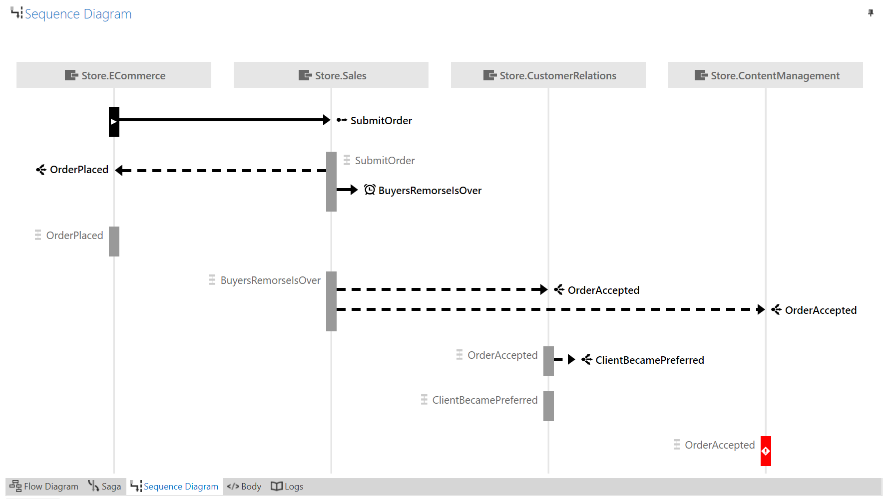
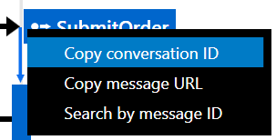
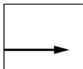
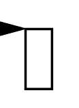
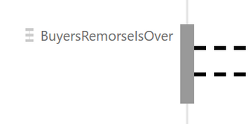

# Introduction

Each visualization diagram in ServiceInsight displays the currently selected message in a broader context to help with troubleshooting and debugging.

The sequence diagram shows all of the messages in the same conversation. It also shows when these messages were sent and handled relative to each other. 

Use the sequence diagram when the timing of messages handling is important to understand.

## Which data is used to generate the diagram

When you send a message through NServiceBus, some headers are added automatically. All messages get the `NServiceBus.MessageId` header. This is a unqiue identifier for the message. 

If handling a message causes more messages to be sent or published then the `MessageId` of the message being handled is copied to the `NServiceBus.RelatedTo` header of the outgoing messages.

Another header that gets copied to outgoing messages is `NServiceBus.ConversationId`. The first mesgsage to be sent in a conversation will get a unique `ConversationId`. Each subsequent message will get the same `ConversationId`.

There are additional headers which are used to label endpoints, messages and message processing. [More information about headers](/nservicebus/messaging/headers.md).

## What is on the diagram

The sequence diagram shows the interaction of endpoints by visualizing sending and processing messages over time. 

### Endpoints and lifelines

Each endpoint involved in the conversation is represented as a labeled grey box along the top of the diagram. Hover on the endpoint label to get additional information such as the host that the endpoint is running on. Extending from the bottom of each endpoint is a (life)line that shows time flowing from top to bottom.

### Start of conversation

Each conversation is initiated by a single command or event. This message is often triggered by some action which is external to the system such as a user clicking a Submit Order button on a website. The metadata used to generate the diagram doesn't include the trigger in this case but it does include the endpoint that sent or published this message. This is represented by a Start of Conversation marker on the endpoint lifeline.

NOTE: Not every sequence diagram will have the start of conversation marker. This can happen if the conversation started a long time ago and the initiating message has expired. It can also happen if the number of messages in the conversation is very large. In this case, ServiceInsight will only get 50 messages from the conversation and this may not include the initiating message.

### Messages

When an endpoint sends a message, a solid arrow is drawn from the lifeline of the sending endpoint to the lifeline of the processing endpoint. The label of each message indicates its type. The arrow always points from the sending endpoint to the receiving endpoint.

Right-clicking on a message label gives access to actions related to that message.

Some time after a message is received it is processed by the endpoint. This is represented as a box on the endpoint lifeline, labeled with the type of message that it is processing. If the endpoint has received multiple messages of the same type you can see which specific instance is being processed by hovering over or selecting the processing box.

If a message arrow is drawn coming out of a processing box then that means that the message was sent as a part of processing the original message. The order that message arrows appear within a processing box is representative of the order they were sent.

NOTE: If a processing box appears further down the diagram then it was executed later. This means other messages sent by other endpoints may have been processed in the meanwhile. The size of a processing box and the distance between them is not important.

If the processing of a message fails, the processing box will be displayed in red with an exclamation mark in it. If the message that failed to process hasn't already been (automatically) retried, you can manually retry the message via the context menu.

### Events

Events are represented in a similar fashion to other messages except that they have dashed lines and a different icon. 

NOTE: Each event that is published will appear on the diagram once for each subscriber. This looks like individual messages were sent to each subscriber by the sender regardless of whether Unicast or Multicast routing is used - [Learn more about Message Routing](/nservicebus/messaging/routing.md).

### Loopback messages

When an endpoint sends a message to itself this is called a loopback message. On the sequence diagram this is represented as a short arrow that does not connect to another endpoint lifeline. Each loopback message is displayed with a special icon. As with any other type of message, hovering over or selecting the message will highlight the processing for that message in the lifeline.

### Timeout messages

A timeout is a special type of loopback message where the handling is deferred until a later time. This type of message is represented just like a loopback message but it has a clock icon to show that it is a timeout.

NOTE: the time of processing may not correspond to the time a timeout message was sent back for processing by the timeout scheduler. The sequence diagram does not currently support visualizing the time the message was sent back and will only indicate when was the message processed.

### Differences with UML sequence diagrams

The language used in the sequence diagram from ServiceInsight is largely modeled after the standard defined by UML sequence diagrams. However, due to some technical limitations as well as some specifics related to messaging systems, the sequence diagram in ServiceInsight has some notable differences when compared to its UML counterpart. Those are the following:

What | Representation in ServiceInsight | Representation in UML
:--- | :---: | :---:
**Sequence beginning** |  | 
 | Represented by a black rectangle with a white "play" icon that acts as a sort of start landmark. This representation is used because metadata about what precedes the sequence is unavailable. | Represented by a message incoming from outside the diagram.
**Uni-directional solid lines** |  | 
 | Used to represent any type of message other than events, including response messages | Used solely for send and request type of messages
**Uni-directional dashed lines** |  | 
 | Used solely to represent event messages | Used solely to represent create messages and response messages
**Filled arrow style** |  | 
 | Used for all message types | Used solely for synchronous send messages
**Open arrow style** |  | 
 | N/A | Used for response messages and asynchronous messages 
**Asynchronous messages** |  | 
 | N/A - All NServiceBus messages are asynchronous. Therefore, the ServiceInsight Sequence Diagram view has no visual representation for synchronous messages, even though they might exhibit synchronous behavior by (system) design. | Asynchronous messages are represented by a sloping dashed or solid line with an open arrow
**Send to self / loopback messages** |  | 
 | Represented as a short uni-directional arrow that does not connect to another endpoint lifeline and a specific icon next to its text label | Represented by an arrow that connects back to the sending object's lifeline. It is immediately followed by its handler, which usually overlaps the handler that sent the loopback message.
**Handlers** |  | 
 | N/A - currently it's not possible to collect telemetry data to visualize message handlers | Represented by rectangles directly attached to arrow lines
**Message Processing** |  | 
 | Displayed as labeled rectangles disjointed from the arrows of its parent messages. This representation was chosen to reflect not only the default asynchronous nature of any associated response messages, but especially because of the execution/processing of parent messages which may only occur after several other messages were sent | N/A
