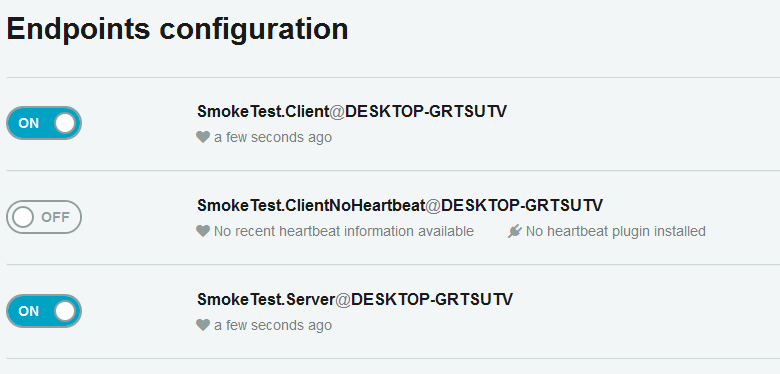
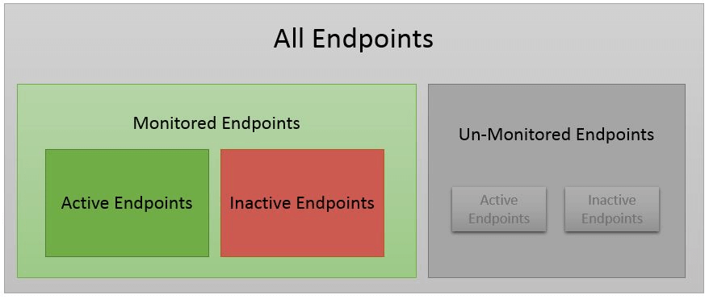
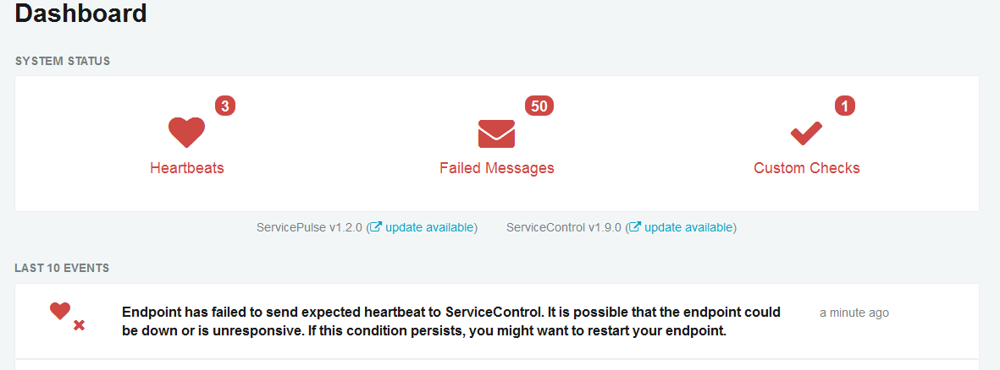
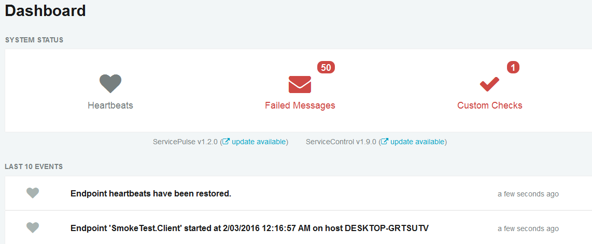
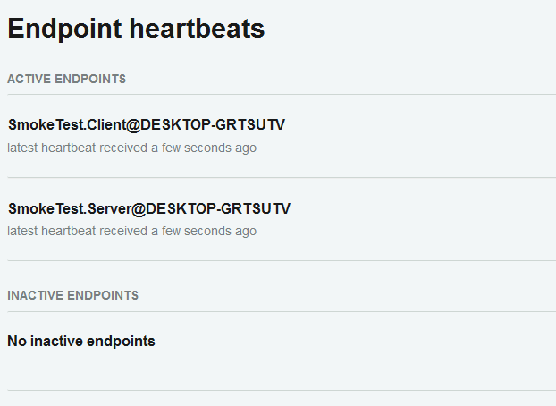

The Endpoints indicator in the ServicePulse dashboard displays the current status of the monitored NServiceBus endpoints. Specifically, it indicates whether, based on the heartbeats received from each endpoint, the endpoint is active or inactive.

This article explains how this is done, and defines the meaning of each of the terms used in describing the status of an endpoint (terms like "active", "monitored" and "heartbeat").  

<!---->

### Monitored vs. Unmonitored Endpoints

An NServiceBus endpoint can be set for monitoring by ServicePulse or can remain unmonitored. See [How to configure endpoints for monitoring by ServicePulse](/servicepulse/how-to-configure-endpoints-for-monitoring.md) for detailed instructions on preparing an endpoint for monitoring by ServicePulse.

It is recommended that you configure all your endpoints for monitoring by ServicePulse. Once configured, the endpoint appears in the ServicePulse Configuration page.   

In the ServicePulse Configuration page you can specify which endpoints you wish to monitor with ServicePulse by checking (or unchecking) the checkbox next to the endpoint's entry.  

This is a configuration setting only. The endpoint itself is unchanged, and is still set for monitoring; the change affects only the way in which ServicePulse treats information received from the endpoint. 

Unchecking an endpoint means that it is ignored by ServicePulse (for example, alerts and indications are not displayed for the unmonitored endpoint). 

Re-checking the endpoint setting as "monitored" does not make any changes to the endpoint itself, and only affects the ServicePulse behavior towards information received from the (now re-)monitored endpoint.
 
Unmonitoring an endpoint via the ServicePulse Configuration page is useful when you wish to temporarily or permanently ignore the behavior of an endpoint. For example, you may wish to shut down the endpoint's host for maintenance, or permanently deactivate the host itself (as when a VM is deactivated). In such cases, the endpoint's data remains available in ServicePulse (via the underlying ServiceControl database) but you may not wish to receive any notifications from ServicePulse related to this intentionally disabled endpoint.  
 

### Active vs. Inactive Endpoints

ServicePulse relies on heartbeat messages sent from the monitored endpoints to indicate whether an endpoint is active or inactive.

An endpoint that is marked for monitoring (by ServicePulse) is expected to periodically send a heartbeat message. As long as a monitored endpoint sends heartbeat messages, it is marked as "active". Marking an endpoint as active means it is able to properly and periodically send messages using the endpoint-defined transport.

If a heartbeat message is not received by ServiceControl from an endpoint within the specified timespan, that endpoint is marked as "inactive". An inactive endpoint indicates that there is a failure in the communication path between ServiceControl and the monitored endpoint. For example, such failures may be caused by a failure of the endpoint itself, a communication failure in the transport, or when ServiceControl is unable to receive and process the heartbeat messages sent by the endpoint.

NOTE: Even if an endpoint is able to send heartbeat messages and it is marked as "active", other failures may occur within the endpoint and its host that prevent it from performing as expected. For example, the endpoint may not be able to process incoming messages, or it may be able to send messages to the ServiceControl queue but not to another queue. To monitor and get alerts for such cases, develop a custom check using the CustomChecks plugin.

For more details on how heartbeats are sent by an endpoint, see [ServiceControl Heartbeat Plugin](/servicecontrol/plugins/heartbeat.md).

Only monitored endpoints are expected by ServicePulse to send heartbeat messages periodically. Unmonitored endpoints (i.e., endpoints marked in the ServicePulse configuration page as "unmonitored") may be sending heartbeats (depending on their specific configuration and whether the relevant plugins were installed for that endpoint) but these heartbeats messages are ignored by ServiceControl and ServicePulse as long as the endpoint is marked as an unmonitored endpoint in the ServicePulse configuration page.

     

### Detecting New Endpoints

When an endpoint is configured for auditing (see [Auditing with NServiceBus](/nservicebus/operations/auditing.md)) but not for monitoring by ServicePulse, its messages are audited by the ServiceControl service and stored in its database.

This allows ServicePulse to detect that endpoint as a new endpoint, and add it to its endpoint list. By default, all detected endpoints are marked for monitoring by ServicePulse, so ServicePulse can send an alert when such newly added endpoints are detected.

The newly detected endpoint can be either configured for monitoring (see [How to configure endpoints for monitoring by ServicePulse](/servicepulse/how-to-configure-endpoints-for-monitoring.md)) or marked as unmonitored endpoints (in the ServicePulse Configuration page).

Configuring the newly added endpoints for monitoring by ServicePulse leads to the following results:

* Heartbeat messages are sent by the NServiceBus endpoints. 
* The heartbeat messages are received and processed by ServiceControl and ServicePulse. 
* The ServicePulse dashboard indicator is updated with the heartbeat data, the endpoints indicator is updated, and appropriate events are displayed.

To display the list of monitored endpoints, click the Endpoints indicator in the dashboard (or the "Endpoints Overview" link in the side navigation menu). The list of monitored endpoints is separated into two columns:
* Active Endpoints (heartbeats were received as expected) 
* Inactive Endpoints (heartbeats were not received) 

