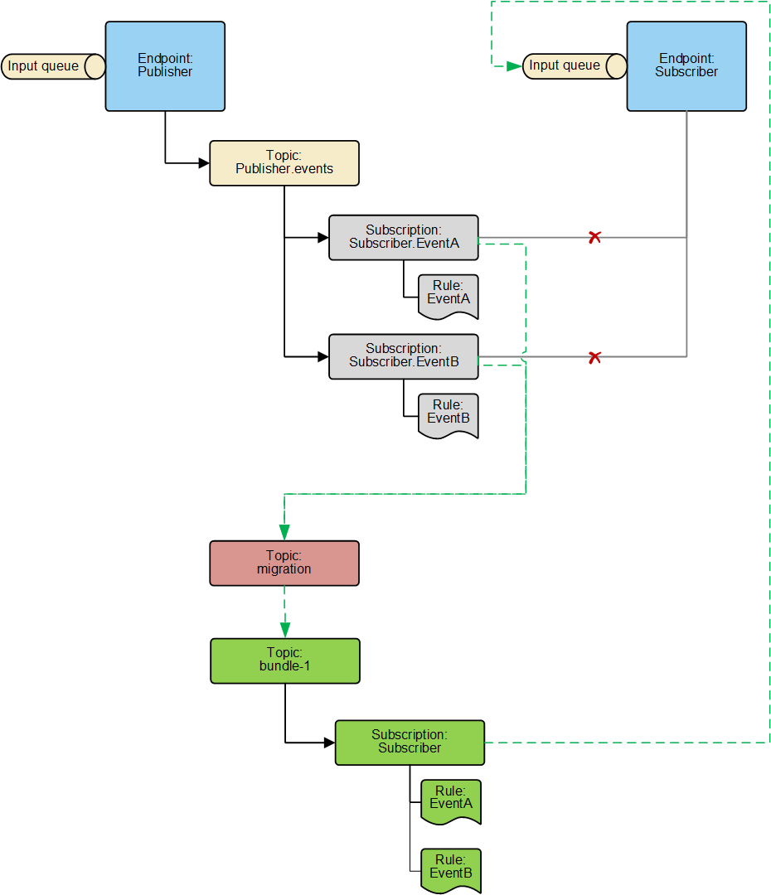

include: legacy-asb-warning

The Endpoint-oriented topology is the first topology that was introduced in the Azure Service Bus transport. The topology design was influenced by the [message-driven publish-subscribe](/nservicebus/messaging/publish-subscribe/#mechanics-message-driven-persistence-based) concept and imposes several [restrictions](/transports/azure-service-bus/legacy/topologies.md#versions-7-and-above-forwarding-topology-topologies-comparison). The Forwarding topology was introduced to take advantage of the broker nature of the Azure Service Bus and to leverage its native capabilities. It is the recommended option for new projects. Thus the new Azure Service Bus transport is only [compatible](/transports/azure-service-bus/compatibility.md) with the Forwarding topology.

Customers that are using the Endpoint-oriented topology and planning to migrate to the new transport are required to migration  their endpoints to the Forwarding topology as a first step. The migration approach described here enables migrating mission-critical endpoints to the Forwarding-topology in any order without applying a big-bang approach.

## Side-by-side migration

INFO: Endpoints that have the migration mode enabled require manage rights to create entities on the broker.

Before switching endpoints to the Forwarding topology, all endpoints need to enable the migration mode. To enable the migration mode:

1. Pick an endpoint that is using the Endpoint-oriented topology indicated by `transport.UseEndpointOrientedTopology()` API call in the endpoint's configuration code.
1. Update the `NServiceBus.Azure.Transports.WindowsAzureServiceBus` Nuget package reference to Version 9.1 or higher.
1. Enable the migration mode by calling `topology.EnableMigrationToForwardingTopology()` on the Endpoint-oriented topology, leaving all the other configuration as-is.

The steps above can be applied to as many endpoints at once as required. Once all the endpoints that need to be updated have the migration mode enabled, deploy the updated endpoints. Repeat this cycle as many times necessary until all Endpoint-oriented endpoints have the migration mode enabled.

Once all endpoints had the migration mode enabled and deployed to production for some time, the endpoints can be moved to the Forwarding topology by switching to the new Azure Service Bus transport as described in the next section.

 NOTE: Endpoints in the migration mode should be allowed to run for some time in production to ensure all existing messages have been forwarded to the receiving endpoints input queue.

## Moving off the legacy transport

Once all endpoints using legacy transport are running in the migration mode, migration to the new transport can be performed. Prior to that, verify compatibility with the new transport described in the [compatibility guide](/transports/azure-service-bus/compatibility.md). To finalize migration from legacy transport :

1. Uninstall the package  `NServiceBus.Azure.Transports.WindowsAzureServiceBus`.
1. Install the package `NServiceBus.Transports.AzureServiceBus`.
1. Delete the non-compiling code starting with `transport.UseEndpointOrientedTopology()` and remove any routing configuration code described in [Publishers name configuration](/transports/azure-service-bus/legacy/publisher-names-configuration.md).
1. If more [advanced configuration options](/transports/azure-service-bus/legacy/configuration/full.md) have been used with the legacy transport, switch those over to the [new configuration options](/transports/azure-service-bus/configuration.md), if there are equivalent APIs. For configuration options that are not available in the new transport, defaults selected specifically for the new transport will be applied.

The steps above can be applied to as many endpoints at once as required. Once all the endpoints that need to be updated have been updated to use the new transport, deploy the updated endpoints. Repeat this cycle as many times necessary until all endpoints have been migrated to the new transport.

NOTE: Endpoints using an Endpoint-oriented topology with migration mode enabled can co-exist and seamlessly communicate with endpoints using both the legacy transport on Forwarding topology and the new Azure Service Bus transport.

## Finalizing migration (cleanup stage)

Once endpoints have been migrated off Endpoint-oriented topology and have been running in production for some time, the [Endpoint-oriented topology](/transports/azure-service-bus/legacy/topologies.md#versions-7-and-above-endpoint-oriented-topology) artifacts can be removed.
Those artifacts are endpoint-specific topics with their subscriptions.

WARNING: exercise caution when removing subscriptions. If not sure what subscriptions can be removed, contact [Support](https://particular.net/support).

## How it works

To understand this section better, refer to the [topologies article](/transports/azure-service-bus/legacy/topologies.md) for details on how Endpoint-oriented and Forwarding topologies operate.

Migration mode has no impact on commands, but events only. It does not change how events are published. It does change how events are **subscribed to**.
Publishing endpoints in migration mode will continue publishing using endpoint specific topic. Subscribers with enabled migration mode will modify how subscriptions work.
Subscribers with enabled migration mode will no longer fetch messages from subscriptions. Instead, they will perform the following:

1. Create Forwarding topology subscription entities; `bundle-1` topic for all events, subscription per subscriber endpoint, and SQL filter per event type (in green). Subscriptions auto-forward to the endpoint's queue.
1. Create a `migration` topic that performs de-duplication and auto-forwards everything to `bundle-1` topic (in red).
1. Auto-forward all events arriving to `<subscriber_endpoint_name>.<event_type_name>` subscriptions under endpoint specific topic `<publishing_endpoint_name>.events` to be routed to the `migration` topic (in grey).

Below is an example of a publisher with 2 events, `EventA` and `EventB`, and a subscriber consuming those events. When in migration mode, the topology looks as following:

Q: is `migration` topic necessary?
A: When an instance of a publisher is converted to Forwarding topology and another instance is still in migration, and event published by an endpoint still in migration needs to be de-duplicated. `migration` topic ensures events are de-duplicated no matter what instance of a publisher has published those.

Q: what should be migrated first, subscribers or publishers?
A: The order of migration doesn't matter. A publisher could also be a subscriber and the other way around.

Q: Can I a new endpoint while in migration mode?
A: Yes.

Q: Are commands affected by migration mode?
A: No. Commands work the same way in both topologies and are not affected by the migration mode.