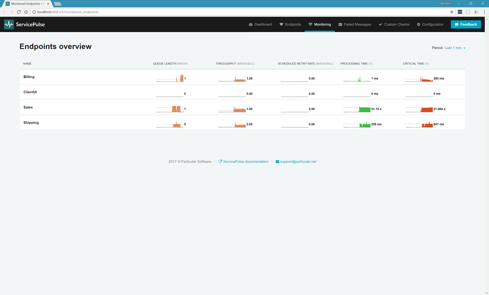

The best way to get started with the monitoring features in the Particular Service Platform is to try them out with a real system. This downloadable sample contains all of the necessary parts of the platform, already configured and ready to run. It also includes 4 sample endpoints that all communicate by exchanging messages over the SQL Transport.

TODO: Add link to download which will be on S3 somewhere

## Prerequisites

In order to run the downloaded sample you will need the following prerequistites.

- Windows (version?): the Particular Service Platform requires the Windows operating system
- Powershell (version?)
- SQL Server (version?)
  - You may provide your own instance of SQL Server or the download package includes an installer for SQL Server LocalDB
- .NET 4.6.1 (check version)

## Running the sample

The sample zip file includes 4 endpoints and Particular Software Platform components, all of which have been configured to talk to each other using a SQL Server instance.

Once you have downloaded the sample zip, unzip it's contents into a folder. For the rest of this tutorial, we will refer to this folder as `MonitoringDemo`.

Open the `MonitoringDemo` folder and double-click on `run.bat`. This script will:

1. Ask you to select a SQL Server to use as a transport. All of the components of the demo communicate by using a shared SQL Server database. You will be prompted to use an existing SQL Server instance or to have the demo create it's own dedicated instance.
2. Creates the database with all of the necessary tables that the demo components will use.
3. Updates the configuration files for all of the components to with connection string details.
4. Runs ServiceControl components, each in their own window. You will be prompted to run each of these with elevated privileges so that they can bind to their network ports.
  - A ServiceControl instance (binds to port 33333)
  - A Monitoring instance (binds to port 33633)
5. Runs the sample endpoints, each in their own window
6. Runs ServicePulse, in it's own window (binds to port 9090)
7. Opens your default browser to the ServicePulse monitoring tab.

### Selecting a SQL Server instance

In order to communicate with each other, all of the components in the sample need access to a shared SQL Server database. If you have an existing SQL Server instance available, select the first option and the demo will use it. 

After selecting a database instance, you will be prompted for the name of the database to use. This should be a brand new database as it will be dropped and recreated every time you run the sample.

After you have selected a database instance, you will be asked to provide credentials. You can opt to use integrated security or supply a user name and password to use a SQL login. The credentials that you supply will be used to drop and recreate the database so they must have enough privileges on the target SQL Server instance.

If you do not have your own SQL Server instance, or you would prefer to keep the demo pieces separate, select the 2nd option. This will install a copy of SQL Server LocalDB 2016 (if you do not already have it installed) and create a brand new instance called `particular-monitoring` for use with the demo.

### Demo walk through

Once everything is running, you will have 4 endpoints which are configured like this:

By default, the ClientUI endpoint sends a steady stream of 1 `PlaceOrder` messages every second. 

The endpoints are also configured to send monitoring data to the Particular Software Platform which you can see in ServicePulse. 

Explore the demo further by asking some questions:

- **[Which message types are taking the longest to process?](walkthrough-1.md)** - take a look at individual endpoint performance and decide where to optimize.

- **[Which endpoints have the most work to do?](walkthrough-2.md)** - look for peaks of traffic and decide when to scale out. 

- **[Are any of the endpoints struggling?](walkthrough-3.md)** - find hidden problems in them system and fix them before messages start to fail.

include: next-steps
